# UI/UX Flow - POS Apotek

## 0. Status Revisi Dokumen

Dokumen ini merupakan versi revisi sinkron dari `04_UI_UX_FLOW_POS_APOTEK.md`. Revisi ini menyelaraskan alur UI/UX dengan PRD, SRS, SDD, dokumen frontend, dan dokumen backend yang sudah diperbarui.

Pembaruan utama pada versi 1.2.0 meliputi:

- penyelarasan route frontend final ke istilah berbahasa Indonesia;
- penegasan bahwa endpoint API backend tetap memakai bahasa Inggris teknis;
- penambahan flow Manajemen User untuk Manager;
- penambahan alur Manajemen Kategori Tree View (`/kategori`) dengan expand/collapse, visual indentation, dan parent selector dropdown (maksimal 3 level);
- penambahan alur Topbar Notification Bell & Panel Dropdown Notifikasi dengan polling/fetch, filter tab, dan filter RBAC per role;
- penambahan alur User Profile Dropdown & Modal Ganti Password pada Topbar;
- penambahan aturan idempotency pada checkout, pembelian, retur, dan koreksi stok;
- penegasan status role Pemilik sebagai opsional pada V1;
- penegasan bahwa jam realtime frontend hanya informasi visual;
- penambahan mapping error backend ke tampilan UI;
- penambahan flow PO obat, pembelian dari PO, pelayanan resep dasar, dan konseling dasar;
- penyesuaian traceability agar sesuai dengan dokumen sinkron terbaru.

Dokumen ini tetap berfokus pada alur antarmuka dan interaksi pengguna, bukan desain database atau service backend. Kalau UI/UX mulai mengatur transaksi database, itu bukan desain, itu percobaan kecil menuju kekacauan.

---

## 0.1. Instruksi Pembacaan untuk AI Coding

Dokumen ini menjelaskan **alur halaman, navigasi, komponen UI, interaksi pengguna, empty state, error state, loading state, dan responsive behavior** untuk aplikasi **POS Apotek**.

Dokumen ini harus dibaca setelah:
1. `01_PRD_POS_APOTEK.md`
2. `02_SRS_POS_APOTEK.md`
3. `03_SDD_SYSTEM_DESIGN_POS_APOTEK.md`
4. `06_FRONTEND_POS_APOTEK.md`
5. `07_BACKEND_POS_APOTEK.md`

Dokumen ini **tidak menggantikan PRD, SRS, atau SDD**.

Batas fungsi dokumen:
- UI/UX Flow menjelaskan **bagaimana pengguna bergerak dan berinteraksi**.
- SRS menjelaskan **perilaku sistem dan validasi**.
- SDD menjelaskan **arsitektur, database, API, dan logika teknis**.
- Task Breakdown menjelaskan **pekerjaan implementasi**.

AI coding wajib mematuhi hal berikut:

1. Jangan membuat halaman yang tidak ada di dokumen ini tanpa menandainya sebagai tambahan di luar scope.
2. Jangan menampilkan HPP, laba, atau informasi sensitif kepada role kasir.
3. Jangan menjadikan tampilan frontend sebagai sumber kebenaran stok, FEFO, batch, HPP, diskon alokasi, atau laba.
4. Jangan membuat alur kasir terlalu panjang. Transaksi normal harus selesai dari satu halaman kasir.
5. Jangan menghilangkan empty state, error state, dan loading state.
6. Jangan membuat layout yang menyebabkan horizontal scroll tidak perlu.
7. Jangan menyembunyikan error validasi hanya karena UI terlihat lebih bersih. UI bersih tanpa pesan error adalah cara elegan untuk membuat pengguna menyalahkan dirinya sendiri.
8. Route frontend final memakai istilah UI berbahasa Indonesia, sedangkan endpoint API backend tetap memakai bahasa Inggris teknis dengan prefix `/api`.
9. Jangan menjadikan jam realtime frontend sebagai waktu final transaksi. Waktu final transaksi wajib berasal dari backend.
10. Gunakan idempotency key pada transaksi penting untuk mencegah transaksi ganda akibat double click, retry, timeout, atau koneksi tidak stabil.
11. Role Pemilik bersifat opsional pada V1. Jika belum diimplementasikan, akses monitoring dapat memakai role Manager terbatas.
12. Response untuk role Kasir harus disanitasi agar tidak memuat harga modal, HPP, laba, margin, harga beli, atau informasi sensitif lain.
13. Harga jual yang tampil di kasir adalah harga jual final rupiah bulat yang ditetapkan Manager.
14. PO tidak boleh divisualkan sebagai stok masuk.
15. Resep tidak boleh divisualkan sebagai stok keluar sebelum checkout berhasil.
16. Kasir hanya boleh melihat satuan jual aktif.

---

## 1. Tujuan UI/UX Flow

Tujuan dokumen ini adalah memastikan aplikasi POS Apotek memiliki alur penggunaan yang jelas, efisien, dan konsisten bagi:
- kasir;
- manager;
- apoteker;
- pemilik.

Dokumen ini menjadi acuan untuk:
- membangun halaman frontend;
- menentukan urutan navigasi;
- menentukan komponen utama setiap halaman;
- menentukan state tampilan;
- menentukan perilaku responsive;
- menjaga konsistensi istilah dan tindakan pengguna.

---

## 2. Prinsip Desain UI/UX

| ID | Prinsip | Penjelasan |
|---|---|---|
| UX-PRIN-001 | Kasir cepat, manager lengkap | Halaman kasir harus singkat dan cepat, halaman manager boleh lebih detail |
| UX-PRIN-002 | Satu aksi utama per halaman | Setiap halaman harus memiliki fokus aksi utama yang jelas |
| UX-PRIN-003 | Server sebagai sumber final | UI hanya menampilkan estimasi sebelum submit |
| UX-PRIN-004 | Informasi sensitif disembunyikan dari kasir | HPP dan laba tidak tampil pada role kasir |
| UX-PRIN-014 | Harga jual kasir final | Kasir melihat harga jual final rupiah bulat, bukan harga modal atau margin |
| UX-PRIN-015 | PO bukan stok | PO adalah rencana pemesanan, bukan stok masuk |
| UX-PRIN-016 | Resep bukan transaksi final | Resep tidak mengurangi stok sebelum checkout berhasil |
| UX-PRIN-017 | Satuan jual aktif | Kasir hanya melihat satuan jual aktif |
| UX-PRIN-005 | Error harus bisa dipahami | Pesan error harus menjelaskan masalah secara jelas |
| UX-PRIN-006 | Empty state harus membantu | Jika data kosong, tampilkan arahan tindakan berikutnya |
| UX-PRIN-007 | Loading state wajib ada | Setiap proses async harus memiliki indikator |
| UX-PRIN-008 | Responsive by default | Layout harus menyesuaikan desktop, tablet, dan mobile |
| UX-PRIN-009 | Konsistensi istilah | Gunakan istilah produk, batch, stok, satuan, transaksi, retur, laporan |
| UX-PRIN-010 | Minimalkan input manual | Gunakan default, dropdown, pencarian, dan perhitungan otomatis |
| UX-PRIN-011 | Idempotent action | Aksi transaksi penting harus mencegah submit ganda |
| UX-PRIN-012 | Route konsisten | Route frontend memakai istilah Indonesia dan API backend tetap teknis |
| UX-PRIN-013 | Waktu final dari backend | Jam frontend hanya tampilan, waktu transaksi final berasal dari server |

---

## 3. Aktor dan Kebutuhan UI

| Role | Status V1 | Fokus UI | Akses Utama |
|---|---|---|---|
| Kasir | Wajib | Transaksi cepat dan retur penjualan | Login, kasir, riwayat transaksi terbatas, retur penjualan |
| Apoteker | Wajib masuk rancangan | Pelayanan obat | PO obat, resep dokter, konseling, stok terbatas |
| Manager | Wajib | Pengelolaan operasional | Dashboard, produk, kategori, supplier, satuan, batch, pembelian, stok, retur, laporan, manajemen user, pengaturan |
| Pemilik | Opsional | Monitoring performa | Dashboard, laporan penjualan, laporan laba, stok, expired alert |

---

## 4. Information Architecture


```mermaid
flowchart TD
    Login[Login]
    Login --> RoleCheck{Role}

    RoleCheck -->|Kasir| KasirHome[Halaman Kasir]
    RoleCheck -->|Apoteker| ServiceHome[Pelayanan]
    RoleCheck -->|Manager| Dashboard[Dashboard]
    RoleCheck -->|Pemilik| OwnerDashboard[Dashboard Pemilik]

    Dashboard --> MasterData[Master Data]
    Dashboard --> PurchaseOrder[Pemesanan / PO]
    Dashboard --> Purchase[Pembelian]
    Dashboard --> Service[Pelayanan]
    Dashboard --> Stock[Stok]
    Dashboard --> Returns[Retur]
    Dashboard --> Reports[Laporan]
    Dashboard --> Settings[Pengaturan]
    Dashboard --> Users[Manajemen User]

    MasterData --> Products[Produk]
    MasterData --> Categories[Kategori]
    MasterData --> Suppliers[Supplier]
    MasterData --> Units[Satuan dan Konversi]
    MasterData --> Batches[Batch]

    Purchase --> PurchaseList[Daftar Pembelian]
    Purchase --> PurchaseCreate[Buat Pembelian]
    PurchaseOrder --> POList[Daftar PO]
    PurchaseOrder --> POCreate[Buat PO]
    PurchaseOrder --> POPrint[Cetak PO]
    Purchase --> PurchaseFromPO[Pembelian dari PO]

    Service --> Prescription[Resep Dokter]
    Service --> Counseling[Konseling]
    Service --> ServiceHistory[Riwayat Pelayanan]
    ServiceHome --> Prescription
    ServiceHome --> Counseling

    Stock --> StockList[Daftar Stok]
    Stock --> StockMutations[Mutasi Stok]
    Stock --> StockAdjustment[Koreksi Stok]

    Returns --> SalesReturn[Retur Penjualan]
    Returns --> PurchaseReturn[Retur Pembelian]

    Reports --> SalesReport[Laporan Penjualan]
    Reports --> ProfitReport[Laporan Laba]
    Reports --> StockReport[Laporan Stok]
    Reports --> ExpiredReport[Laporan Expired]

    KasirHome --> SalesHistory[Riwayat Transaksi Terbatas]
    KasirHome --> CashierReturn[Retur Penjualan]
```

---

## 5. Struktur Navigasi Utama

## 5.1 Sidebar Manager

Sidebar untuk role Manager:

```text
Dashboard
Kasir
Pelayanan
  - Resep Dokter
  - Konseling
  - Riwayat Pelayanan
Master Data
  - Produk
  - Kategori
  - Supplier
  - Satuan
  - Batch
Pembelian
Pemesanan / PO
Stok
  - Daftar Stok
  - Mutasi Stok
  - Koreksi Stok
Retur
  - Retur Penjualan
  - Retur Pembelian
Laporan
  - Penjualan
  - Laba
  - Stok
  - Expired
Manajemen User
Pengaturan
Logout
```

## 5.2 Sidebar Kasir

Sidebar untuk role Kasir:

```text
Kasir
Riwayat Transaksi
Retur Penjualan
Logout
```

Catatan:
- Kasir tidak melihat menu laporan laba.
- Kasir tidak melihat menu pembelian.
- Kasir tidak melihat menu supplier.
- Kasir tidak melihat menu koreksi stok.
- Kasir tidak melihat HPP dan laba dalam bentuk apa pun.
- Kasir tidak melihat harga modal atau margin dalam bentuk apa pun.
- Kasir hanya dapat menarik resep siap bayar dari halaman kasir atau aksi khusus, bukan mengelola resep.

## 5.2A Sidebar Apoteker

Sidebar untuk role Apoteker:

```text
Pelayanan
  - Resep Dokter
  - Konseling
  - Riwayat Pelayanan
Pemesanan / PO
Stok
Logout
```

Catatan:
- Apoteker tidak melihat laporan laba.
- Apoteker tidak melihat harga modal, HPP, margin, atau laba kecuali izin khusus ditambahkan eksplisit.
- Apoteker dapat membuat PO dan resep dasar, tetapi pembelian final tetap Manager.

## 5.3 Sidebar Pemilik

Sidebar untuk role Pemilik:

```text
Dashboard
Laporan
  - Penjualan
  - Laba
  - Stok
  - Expired
Logout
```

Catatan:
- Role Pemilik bersifat opsional pada V1.
- Jika role Pemilik belum dibuat, kebutuhan monitoring dapat menggunakan akses Manager terbatas.
- Pemilik tidak melakukan aksi operasional seperti pembelian, koreksi stok, pengubahan harga, atau manajemen user.

## 5.4 Mapping Route Frontend Final

Route frontend final menggunakan istilah UI berbahasa Indonesia. Endpoint API backend tetap menggunakan bahasa Inggris teknis dengan prefix `/api`. Jangan mencampur keduanya seolah-olah route adalah tempat eksperimen bahasa.

| Halaman UI | Route Frontend Final | Endpoint API Utama | Role |
|---|---|---|---|
| Login | `/login` | `POST /api/auth/login` | Publik |
| Dashboard | `/dashboard` | `/api/dashboard/*` | Manager, Pemilik, Kasir terbatas opsional |
| Kasir | `/kasir` | `POST /api/sales`, `GET /api/products/search` | Kasir, Manager |
| Riwayat Transaksi | `/riwayat-transaksi` | `GET /api/sales` | Kasir terbatas, Manager |
| Detail Transaksi | `/riwayat-transaksi/:id` | `GET /api/sales/:id` | Kasir terbatas, Manager |
| Retur Penjualan | `/retur-penjualan` | `POST /api/sales-returns` | Kasir, Manager |
| Produk | `/produk` | `/api/products` | Manager |
| Tambah Produk | `/produk/tambah` | `POST /api/products` | Manager |
| Edit Produk | `/produk/:id/edit` | `PATCH /api/products/:id` | Manager |
| Satuan Produk | `/produk/:id/satuan` | `/api/products/:id/units` | Manager |
| Kategori | `/kategori` | `/api/categories` | Manager |
| Supplier | `/supplier` | `/api/suppliers` | Manager |
| Satuan | `/satuan` | `/api/units` | Manager |
| Batch | `/batch` | `/api/batches` | Manager |
| Detail Batch | `/batch/:id` | `GET /api/batches/:id` | Manager |
| Pemesanan / PO | `/pemesanan` | `/api/purchase-orders` | Apoteker, Manager |
| Tambah PO | `/pemesanan/tambah` | `POST /api/purchase-orders` | Apoteker, Manager |
| Detail PO | `/pemesanan/:id` | `GET /api/purchase-orders/:id` | Apoteker, Manager |
| Cetak PO | `/pemesanan/:id/cetak` | `POST /api/purchase-orders/:id/print-preview` | Apoteker, Manager |
| Pembelian | `/pembelian` | `/api/purchases` | Manager |
| Tambah Pembelian | `/pembelian/tambah` | `POST /api/purchases` | Manager |
| Pembelian dari PO | `/pembelian/dari-po/:poId` | `GET /api/purchases/create-from-po/:poId`, `POST /api/purchases` | Manager |
| Resep Dokter | `/pelayanan/resep` | `/api/prescriptions` | Apoteker, Manager |
| Tambah Resep | `/pelayanan/resep/tambah` | `POST /api/prescriptions` | Apoteker, Manager |
| Detail Resep | `/pelayanan/resep/:id` | `GET /api/prescriptions/:id` | Apoteker, Manager |
| Konseling | `/pelayanan/konseling` | `/api/counseling-records` | Apoteker, Manager |
| Riwayat Pelayanan | `/pelayanan/riwayat` | `/api/prescriptions`, `/api/counseling-records` | Apoteker, Manager |
| Retur Pembelian | `/retur-pembelian` | `/api/purchase-returns` | Manager |
| Stok | `/stok` | `/api/stock` | Manager, Kasir terbatas |
| Mutasi Stok | `/mutasi-stok` | `/api/stock/mutations` | Manager |
| Koreksi Stok | `/koreksi-stok` | `POST /api/stock/adjustments` | Manager |
| Laporan Penjualan | `/laporan/penjualan` | `/api/reports/sales` | Manager, Pemilik |
| Laporan Laba | `/laporan/laba` | `/api/reports/profit` | Manager, Pemilik |
| Laporan Stok | `/laporan/stok` | `/api/reports/stock` | Manager, Pemilik |
| Laporan Expired | `/laporan/expired` | `/api/reports/expired-batches` | Manager, Pemilik |
| Manajemen User | `/users` | `/api/users` | Manager |
| Pengaturan | `/settings` | `/api/settings` | Manager |

Aturan:
- Route lama seperti `/produk`, `/kategori`, `/supplier`, `/satuan`, `/batch`, `/pembelian`, `/riwayat-transaksi`, dan `/reports/*` tidak dipakai sebagai route UI utama.
- Nama folder frontend tetap boleh memakai bahasa Inggris teknis, misalnya `products`, `sales`, dan `reports`.
- Label menu UI tetap memakai bahasa Indonesia.
- Jika ada konflik route antara dokumen lama dan tabel ini, gunakan tabel route final ini.

---

## 6. Layout Global

## 6.1 Desktop Layout

```text
+--------------------------------------------------------------+
| Topbar: Nama Apotek | Jam Lokal | User | Logout              |
+----------------------+---------------------------------------+
| Sidebar              | Main Content                          |
|                      |                                       |
| - Menu               | Page Header                           |
| - Submenu            | Filter / Action                       |
|                      | Content                               |
|                      | Table / Form / Card                   |
+----------------------+---------------------------------------+
```

### Komponen Desktop
- Sidebar tetap di kiri.
- Topbar tetap di atas.
- Main content menggunakan lebar fleksibel.
- Card dan tabel tidak boleh melebihi viewport.
- Gunakan pagination untuk data besar.

## 6.2 Tablet Layout

```text
+--------------------------------------------------------------+
| Topbar: Menu Button | Nama Halaman | User                     |
+--------------------------------------------------------------+
| Collapsible Sidebar / Drawer                                 |
+--------------------------------------------------------------+
| Main Content                                                  |
+--------------------------------------------------------------+
```

### Aturan Tablet
- Sidebar boleh menjadi drawer.
- Konten utama tetap prioritas.
- Form dua kolom dapat berubah menjadi satu kolom.
- Tabel besar harus menggunakan responsive table atau card list.

## 6.3 Mobile Layout

```text
+--------------------------------------------------------------+
| Topbar: Menu | Page Title | User                             |
+--------------------------------------------------------------+
| Main Content                                                  |
| Cards / Compact Forms / Bottom Action                         |
+--------------------------------------------------------------+
```

### Aturan Mobile
- Sidebar berubah menjadi drawer.
- Tabel kompleks berubah menjadi list card.
- Tombol aksi utama tetap mudah dijangkau.
- Halaman kasir tetap dapat dipakai, tetapi pengalaman optimal tetap desktop/tablet.

---

## 6.4 UI Flow Topbar Notification Bell & Panel Dropdown Notifikasi

**Komponen:** Topbar Notification Bell & Panel Dropdown Notifikasi  
**Endpoint API:** `/api/notifications`, `/api/notifications/:id/read`, `/api/notifications/read-all`, `/api/notifications/:id`  
**Aktor:** Kasir, Apoteker, Manager, Pemilik (sesuai filter RBAC role)

### Fitur & Komponen Utama
- **Notification Bell Icon**: Berada pada Topbar sebelah kanan. Menampilkan badge indikator berwarna merah dengan counter jumlah notifikasi unread (belum dibaca).
- **Polling & Fetching**: Mendukung auto-polling background (interval 30-60 detik) serta refetch otomatis saat pengguna mengklik ikon lonceng.
- **Dropdown Panel Notifikasi**: Panel popover/dropdown yang muncul saat ikon lonceng diklik:
  - Header Panel: Judul "Notifikasi", counter unread, dan tombol "Tandai Semua Dibaca" (Mark All as Read).
  - Filter Tabs:
    - `Semua` (Menampilkan seluruh notifikasi role aktif)
    - `Stok & Expired` (Alert stok kritis & batch mendekati expired)
    - `Transaksi & PO` (Update status PO, resep, atau retur)
    - `Sistem` (Pengumuman & audit log)
  - Scrollable Notification List Container:
    - Card Item Notifikasi: Icon tipe notifikasi, Judul, Pesan ringkas, Waktu relatif (misal "5 menit yang lalu"), indikator dot/background untuk status Unread.
    - Aksi per Item: Klik card untuk beralih status ke Read & redirect ke halaman terkait (misal `/stok` atau `/pemesanan/:id`), tombol hapus/discard item notifikasi.
  - Footer Panel: Link "Lihat Semua Notifikasi" atau tombol tutup panel.
- **Filtering RBAC per Role**:
  - `KASIR`: Hanya menerima notifikasi status retur penjualan & pengumuman sistem.
  - `APOTEKER`: Menampilkan notifikasi stok rendah, expired batch, PO status, dan resep status.
  - `MANAGER`: Menampilkan seluruh notifikasi operasional, finansial, dan audit.
  - `PEMILIK`: Menampilkan notifikasi ringkasan harian laba/omzet & expired alert summary.

### Flow Interaksi Notification Bell & Panel

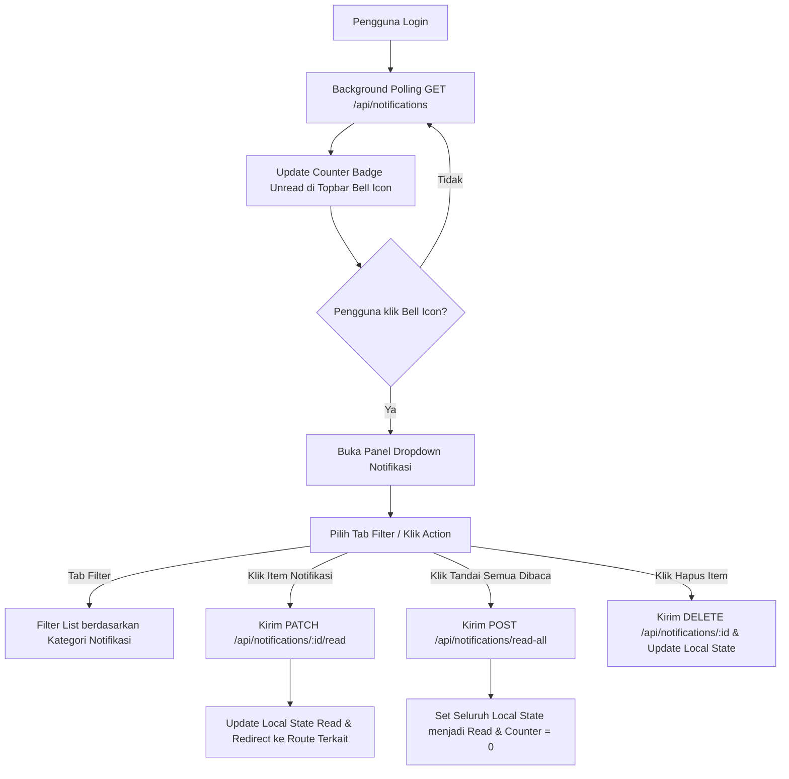
```mermaid
flowchart TD
    A[Pengguna Login] --> B[Background Polling GET /api/notifications]
    B --> C[Update Counter Badge Unread di Topbar Bell Icon]
    C --> D{Pengguna klik Bell Icon?}
    D -->|Tidak| B
    D -->|Ya| E[Buka Panel Dropdown Notifikasi]
    E --> F[Pilih Tab Filter / Klik Action]
    F -->|Tab Filter| G[Filter List berdasarkan Kategori Notifikasi]
    F -->|Klik Item Notifikasi| H[Kirim PATCH /api/notifications/:id/read]
    H --> I[Update Local State Read & Redirect ke Route Terkait]
    F -->|Klik Tandai Semua Dibaca| J[Kirim POST /api/notifications/read-all]
    J --> K[Set Seluruh Local State menjadi Read & Counter = 0]
    F -->|Klik Hapus Item| L[Kirim DELETE /api/notifications/:id & Update Local State]
```

---

## 6.5 UI Flow User Profile Dropdown & Modal Ganti Password

**Komponen:** Topbar User Profile Button, Dropdown Menu, & Modal Ganti Password  
**Endpoint API:** `GET /api/auth/me`, `POST /api/auth/change-password`, `POST /api/auth/logout`  
**Aktor:** Semua User (Kasir, Apoteker, Manager, Pemilik)

### Fitur & Komponen Utama
- **User Profile Trigger Button**: Berada di pojok kanan Topbar. Menampilkan avatar/inisial user, nama lengkap user, dan badge Role (`KASIR`, `APOTEKER`, `MANAGER`, `PEMILIK`).
- **Dropdown Menu Profile**:
  - Ringkasan User Info (Nama, Username, Role).
  - Opsi Menu:
    1. `Profil Saya` (Membuka drawer/modal info profil singkat).
    2. `Ganti Password` (Membuka Modal Form Ganti Password).
    3. `Logout` (Mengabaikan/mencabut sesi, menghapus token local/cookie, redirect ke `/login`).
- **Modal Form Ganti Password**:
  - Field Input:
    1. `Password Saat Ini` (Input Password, wajib).
    2. `Password Baru` (Input Password, wajib, min 6/8 karakter).
    3. `Konfirmasi Password Baru` (Input Password, wajib, harus persis sama dengan Password Baru).
  - Validasi UI:
    - Password saat ini tidak boleh kosong.
    - Password baru tidak boleh sama dengan password saat ini.
    - Konfirmasi password baru harus cocok.
    - Menampilkan error pesan dari backend jika password saat ini salah.
  - Aksi: Tombol "Batal" dan Tombol "Simpan Password" (dengan loading spinner saat submit).
  - Success State: Toast notifikasi "Password berhasil diperbarui."

### Flow Interaksi Profile & Ganti Password Modal

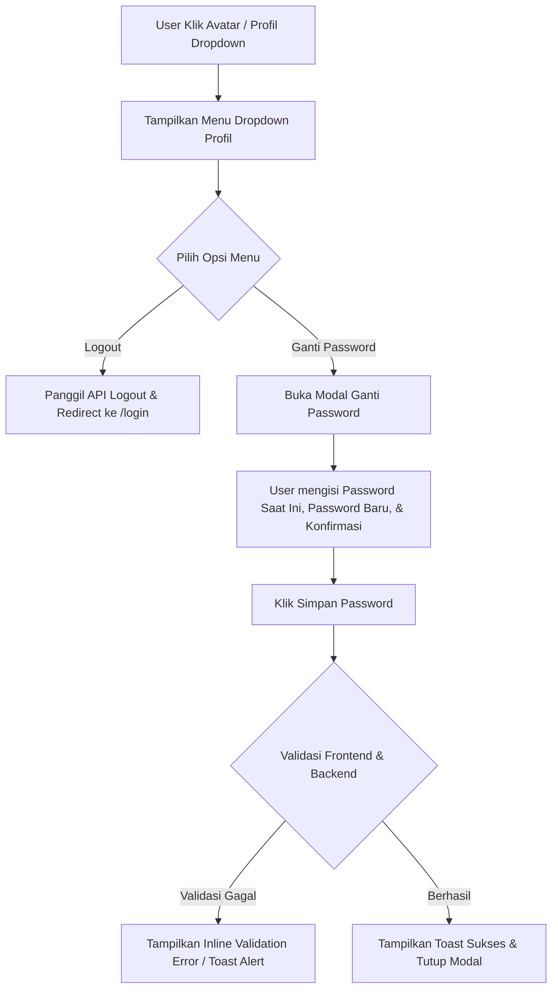
```mermaid
flowchart TD
    A[User Klik Avatar / Profil Dropdown] --> B[Tampilkan Menu Dropdown Profil]
    B --> C{Pilih Opsi Menu}
    C -->|Logout| D[Panggil API Logout & Redirect ke /login]
    C -->|Ganti Password| E[Buka Modal Ganti Password]
    E --> F[User mengisi Password Saat Ini, Password Baru, & Konfirmasi]
    F --> G[Klik Simpan Password]
    G --> H{Validasi Frontend & Backend}
    H -->|Validasi Gagal| I[Tampilkan Inline Validation Error / Toast Alert]
    H -->|Berhasil| J[Tampilkan Toast Sukses & Tutup Modal]
```

---

## 7. Komponen Global

| Komponen | Fungsi |
|---|---|
| AppShell | Layout utama aplikasi |
| Sidebar | Navigasi berdasarkan role |
| Topbar | Judul halaman, jam lokal, user aktif |
| Breadcrumb | Navigasi konteks jika halaman dalam |
| PageHeader | Judul, deskripsi, aksi utama |
| SearchInput | Pencarian data |
| FilterBar | Filter tanggal, kategori, status |
| DataTable | Tabel data desktop |
| CardList | Tampilan data mobile |
| Pagination | Navigasi halaman data |
| Modal | Konfirmasi atau form ringkas |
| Drawer | Sidebar mobile atau detail panel |
| Toast | Notifikasi sukses/error ringan |
| AlertBox | Peringatan penting |
| LoadingSkeleton | Loading state |
| EmptyState | Tampilan data kosong |
| ErrorState | Tampilan error |
| ConfirmDialog | Konfirmasi aksi berisiko |
| BadgeStatus | Status aktif, nonaktif, expired, stok rendah |
| DateRangePicker | Filter tanggal laporan |
| RoleGuard | Pembatas akses komponen berdasarkan role |

---

## 8. State Global UI

## 8.1 Loading State

Digunakan saat:
- login sedang diproses;
- data tabel dimuat;
- transaksi sedang disimpan;
- laporan sedang dibuat;
- file sedang diekspor.

Contoh teks:
```text
Memuat data...
Menyimpan transaksi...
Membuat laporan...
```

## 8.2 Empty State

Digunakan saat:
- daftar produk kosong;
- pencarian tidak menemukan hasil;
- belum ada transaksi;
- belum ada batch;
- laporan tidak memiliki data pada periode tertentu.

Format empty state:
```text
Judul: Data belum tersedia
Deskripsi: Belum ada data yang dapat ditampilkan.
Aksi: Tambah Data / Ubah Filter
```

## 8.3 Error State

Digunakan saat:
- validasi gagal;
- akses ditolak;
- server gagal;
- stok tidak cukup;
- data konflik.

Format error state:
```text
Judul: Proses gagal
Deskripsi: Jelaskan penyebab utama secara jelas.
Aksi: Coba Lagi / Kembali / Ubah Input
```

## 8.4 Success State

Digunakan saat:
- data berhasil disimpan;
- transaksi berhasil;
- retur berhasil;
- laporan berhasil diekspor.

Contoh:
```text
Transaksi berhasil disimpan.
Produk berhasil ditambahkan.
Retur berhasil diproses.
```

---

## 9. UI Flow Login

## 9.1 Halaman Login

**Route:** `/login`  
**Aktor:** Kasir, Manager, Pemilik  
**Referensi:** SRS-AUTH-001

### Komponen
- Logo atau nama apotek.
- Input username/email.
- Input password.
- Tombol login.
- Pesan error.
- Loading state saat login.

### Layout

```text
+--------------------------------------+
|              POS Apotek              |
|--------------------------------------|
| Username / Email                     |
| [____________________________]       |
| Password                             |
| [____________________________]       |
| [ Login ]                            |
|                                      |
| Error message area                   |
+--------------------------------------+
```

### Flow

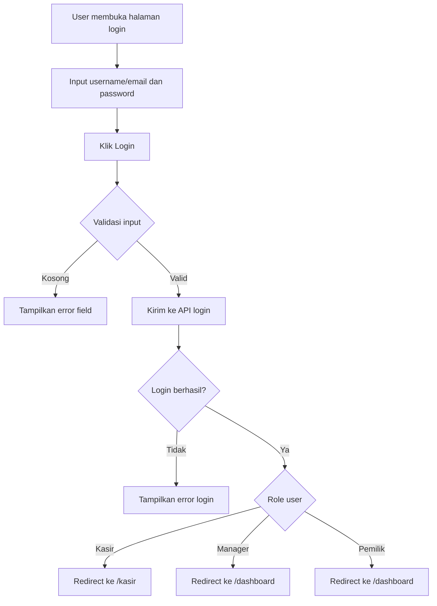
```mermaid
flowchart TD
    A[User membuka halaman login] --> B[Input username/email dan password]
    B --> C[Klik Login]
    C --> D{Validasi input}
    D -->|Kosong| E[Tampilkan error field]
    D -->|Valid| F[Kirim ke API login]
    F --> G{Login berhasil?}
    G -->|Tidak| H[Tampilkan error login]
    G -->|Ya| I{Role user}
    I -->|Kasir| J[Redirect ke /kasir]
    I -->|Manager| K[Redirect ke /dashboard]
    I -->|Pemilik| L[Redirect ke /dashboard]
```

### Validation UI
| Kondisi | Pesan |
|---|---|
| Username/email kosong | Username atau email wajib diisi |
| Password kosong | Password wajib diisi |
| Login gagal | Username/email atau password salah |
| Akun nonaktif | Akun pengguna tidak aktif |

### Acceptance Criteria UI
- Input terlihat jelas.
- Tombol login disabled saat proses login.
- Error ditampilkan di area yang mudah terlihat.
- Role menentukan halaman tujuan setelah login.

---

## 10. UI Flow Dashboard

## 10.1 Halaman Dashboard Manager

**Route:** `/dashboard`  
**Aktor:** Manager, Pemilik  
**Referensi:** SRS-DASH-001

### Komponen Utama
- Card omzet hari ini.
- Card laba hari ini.
- Card laba minggu ini.
- Card laba bulan ini.
- Card laba tahun ini.
- Card jumlah transaksi hari ini.
- Card stok kritis.
- Card batch mendekati expired.
- Daftar transaksi terbaru.
- Daftar produk stok rendah.
- Daftar batch mendekati expired.

### Layout Desktop

```text
+------------------------------------------------------------------+
| Dashboard                                                        |
| Ringkasan operasional apotek                                     |
+----------------+----------------+----------------+---------------+
| Omzet Hari Ini | Laba Hari Ini  | Transaksi Hari | Stok Kritis   |
+----------------+----------------+----------------+---------------+
| Laba Minggu    | Laba Bulan     | Laba Tahun     | Expired Alert |
+----------------+----------------+----------------+---------------+
| Transaksi Terbaru                 | Stok Kritis                   |
+-----------------------------------+------------------------------+
| Batch Mendekati Expired                                          |
+------------------------------------------------------------------+
```

### Flow

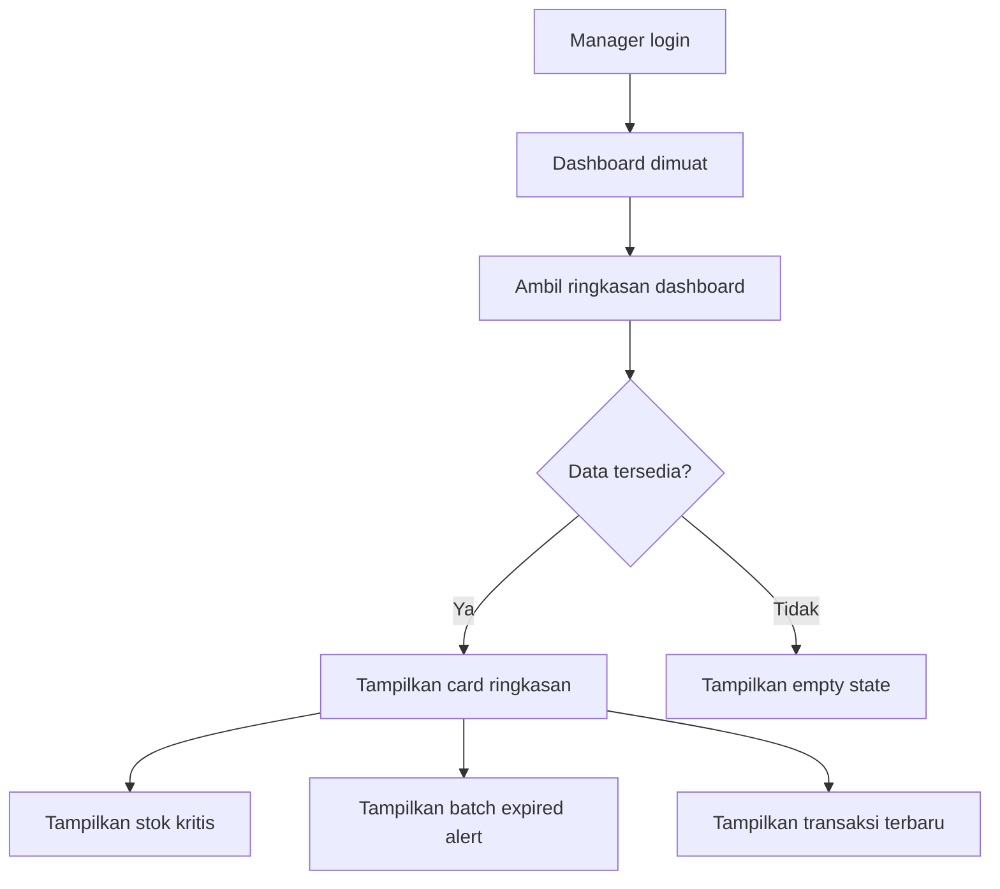
```mermaid
flowchart TD
    A[Manager login] --> B[Dashboard dimuat]
    B --> C[Ambil ringkasan dashboard]
    C --> D{Data tersedia?}
    D -->|Ya| E[Tampilkan card ringkasan]
    D -->|Tidak| F[Tampilkan empty state]
    E --> G[Tampilkan stok kritis]
    E --> H[Tampilkan batch expired alert]
    E --> I[Tampilkan transaksi terbaru]
```

### Rules
- Kasir tidak boleh melihat laba.
- Jika kasir diarahkan ke dashboard terbatas, hilangkan card laba dan HPP.
- Semua nilai uang diformat Rupiah.
- Periode waktu mengikuti zona Asia/Makassar untuk tampilan.

### Empty State
```text
Belum ada transaksi hari ini.
Transaksi terbaru akan muncul setelah kasir menyimpan penjualan.
```

### Error State
```text
Dashboard gagal dimuat.
Coba muat ulang halaman.
```

---

## 11. UI Flow Halaman Kasir

## 11.1 Halaman Kasir

**Route:** `/kasir`  
**Aktor:** Kasir, Manager  
**Referensi:** SRS-SALE-001 sampai SRS-SALE-006

### Tujuan
Halaman kasir harus memungkinkan transaksi normal selesai dalam satu halaman.

### Komponen Utama
- Jam realtime lokal.
- Search produk.
- Filter kategori cepat.
- Daftar hasil pencarian produk.
- Detail produk terpilih.
- Pilihan satuan jual.
- Input qty.
- Tombol tambah ke keranjang.
- Keranjang transaksi.
- Diskon transaksi.
- Metode pembayaran.
- Uang diterima.
- Kembalian.
- Tombol simpan transaksi.
- Tombol reset/batal transaksi.
- Notifikasi stok tidak cukup.
- Modal sukses transaksi.

### Layout Desktop

```text
+--------------------------------------------------------------------------------+
| Kasir | Jam Lokal | Kasir Aktif                                                 |
+---------------------------------------+----------------------------------------+
| Search Produk                         | Keranjang Transaksi                    |
| [Cari nama/kode/barcode...]           |----------------------------------------|
| Filter Kategori                       | Produk | Qty | Satuan | Harga | Aksi   |
|---------------------------------------|----------------------------------------|
| Daftar Produk                         | Subtotal                               |
| - Produk A                            | Diskon                                 |
| - Produk B                            | Total                                  |
| - Produk C                            | Metode Pembayaran                      |
|                                       | Uang Diterima                          |
| Detail Produk Terpilih                | Kembalian                              |
| Satuan | Qty | Tambah                 | [Simpan Transaksi] [Reset]             |
+---------------------------------------+----------------------------------------+
```

### Layout Mobile

```text
+--------------------------------------+
| Kasir | Jam                          |
+--------------------------------------+
| Search Produk                        |
| Daftar Produk / Card                 |
| Detail Produk + Tambah               |
| Keranjang                            |
| Pembayaran                           |
| [Simpan Transaksi]                   |
+--------------------------------------+
```

---

## 11.2 Flow Pencarian Produk Kasir

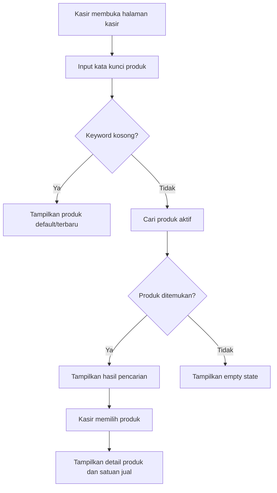
```mermaid
flowchart TD
    A[Kasir membuka halaman kasir] --> B[Input kata kunci produk]
    B --> C{Keyword kosong?}
    C -->|Ya| D[Tampilkan produk default/terbaru]
    C -->|Tidak| E[Cari produk aktif]
    E --> F{Produk ditemukan?}
    F -->|Ya| G[Tampilkan hasil pencarian]
    F -->|Tidak| H[Tampilkan empty state]
    G --> I[Kasir memilih produk]
    I --> J[Tampilkan detail produk dan satuan jual]
```

### Search Behavior
- Pencarian mendukung nama produk.
- Pencarian mendukung kode produk.
- Pencarian mendukung barcode sebagai input keyboard.
- Pencarian mendukung nama generik jika tersedia.
- Gunakan debounce agar tidak memanggil API terlalu sering.
- Produk nonaktif tidak boleh muncul untuk transaksi baru.
- Produk tanpa stok boleh muncul dengan badge `Stok Habis`, tetapi tidak dapat ditambahkan.

### Empty State Pencarian
```text
Produk tidak ditemukan.
Periksa kembali nama, kode, atau barcode produk.
```

---

## 11.3 Flow Tambah Produk ke Keranjang

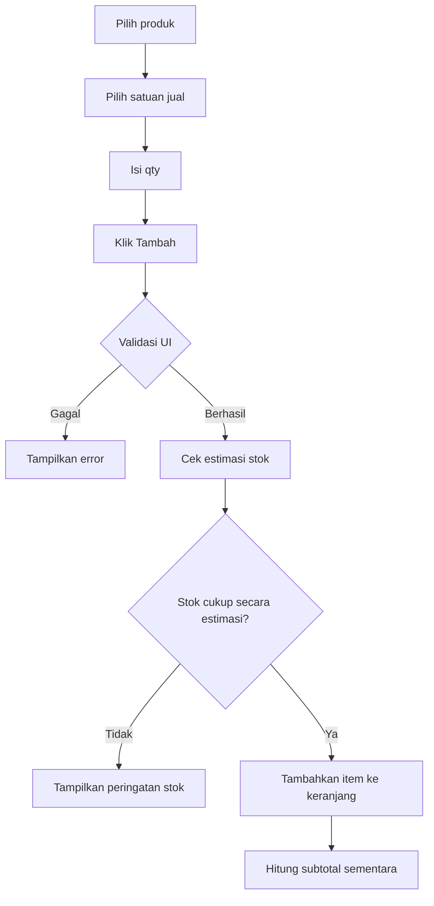
```mermaid
flowchart TD
    A[Pilih produk] --> B[Pilih satuan jual]
    B --> C[Isi qty]
    C --> D[Klik Tambah]
    D --> E{Validasi UI}
    E -->|Gagal| F[Tampilkan error]
    E -->|Berhasil| G[Cek estimasi stok]
    G --> H{Stok cukup secara estimasi?}
    H -->|Tidak| I[Tampilkan peringatan stok]
    H -->|Ya| J[Tambahkan item ke keranjang]
    J --> K[Hitung subtotal sementara]
```

### Validation UI
| Kondisi | Pesan |
|---|---|
| Produk belum dipilih | Pilih produk terlebih dahulu |
| Satuan belum dipilih | Pilih satuan jual |
| Qty kosong | Qty wajib diisi |
| Qty <= 0 | Qty harus lebih besar dari 0 |
| Estimasi stok tidak cukup | Stok produk tidak mencukupi |

### Catatan Penting
- Validasi UI hanya validasi awal.
- Validasi final tetap dilakukan backend saat simpan transaksi.
- Keranjang belum mengurangi stok.

---

## 11.4 Flow Ubah Keranjang

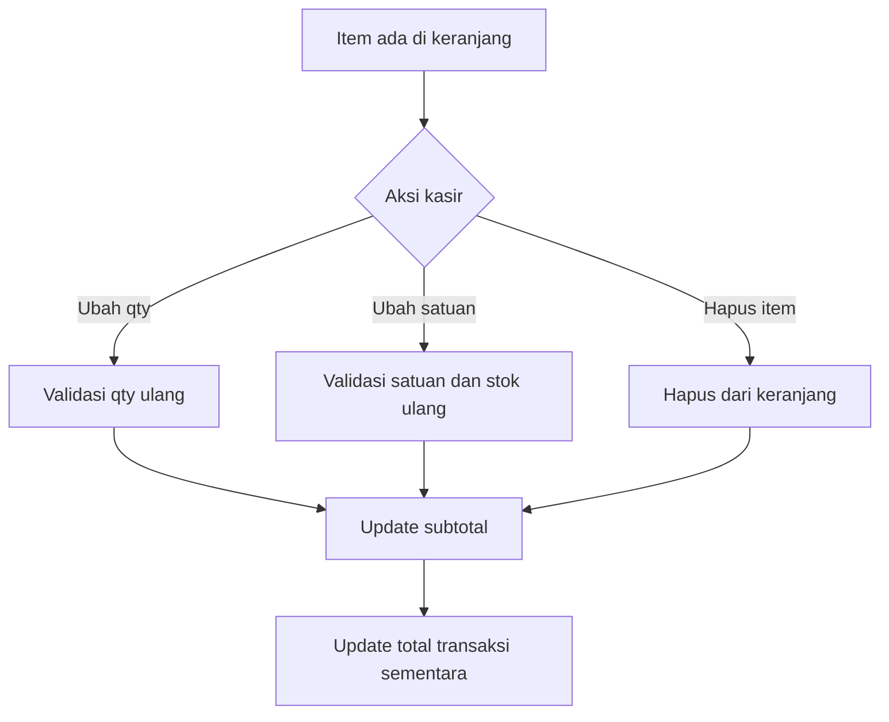
```mermaid
flowchart TD
    A[Item ada di keranjang] --> B{Aksi kasir}
    B -->|Ubah qty| C[Validasi qty ulang]
    B -->|Ubah satuan| D[Validasi satuan dan stok ulang]
    B -->|Hapus item| E[Hapus dari keranjang]
    C --> F[Update subtotal]
    D --> F
    E --> F
    F --> G[Update total transaksi sementara]
```

### Rules
- Item dapat dihapus sebelum transaksi disimpan.
- Qty dapat diubah sebelum transaksi disimpan.
- Satuan dapat diubah sebelum transaksi disimpan.
- Setelah transaksi final, perubahan harus melalui retur, bukan edit transaksi diam-diam.

---

## 11.5 Flow Pembayaran

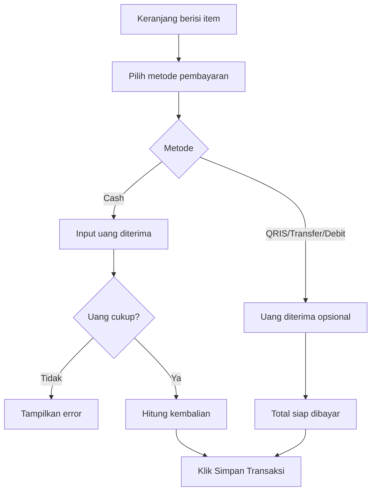
```mermaid
flowchart TD
    A[Keranjang berisi item] --> B[Pilih metode pembayaran]
    B --> C{Metode}
    C -->|Cash| D[Input uang diterima]
    C -->|QRIS/Transfer/Debit| E[Uang diterima opsional]
    D --> F{Uang cukup?}
    F -->|Tidak| G[Tampilkan error]
    F -->|Ya| H[Hitung kembalian]
    E --> I[Total siap dibayar]
    H --> J[Klik Simpan Transaksi]
    I --> J
```

### Payment UI
| Field | Kondisi |
|---|---|
| Metode pembayaran | Wajib |
| Uang diterima | Wajib untuk cash |
| Kembalian | Muncul untuk cash |
| Tombol simpan | Disabled jika keranjang kosong atau cash kurang |

### Pesan Error
```text
Nominal pembayaran belum mencukupi.
```

---

## 11.6 Flow Simpan Transaksi

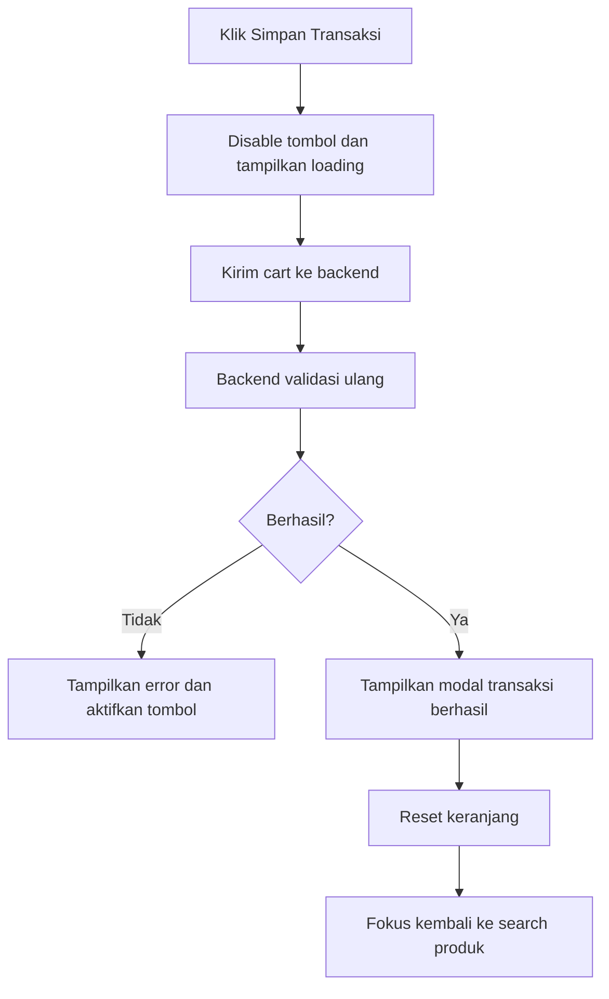
```mermaid
flowchart TD
    A[Klik Simpan Transaksi] --> B[Disable tombol dan tampilkan loading]
    B --> C[Kirim cart ke backend]
    C --> D[Backend validasi ulang]
    D --> E{Berhasil?}
    E -->|Tidak| F[Tampilkan error dan aktifkan tombol]
    E -->|Ya| G[Tampilkan modal transaksi berhasil]
    G --> H[Reset keranjang]
    H --> I[Fokus kembali ke search produk]
```

### Modal Sukses Transaksi
Isi minimal:
- nomor transaksi;
- total;
- uang diterima;
- kembalian;
- metode pembayaran;
- tombol transaksi baru;
- tombol lihat detail;
- tombol cetak/simpan struk jika fitur tersedia.

### Error yang Mungkin Muncul
| Kondisi | Pesan |
|---|---|
| Stok berubah saat submit | Stok produk berubah. Periksa ulang keranjang. |
| Stok tidak cukup | Stok produk tidak mencukupi. |
| Batch valid tidak tersedia | Batch aktif yang dapat dijual tidak tersedia. |
| Diskon tidak valid | Diskon tidak boleh melebihi subtotal. |
| Server error | Transaksi gagal disimpan. Coba ulangi. |
| Sesi habis | Sesi login berakhir. Silakan login ulang. |
| Request sudah diproses | Transaksi sudah diproses. Muat ulang detail transaksi. |

### Acceptance Criteria UI
- Kasir dapat menyelesaikan transaksi dari satu halaman.
- Tombol submit tidak bisa diklik berulang saat loading.
- Frontend mengirim `idempotencyKey` unik saat checkout.
- Jika request timeout, frontend tidak membuat transaksi baru dengan key berbeda sebelum status transaksi dikonfirmasi.
- Setelah sukses, keranjang kosong.
- Fokus input kembali ke pencarian produk.

### Aturan Idempotency Checkout

```text
1. Frontend membuat idempotencyKey ketika user menekan Simpan Transaksi.
2. Tombol submit langsung disabled selama request berjalan.
3. Jika request berhasil, key dianggap selesai dan keranjang direset.
4. Jika request gagal karena validasi, key boleh dibuang setelah user memperbaiki input.
5. Jika request timeout atau jaringan gagal, frontend harus mencoba membaca status transaksi atau mengulang request dengan idempotencyKey yang sama.
6. Backend wajib menolak pembuatan transaksi ganda dari idempotencyKey yang sama.
```

Idempotency bukan hiasan teknis. Tanpa ini, satu klik gugup dari kasir bisa berubah menjadi dua transaksi. Teknologi memang gemar mengubah kepanikan kecil menjadi laporan keuangan aneh.

---

## 12. UI Flow Produk

## 12.1 Daftar Produk

**Route:** `/produk`  
**Aktor:** Manager  
**Referensi:** SRS-PROD-001 sampai SRS-PROD-004

### Komponen
- Page header.
- Tombol tambah produk.
- Search produk.
- Filter kategori.
- Filter status aktif/nonaktif.
- Tabel produk.
- Badge stok rendah.
- Badge aktif/nonaktif.
- Aksi edit, detail, nonaktifkan/aktifkan.

### Layout

```text
+------------------------------------------------------------------+
| Produk                                             [Tambah Produk]|
| Kelola data produk obat dan barang apotek                         |
+------------------------------------------------------------------+
| Search | Filter Kategori | Filter Status                          |
+------------------------------------------------------------------+
| Kode | Nama | Kategori | Satuan Dasar | Stok | Status | Aksi      |
+------------------------------------------------------------------+
```

### Flow

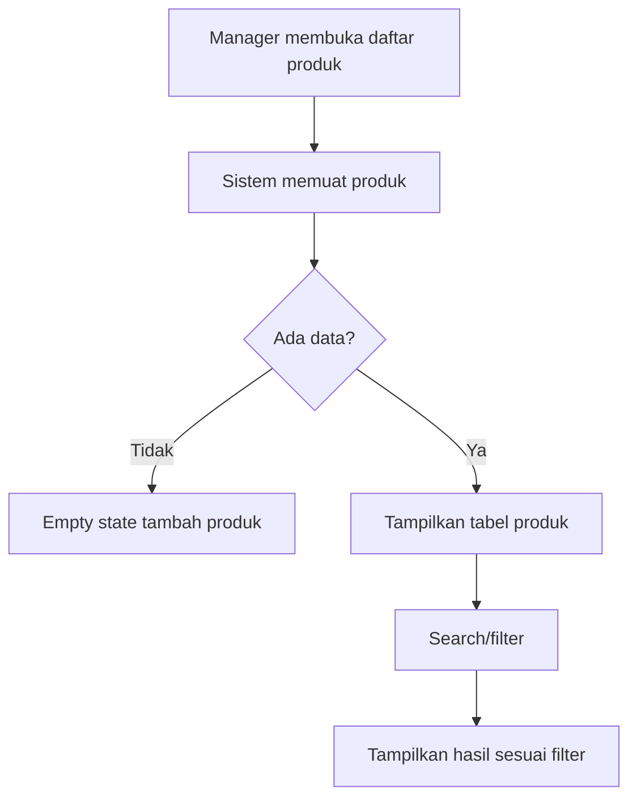
```mermaid
flowchart TD
    A[Manager membuka daftar produk] --> B[Sistem memuat produk]
    B --> C{Ada data?}
    C -->|Tidak| D[Empty state tambah produk]
    C -->|Ya| E[Tampilkan tabel produk]
    E --> F[Search/filter]
    F --> G[Tampilkan hasil sesuai filter]
```

### Empty State
```text
Belum ada produk.
Tambahkan produk pertama agar dapat digunakan pada pembelian dan transaksi.
```

---

## 12.2 Form Tambah/Edit Produk

**Route:** `/produk/tambah`, `/produk/:id/edit`

### Field
| Field | Tipe UI | Wajib |
|---|---|---:|
| Kode produk | Text input | Ya |
| Barcode | Text input | Tidak |
| Nama produk | Text input | Ya |
| Nama generik | Text input | Tidak |
| Kategori | Select/searchable select | Ya |
| Satuan dasar | Select | Ya |
| Stok minimum | Number input | Ya |
| Deskripsi | Textarea | Tidak |
| Status aktif | Toggle | Ya |

### Flow Tambah Produk

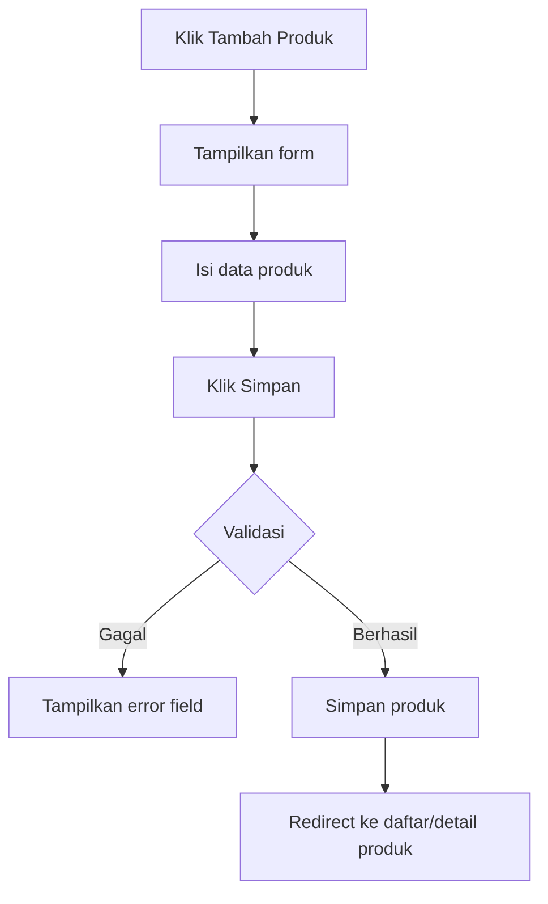
```mermaid
flowchart TD
    A[Klik Tambah Produk] --> B[Tampilkan form]
    B --> C[Isi data produk]
    C --> D[Klik Simpan]
    D --> E{Validasi}
    E -->|Gagal| F[Tampilkan error field]
    E -->|Berhasil| G[Simpan produk]
    G --> H[Redirect ke daftar/detail produk]
```

### Error Field
| Kondisi | Pesan |
|---|---|
| Kode kosong | Kode produk wajib diisi |
| Kode duplikat | Kode produk sudah digunakan |
| Nama kosong | Nama produk wajib diisi |
| Kategori kosong | Kategori wajib dipilih |
| Satuan dasar kosong | Satuan dasar wajib dipilih |
| Stok minimum negatif | Stok minimum tidak boleh negatif |

---

## 13. UI Flow Kategori

## 13.1 Tree View Manajemen Kategori

**Route:** `/kategori`  
**Aktor:** Manager  
**Referensi:** SRS-CAT-001, SDD Kategori Tree

### Fitur & Komponen Utama
- **Header**: Judul "Manajemen Kategori", tombol "+ Tambah Kategori Root", search input filter nama/kode kategori.
- **Visual Tree View Container**:
  - **Visual Indentation**: Indentasi bertingkat horizontal yang jelas sesuai dengan level hirarki:
    - Level 1 (Root Kategori): Tanpa indentasi, badge `Root` / `Level 1`.
    - Level 2 (Sub-kategori): Indentasi 24px ke kanan, badge `Sub-kategori` / `Level 2`.
    - Level 3 (Sub-sub-kategori): Indentasi 48px ke kanan, badge `Sub-sub` / `Level 3`.
  - **Toggle Expand / Collapse**: Tombol ikon indikator (`▶` tersimpan/collapse, `▼` terbuka/expanded) pada setiap parent node yang memiliki child category.
  - **Node Content**: Nama Kategori, Slug/Kode, Jumlah Produk Terikat, Status Aktif/Nonaktif.
  - **Aksi Node**:
    - Tombol `+ Sub-kategori` (hanya aktif jika level node saat ini < 3).
    - Tombol `Edit` (membuka modal edit kategori).
    - Tombol `Nonaktifkan / Aktifkan`.
    - Tombol `Hapus` (memicu pengecekan proteksi hapus parent).
- **Modal Form Tambah / Edit Kategori**:
  - Field Nama Kategori (Input Text, wajib, unik per parent).
  - Field Slug / Kode (Opsional / Auto-generated).
  - Dropdown **Parent Selector** (Visual Parent Selection):
    - Opsi teratas: `Tanpa Parent (Root / Utama)`.
    - Daftar Kategori terurut dengan visual indentasi (menampilkan kategori level 1 dan level 2 saja sebagai opsi parent).
    - **Proteksi Dropdown**: Kategori level 3 disembunyikan/disabled dari pilihan parent agar kedalaman tidak melebihi maks 3 level. Kategori yang sedang di-edit serta seluruh descendant-nya disembunyikan untuk mencegah circular parent loop.
  - Radio/Switch Status Aktif.
- **Modal Alert Proteksi Hapus Parent Category**:
  - Peringatan khusus jika Manager mencoba menghapus kategori yang masih memiliki child category atau terikat pada produk:
    ```text
    Kategori tidak dapat dihapus!
    Kategori ini masih memiliki 2 sub-kategori dan 5 produk terikat.
    Silakan pindahkan atau hapus sub-kategori dan produk terlebih dahulu.
    ```

### Flow Interaksi Kategori Tree View

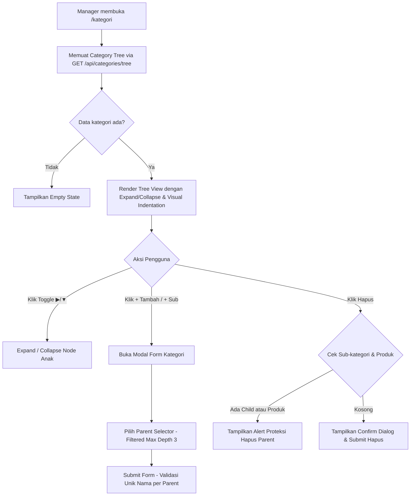
```mermaid
flowchart TD
    A[Manager membuka /kategori] --> B[Memuat Category Tree via GET /api/categories/tree]
    B --> C{Data kategori ada?}
    C -->|Tidak| D[Tampilkan Empty State]
    C -->|Ya| E[Render Tree View dengan Expand/Collapse & Visual Indentation]
    E --> F{Aksi Pengguna}
    F -->|Klik Toggle ▶/▼| G[Expand / Collapse Node Anak]
    F -->|Klik + Tambah / + Sub| H[Buka Modal Form Kategori]
    H --> I[Pilih Parent Selector - Filtered Max Depth 3]
    I --> J[Submit Form - Validasi Unik Nama per Parent]
    F -->|Klik Hapus| K{Cek Sub-kategori & Produk}
    K -->|Ada Child atau Produk| L[Tampilkan Alert Proteksi Hapus Parent]
    K -->|Kosong| M[Tampilkan Confirm Dialog & Submit Hapus]
```

### Validation UI
| Kondisi | Pesan |
|---|---|
| Nama kategori kosong | Nama kategori wajib diisi |
| Nama duplikat pada parent sama | Nama kategori sudah digunakan pada level parent ini |
| Kedalaman > 3 level | Kategori tidak boleh melebihi 3 level hirarki |
| Hapus parent dengan child/produk | Kategori masih memiliki sub-kategori atau produk terikat |

### Empty State
```text
Belum ada kategori.
Klik tombol "+ Tambah Kategori Root" untuk membuat kategori utama apotek.
```

---

## 14. UI Flow Supplier

## 14.1 Daftar Supplier

**Route:** `/supplier`  
**Aktor:** Manager  
**Referensi:** SRS-SUP-001

### Komponen
- Search supplier.
- Tombol tambah supplier.
- Tabel supplier.
- Status aktif/nonaktif.
- Aksi edit dan nonaktifkan.

### Field Form Supplier
| Field | Wajib |
|---|---:|
| Nama supplier | Ya |
| Nomor telepon | Tidak |
| Alamat | Tidak |
| Kontak person | Tidak |
| Status aktif | Ya |

### Empty State
```text
Belum ada supplier.
Tambahkan supplier agar pembelian dapat dicatat.
```

---

## 15. UI Flow Satuan dan Konversi

## 15.1 Halaman Master Satuan

**Route:** `/satuan`  
**Aktor:** Manager  
**Referensi:** SRS-UNIT-001, SRS-UNIT-002

### Komponen
- Daftar satuan umum.
- Form tambah satuan.
- Status aktif/nonaktif.
- Aksi edit.

### Flow Master Satuan

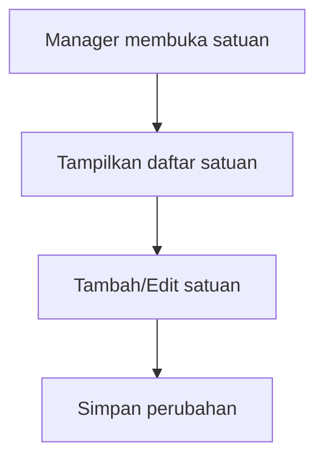
```mermaid
flowchart TD
    A[Manager membuka satuan] --> B[Tampilkan daftar satuan]
    B --> C[Tambah/Edit satuan]
    C --> D[Simpan perubahan]
```

---

## 15.2 Konversi Satuan Produk

Konversi satuan dapat ditempatkan pada:
- tab detail produk; atau
- halaman khusus `/produk/:id/satuan`.

### Komponen
- Informasi produk.
- Satuan dasar.
- Daftar satuan jual.
- Form tambah satuan jual.
- Input faktor konversi.
- Toggle default satuan jual.

### Layout

```text
+---------------------------------------------------+
| Produk: Paracetamol 500mg                         |
| Satuan Dasar: tablet                              |
+---------------------------------------------------+
| Satuan Jual | Konversi ke Tablet | Default | Aksi |
| tablet      | 1                  | Ya      | Edit |
| strip       | 10                 | Tidak   | Edit |
| box         | 100                | Tidak   | Edit |
+---------------------------------------------------+
| [Tambah Satuan Jual]                              |
+---------------------------------------------------+
```

### Validation UI
| Kondisi | Pesan |
|---|---|
| Satuan kosong | Satuan jual wajib dipilih |
| Konversi kosong | Faktor konversi wajib diisi |
| Konversi <= 0 | Faktor konversi harus lebih besar dari 0 |
| Duplikat satuan | Satuan jual sudah digunakan pada produk ini |

---

## 16. UI Flow Batch Obat

## 16.1 Daftar Batch

**Route:** `/batch`  
**Aktor:** Manager  
**Referensi:** SRS-BATCH-001 sampai SRS-BATCH-003

### Komponen
- Search produk/batch.
- Filter produk.
- Filter status batch.
- Filter expired.
- Tabel batch.
- Badge aktif, habis, expired, mendekati expired.
- Aksi detail dan ubah status.

### Layout

```text
+--------------------------------------------------------------------------------+
| Batch Obat                                                                      |
+--------------------------------------------------------------------------------+
| Search | Produk | Status | Expired dalam |                                      |
+--------------------------------------------------------------------------------+
| Produk | Batch | Expired | Stok | HPP | Harga Jual | Status | Aksi              |
+--------------------------------------------------------------------------------+
```

### Catatan Role
- Manager dapat melihat HPP.
- Manager mengisi harga jual per satuan sebagai rupiah bulat manual.
- Harga modal/HPP Manager dapat berpresisi tinggi sesuai aturan backend.
- Kasir tidak boleh melihat halaman batch penuh.
- Kasir hanya boleh melihat stok tersedia yang relevan untuk transaksi.

---

## 16.2 Detail Batch

**Route:** `/batch/:id`

### Komponen
- Informasi produk.
- Nomor batch.
- Expired date.
- Stok awal.
- Stok saat ini.
- HPP.
- Harga jual per satuan.
- Riwayat mutasi batch.
- Status batch.

### Flow

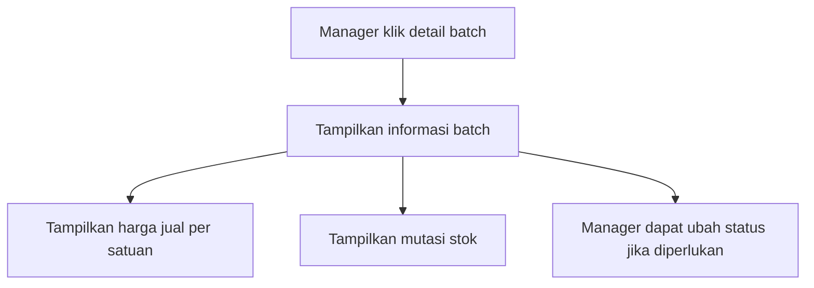
```mermaid
flowchart TD
    A[Manager klik detail batch] --> B[Tampilkan informasi batch]
    B --> C[Tampilkan harga jual per satuan]
    B --> D[Tampilkan mutasi stok]
    B --> E[Manager dapat ubah status jika diperlukan]
```

---

## 17. UI Flow Pembelian Supplier

## 17.1 Daftar Pembelian

**Route:** `/pembelian`  
**Aktor:** Manager  
**Referensi:** SRS-PUR-001, SRS-PUR-002

### Komponen
- Filter tanggal.
- Filter supplier.
- Search nomor pembelian/invoice.
- Tombol tambah pembelian.
- Tabel pembelian.
- Aksi detail.

### Empty State
```text
Belum ada pembelian.
Catat pembelian supplier agar stok batch dapat bertambah.
```

---

## 17.2 Form Pembelian

**Route:** `/pembelian/tambah`

### Komponen
- Pilih supplier.
- Tanggal pembelian.
- Nomor invoice opsional.
- Item pembelian dinamis.
- Pilih produk.
- Pilih satuan pembelian.
- Qty pembelian.
- Harga beli.
- Nomor batch.
- Expired date.
- Harga jual per satuan.
- Ringkasan subtotal.
- Tombol simpan.

### Layout

```text
+--------------------------------------------------------------------------+
| Pembelian Baru                                                           |
+--------------------------------------------------------------------------+
| Supplier | Tanggal | Nomor Invoice                                       |
+--------------------------------------------------------------------------+
| Item Pembelian                                                           |
| Produk | Satuan | Qty | Harga Beli | Batch | Expired | Harga Jual | Aksi |
+--------------------------------------------------------------------------+
| [Tambah Item]                                                            |
+--------------------------------------------------------------------------+
| Subtotal Pembelian                                             [Simpan]  |
+--------------------------------------------------------------------------+
```

### Flow Pembelian

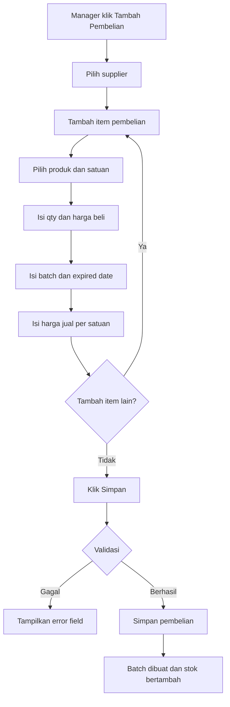
```mermaid
flowchart TD
    A[Manager klik Tambah Pembelian] --> B[Pilih supplier]
    B --> C[Tambah item pembelian]
    C --> D[Pilih produk dan satuan]
    D --> E[Isi qty dan harga beli]
    E --> F[Isi batch dan expired date]
    F --> G[Isi harga jual per satuan]
    G --> H{Tambah item lain?}
    H -->|Ya| C
    H -->|Tidak| I[Klik Simpan]
    I --> J{Validasi}
    J -->|Gagal| K[Tampilkan error field]
    J -->|Berhasil| L[Simpan pembelian]
    L --> M[Batch dibuat dan stok bertambah]
```

Harga beli/harga modal pada form Manager boleh menerima presisi desimal tinggi. Harga jual per satuan tetap diinput sebagai Rupiah bulat karena menjadi harga final pelanggan.

### Error Field
| Kondisi | Pesan |
|---|---|
| Supplier kosong | Supplier wajib dipilih |
| Item kosong | Minimal satu item pembelian wajib diisi |
| Produk kosong | Produk wajib dipilih |
| Qty <= 0 | Qty pembelian harus lebih besar dari 0 |
| Harga beli negatif | Harga beli tidak boleh negatif |
| Nomor batch kosong | Nomor batch wajib diisi |
| Expired kosong | Tanggal kedaluwarsa wajib diisi |
| Satuan tidak valid | Satuan pembelian tidak valid |

### Success State
```text
Pembelian berhasil disimpan.
Batch baru telah dibuat dan stok bertambah.
```

### Aturan Idempotency Pembelian
- Frontend mengirim `idempotencyKey` saat menyimpan pembelian final.
- Tombol simpan disabled selama proses berjalan.
- Jika request timeout, frontend tidak boleh membuat pembelian baru dengan key berbeda sebelum status pembelian dikonfirmasi.
- Backend wajib memastikan satu pembelian tidak tercatat ganda akibat retry.

---

## 18. UI Flow Riwayat Transaksi

## 18.1 Daftar Transaksi

**Route:** `/riwayat-transaksi`  
**Aktor:** Manager, Kasir terbatas  
**Referensi:** SRS-SALE-005

### Komponen
- Filter tanggal.
- Filter metode pembayaran.
- Filter kasir untuk Manager.
- Search nomor transaksi.
- Tabel transaksi.
- Aksi detail.

### Role Display
| Field | Kasir | Manager |
|---|---:|---:|
| Nomor transaksi | Ya | Ya |
| Waktu transaksi | Ya | Ya |
| Total | Ya | Ya |
| Metode pembayaran | Ya | Ya |
| Kasir | Tidak wajib | Ya |
| HPP | Tidak | Ya |
| Laba | Tidak | Ya |

---

## 18.2 Detail Transaksi

**Route:** `/riwayat-transaksi/:id`

### Komponen
- Nomor transaksi.
- Waktu transaksi.
- Kasir.
- Metode pembayaran.
- Item transaksi.
- Total pembayaran.
- Detail batch untuk Manager.
- Tombol retur jika item masih bisa diretur.

### Role Rules
- Kasir dapat melihat detail transaksi yang dibutuhkan untuk retur.
- Kasir tidak melihat HPP dan laba.
- Manager dapat melihat detail batch, HPP, dan laba.

---

## 19. UI Flow Retur Penjualan

## 19.1 Halaman Retur Penjualan

**Route:** `/retur-penjualan` atau `/riwayat-transaksi/:id/retur`  
**Aktor:** Kasir, Manager  
**Referensi:** SRS-RETSALE-001

### Komponen
- Search transaksi asal.
- Informasi transaksi.
- Daftar item yang dapat diretur.
- Input qty retur.
- Alasan retur.
- Ringkasan refund.
- Tombol proses retur.

### Flow

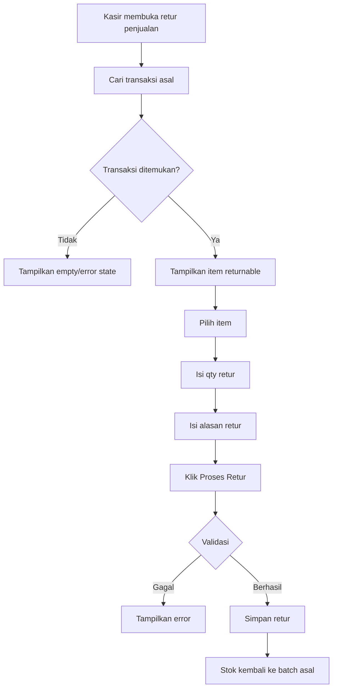
```mermaid
flowchart TD
    A[Kasir membuka retur penjualan] --> B[Cari transaksi asal]
    B --> C{Transaksi ditemukan?}
    C -->|Tidak| D[Tampilkan empty/error state]
    C -->|Ya| E[Tampilkan item returnable]
    E --> F[Pilih item]
    F --> G[Isi qty retur]
    G --> H[Isi alasan retur]
    H --> I[Klik Proses Retur]
    I --> J{Validasi}
    J -->|Gagal| K[Tampilkan error]
    J -->|Berhasil| L[Simpan retur]
    L --> M[Stok kembali ke batch asal]
```

### Validation UI
| Kondisi | Pesan |
|---|---|
| Transaksi tidak ditemukan | Transaksi tidak ditemukan |
| Item belum dipilih | Pilih item yang akan diretur |
| Qty <= 0 | Qty retur harus lebih besar dari 0 |
| Qty melebihi sisa | Qty retur melebihi jumlah yang dapat diretur |
| Alasan kosong | Alasan retur wajib diisi |

### Aturan Idempotency Retur Penjualan
- Frontend mengirim `idempotencyKey` saat proses retur dikirim.
- Retur yang sama tidak boleh tercatat dua kali akibat double click atau retry.
- Jika request timeout, frontend harus mengulang dengan idempotencyKey yang sama atau meminta status retur dari backend.

### Success State
```text
Retur penjualan berhasil diproses.
Stok telah dikembalikan ke batch asal.
```

---

## 20. UI Flow Retur Pembelian

## 20.1 Halaman Retur Pembelian

**Route:** `/retur-pembelian`  
**Aktor:** Manager  
**Referensi:** SRS-RETPUR-001

### Komponen
- Search pembelian atau batch.
- Pilih supplier.
- Pilih batch.
- Input qty retur.
- Alasan retur.
- Ringkasan nilai retur.
- Tombol proses retur.

### Flow

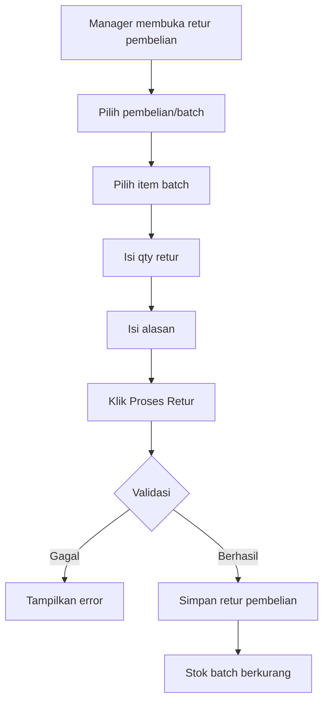
```mermaid
flowchart TD
    A[Manager membuka retur pembelian] --> B[Pilih pembelian/batch]
    B --> C[Pilih item batch]
    C --> D[Isi qty retur]
    D --> E[Isi alasan]
    E --> F[Klik Proses Retur]
    F --> G{Validasi}
    G -->|Gagal| H[Tampilkan error]
    G -->|Berhasil| I[Simpan retur pembelian]
    I --> J[Stok batch berkurang]
```

### Validation UI
| Kondisi | Pesan |
|---|---|
| Batch kosong | Batch wajib dipilih |
| Qty <= 0 | Qty retur harus lebih besar dari 0 |
| Qty melebihi stok | Qty retur melebihi stok batch tersedia |
| Alasan kosong | Alasan retur wajib diisi |

### Aturan Idempotency Retur Pembelian
- Frontend mengirim `idempotencyKey` saat retur pembelian diproses.
- Retur pembelian tidak boleh membuat stok batch berkurang dua kali akibat retry.
- Tombol proses retur wajib disabled selama request berjalan.

---

## 21. UI Flow Stok dan Mutasi

## 21.1 Daftar Stok

**Route:** `/stok`  
**Aktor:** Manager, Kasir terbatas  
**Referensi:** SRS-STOCK-001

### Komponen
- Search produk.
- Filter kategori.
- Filter stok rendah.
- Filter expired.
- Tabel stok.
- Aksi lihat batch.
- Aksi koreksi stok untuk Manager.

### Layout

```text
+------------------------------------------------------------------+
| Stok Produk                                                       |
+------------------------------------------------------------------+
| Search | Kategori | Status Stok | Expired                         |
+------------------------------------------------------------------+
| Produk | Kategori | Total Stok | Stok Minimum | Status | Aksi      |
+------------------------------------------------------------------+
```

### Role Rules
- Kasir hanya melihat stok tersedia.
- Manager dapat melihat stok per batch dan mutasi.
- Kasir tidak bisa koreksi stok.

---

## 21.2 Mutasi Stok

**Route:** `/mutasi-stok`  
**Aktor:** Manager  
**Referensi:** SRS-STOCK-002

### Komponen
- Filter tanggal.
- Filter produk.
- Filter batch.
- Filter tipe mutasi.
- Tabel mutasi.

### Field Tabel
| Field |
|---|
| Waktu |
| Produk |
| Batch |
| Tipe mutasi |
| Qty sebelum |
| Perubahan |
| Qty sesudah |
| Referensi |
| User |
| Alasan |

### Empty State
```text
Belum ada mutasi stok pada filter ini.
```

---

## 21.3 Koreksi Stok

**Route:** `/koreksi-stok`  
**Aktor:** Manager  
**Referensi:** SRS-STOCK-003

### Komponen
- Pilih produk.
- Pilih batch.
- Tampilkan stok saat ini.
- Input stok hasil koreksi.
- Input alasan koreksi.
- Konfirmasi aksi.

### Flow

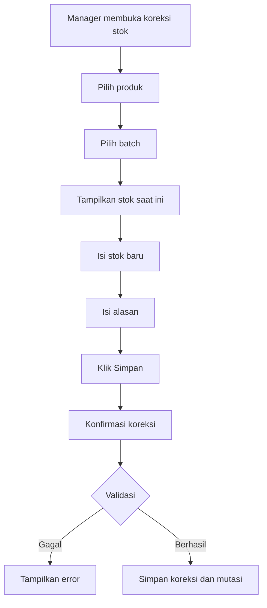
```mermaid
flowchart TD
    A[Manager membuka koreksi stok] --> B[Pilih produk]
    B --> C[Pilih batch]
    C --> D[Tampilkan stok saat ini]
    D --> E[Isi stok baru]
    E --> F[Isi alasan]
    F --> G[Klik Simpan]
    G --> H[Konfirmasi koreksi]
    H --> I{Validasi}
    I -->|Gagal| J[Tampilkan error]
    I -->|Berhasil| K[Simpan koreksi dan mutasi]
```

### Warning UI
```text
Koreksi stok akan mengubah jumlah stok sistem dan mencatat mutasi. Pastikan jumlah sesuai hasil stok fisik.
```

### Aturan Idempotency Koreksi Stok
- Frontend mengirim `idempotencyKey` saat koreksi stok disimpan.
- Koreksi yang sama tidak boleh mencatat mutasi ganda.
- Dialog konfirmasi wajib tampil sebelum request dikirim.

---

## 22. UI Flow Laporan

## 22.1 Laporan Penjualan

**Route:** `/laporan/penjualan`  
**Aktor:** Manager, Pemilik  
**Referensi:** SRS-REPORT-001

### Komponen
- Filter periode.
- Filter metode pembayaran.
- Filter kasir.
- Filter produk/kategori opsional.
- Card ringkasan.
- Tabel transaksi.
- Tombol ekspor Excel.
- Tombol ekspor PDF.

### Layout

```text
+------------------------------------------------------------------+
| Laporan Penjualan                             [Excel] [PDF]       |
+------------------------------------------------------------------+
| Periode | Metode Bayar | Kasir | Produk/Kategori                  |
+------------------------------------------------------------------+
| Omzet | Diskon | Total Transaksi | Retur                           |
+------------------------------------------------------------------+
| Tabel transaksi                                                  |
+------------------------------------------------------------------+
```

### Flow

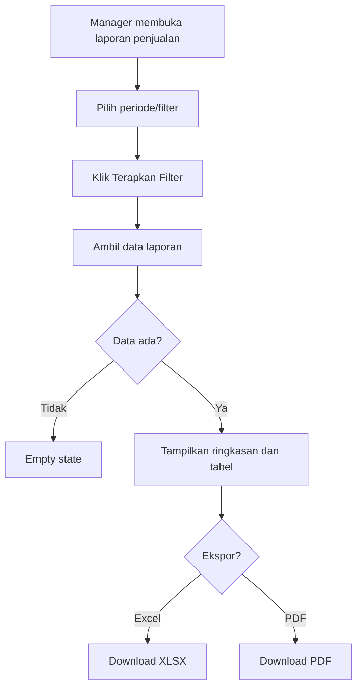
```mermaid
flowchart TD
    A[Manager membuka laporan penjualan] --> B[Pilih periode/filter]
    B --> C[Klik Terapkan Filter]
    C --> D[Ambil data laporan]
    D --> E{Data ada?}
    E -->|Tidak| F[Empty state]
    E -->|Ya| G[Tampilkan ringkasan dan tabel]
    G --> H{Ekspor?}
    H -->|Excel| I[Download XLSX]
    H -->|PDF| J[Download PDF]
```

---

## 22.2 Laporan Laba

**Route:** `/laporan/laba`  
**Aktor:** Manager, Pemilik  
**Referensi:** SRS-REPORT-002

### Komponen
- Filter periode.
- Card omzet.
- Card HPP.
- Card diskon.
- Card laba.
- Koreksi retur.
- Tabel laba per transaksi.
- Tabel laba per produk.
- Tombol ekspor.

### Role Rules
- Kasir tidak boleh mengakses halaman ini.
- Endpoint harus menolak role kasir.
- Sidebar kasir tidak menampilkan menu ini.

### Layout

```text
+------------------------------------------------------------------+
| Laporan Laba                                  [Excel] [PDF]       |
+------------------------------------------------------------------+
| Periode                                                          |
+------------------------------------------------------------------+
| Omzet | HPP | Diskon | Laba | Koreksi Retur                       |
+------------------------------------------------------------------+
| Detail Laba per Transaksi / Produk                               |
+------------------------------------------------------------------+
```

### Empty State
```text
Tidak ada data laba pada periode ini.
Ubah periode laporan atau pastikan transaksi sudah tersimpan.
```

---

## 22.3 Laporan Stok

**Route:** `/laporan/stok`  
**Aktor:** Manager, Pemilik

### Komponen
- Filter kategori.
- Filter status stok.
- Tabel stok per produk.
- Detail batch.
- Export.

### Data Minimal
- produk;
- kategori;
- total stok tersedia;
- stok minimum;
- status stok;
- jumlah batch aktif;
- jumlah batch mendekati expired.

---

## 22.4 Laporan Expired

**Route:** `/laporan/expired`  
**Aktor:** Manager, Pemilik

### Komponen
- Filter periode expired.
- Filter kategori.
- Tabel batch.
- Badge mendekati expired atau expired.
- Export.

### Data Minimal
- produk;
- nomor batch;
- expired date;
- sisa hari;
- stok batch;
- status.

---

## 23. UI Flow Manajemen User

## 23.1 Daftar User

**Route:** `/users`  
**Aktor:** Manager  
**Referensi:** SRS-AUTH-003, SRS-USER-001, SDD User Module

### Tujuan
Manajemen user digunakan Manager untuk membuat, mengubah, menonaktifkan akun, dan mengatur role pengguna. Fitur ini bersifat **Should Have** pada V1, tetapi sangat disarankan karena sistem POS Apotek membutuhkan pemisahan akses Kasir dan Manager.

### Komponen
- Page header.
- Tombol tambah user.
- Search user.
- Filter role.
- Filter status aktif/nonaktif.
- Tabel user.
- Badge role.
- Badge status akun.
- Aksi edit, nonaktifkan, aktifkan, dan reset password jika fitur tersedia.

### Layout

```text
+------------------------------------------------------------------+
| Manajemen User                                      [Tambah User] |
| Kelola akun pengguna dan hak akses sistem                         |
+------------------------------------------------------------------+
| Search | Filter Role | Filter Status                              |
+------------------------------------------------------------------+
| Nama | Username | Email | Role | Status | Login Terakhir | Aksi    |
+------------------------------------------------------------------+
```

### Flow

```mermaid
flowchart TD
    A[Manager membuka Manajemen User] --> B[Sistem memuat daftar user]
    B --> C{Data tersedia?}
    C -->|Tidak| D[Tampilkan empty state]
    C -->|Ya| E[Tampilkan tabel user]
    E --> F[Manager tambah/edit/nonaktifkan user]
    F --> G{Aksi berisiko?}
    G -->|Ya| H[Tampilkan confirm dialog]
    G -->|Tidak| I[Simpan perubahan]
    H --> I
```

### Role Rules
- Kasir tidak boleh membuka halaman Manajemen User.
- Manager dapat membuat dan mengubah user sesuai scope V1.
- Pemilik tidak wajib memiliki akses manajemen user.
- User nonaktif tidak boleh login.
- Password tidak boleh ditampilkan ulang setelah dibuat.

### Empty State
```text
Belum ada user tambahan.
Tambahkan user agar kasir atau manager dapat menggunakan sistem sesuai hak akses.
```

---

## 23.2 Form Tambah/Edit User

**Route:** `/users/tambah`, `/users/:id/edit`  
**Aktor:** Manager

### Field
| Field | Tipe UI | Wajib | Catatan |
|---|---|---:|---|
| Nama | Text input | Ya | Nama pengguna |
| Username | Text input | Ya | Harus unik |
| Email | Email input | Tidak | Harus unik jika diisi |
| Password awal | Password input | Ya saat tambah | Tidak ditampilkan ulang |
| Role | Select | Ya | Minimal Kasir dan Manager |
| Status aktif | Toggle | Ya | User nonaktif tidak dapat login |

### Validation UI
| Kondisi | Pesan |
|---|---|
| Nama kosong | Nama user wajib diisi |
| Username kosong | Username wajib diisi |
| Username duplikat | Username sudah digunakan |
| Email tidak valid | Format email tidak valid |
| Email duplikat | Email sudah digunakan |
| Password kosong saat tambah | Password awal wajib diisi |
| Role kosong | Role wajib dipilih |

### Confirmation Dialog
```text
Nonaktifkan user ini?
User tidak dapat login setelah dinonaktifkan, tetapi histori aktivitas tetap tersimpan.
```

### Success State
```text
User berhasil disimpan.
```

## 25. UI Flow Pengaturan

## 23.1 Profil Apotek

**Route:** `/settings`  
**Aktor:** Manager  
**Referensi:** SRS-SETTING-001

### Komponen
- Nama apotek.
- Alamat.
- Nomor telepon.
- Logo opsional.
- Ambang alert expired.
- Timezone tampilan.
- Tombol simpan.

### Validation UI
| Kondisi | Pesan |
|---|---|
| Expired alert days < 1 | Ambang expired minimal 1 hari |
| Timezone kosong | Timezone wajib dipilih |

---

## 25. Role-Based UI Visibility

| Komponen/Menu | Kasir | Manager | Pemilik |
|---|---:|---:|---:|
| Halaman Kasir | Ya | Ya | Tidak wajib |
| Dashboard laba | Tidak | Ya | Ya |
| Produk | Tidak | Ya | Lihat opsional |
| Kategori | Tidak | Ya | Tidak wajib |
| Supplier | Tidak | Ya | Tidak wajib |
| Satuan | Tidak | Ya | Tidak wajib |
| Batch lengkap | Tidak | Ya | Lihat |
| Pembelian | Tidak | Ya | Lihat |
| Retur Penjualan | Ya | Ya | Tidak wajib |
| Retur Pembelian | Tidak | Ya | Lihat |
| Koreksi Stok | Tidak | Ya | Tidak |
| Laporan Penjualan | Tidak | Ya | Ya |
| Laporan Laba | Tidak | Ya | Ya |
| HPP | Tidak | Ya | Ya |
| Laba | Tidak | Ya | Ya |
| Mutasi Stok | Tidak | Ya | Lihat |
| Manajemen User | Tidak | Ya | Tidak wajib |
| Pengaturan | Tidak | Ya | Tidak wajib |

---

## 26. Empty State Standar

| Halaman | Empty State |
|---|---|
| Produk | Belum ada produk. Tambahkan produk pertama. |
| Kategori | Belum ada kategori. Tambahkan kategori produk. |
| Supplier | Belum ada supplier. Tambahkan supplier untuk pembelian. |
| Batch | Belum ada batch. Catat pembelian untuk membuat batch. |
| Pembelian | Belum ada pembelian. Tambahkan pembelian supplier. |
| Transaksi | Belum ada transaksi pada periode ini. |
| Retur | Belum ada retur. |
| Stok | Belum ada data stok. |
| Mutasi | Belum ada mutasi stok. |
| Laporan | Tidak ada data pada filter ini. |
| Search | Data tidak ditemukan. Ubah kata kunci pencarian. |

---

## 27. Error State Standar

| Error Backend / Kondisi | Tampilan UI |
|---|---|
| `FORBIDDEN_ROLE` / Akses ditolak | Halaman akses ditolak dengan tombol kembali |
| `SESSION_EXPIRED` / Sesi habis | Redirect ke login dengan pesan sesi berakhir |
| `SERVER_ERROR` / Server error | Pesan umum dan tombol coba lagi |
| `NOT_FOUND` / Data tidak ditemukan | Empty/error state sesuai konteks |
| `VALIDATION_ERROR` / Validasi field | Pesan error di bawah field terkait |
| `INSUFFICIENT_STOCK` / Stok tidak cukup | Stok produk tidak mencukupi. Periksa qty atau pilih produk lain. |
| `BATCH_NOT_AVAILABLE` / Batch valid tidak tersedia | Batch aktif dengan stok tersedia tidak ditemukan. |
| `INVALID_UNIT` / Satuan tidak valid | Satuan jual tidak valid untuk produk ini. |
| `PRODUCT_INACTIVE` / Produk nonaktif | Produk ini tidak dapat dijual karena sudah nonaktif. |
| `DISCOUNT_EXCEEDS_SUBTOTAL` / Diskon melebihi subtotal | Diskon tidak boleh melebihi subtotal transaksi. |
| `PAYMENT_INSUFFICIENT` / Cash kurang | Nominal pembayaran belum mencukupi. |
| `DUPLICATE_IDEMPOTENCY_KEY` / Request sudah diproses | Transaksi sudah diproses. Muat ulang detail transaksi. |
| `CONFLICT_DATA` / Konflik data | Data berubah. Muat ulang data sebelum melanjutkan. |
| Export gagal | Laporan gagal diekspor. Coba ulangi. |

---

## 28. Loading State Standar

| Aksi | Loading State |
|---|---|
| Login | Tombol login berubah menjadi Memproses... |
| Memuat tabel | Skeleton table |
| Search produk | Spinner kecil di input search |
| Simpan transaksi | Tombol disabled dan teks Menyimpan... |
| Simpan form | Tombol disabled dan teks Menyimpan... |
| Proses retur | Tombol disabled dan teks Memproses... |
| Buat laporan | Skeleton card dan tabel |
| Export laporan | Tombol disabled dan teks Mengekspor... |

---

## 29. Toast dan Notifikasi

## 28.1 Success Toast

Contoh:
```text
Produk berhasil disimpan.
Pembelian berhasil dicatat.
Transaksi berhasil disimpan.
Retur berhasil diproses.
Laporan berhasil diekspor.
```

## 28.2 Error Toast

Contoh:
```text
Produk gagal disimpan.
Transaksi gagal diproses.
Stok produk tidak mencukupi.
Laporan gagal diekspor.
```

## 28.3 Warning Toast

Contoh:
```text
Produk mendekati stok minimum.
Batch mendekati tanggal kedaluwarsa.
Data stok berubah. Periksa ulang keranjang.
```

---

## 30. Form Behavior

| Aturan | Penjelasan |
|---|---|
| Field wajib diberi indikator | Gunakan tanda atau label jelas |
| Error muncul dekat field | Jangan hanya toast untuk error field |
| Tombol simpan disabled saat loading | Mencegah double submit |
| Perubahan belum disimpan diberi peringatan | Khusus form panjang |
| Input angka tidak boleh menerima nilai negatif jika tidak relevan | Qty, harga, stok minimum |
| Date picker digunakan untuk tanggal | Mengurangi salah format |
| Select searchable untuk data besar | Produk, supplier, batch |
| Konfirmasi aksi berisiko | Nonaktifkan produk, koreksi stok, retur |

---

## 31. Responsive Behavior Detail

## 30.1 Breakpoint Rekomendasi

| Ukuran | Perilaku |
|---|---|
| >= 1200px | Desktop penuh, sidebar tetap |
| 992px - 1199px | Desktop sedang, grid menyesuaikan |
| 768px - 991px | Tablet, sidebar drawer/collapsible |
| < 768px | Mobile, tabel menjadi card/list |

## 30.2 Tabel Responsif

| Kondisi | Perilaku |
|---|---|
| Desktop | Tabel penuh |
| Tablet | Tabel dengan kolom penting |
| Mobile | Card list |
| Data banyak | Pagination |
| Filter banyak | Filter drawer |

## 30.3 Form Responsif

| Kondisi | Perilaku |
|---|---|
| Desktop | Dua kolom untuk form panjang |
| Tablet | Satu atau dua kolom sesuai ruang |
| Mobile | Satu kolom |
| Tombol aksi | Sticky bottom jika form panjang |

## 30.4 Halaman Kasir Responsif

| Area | Desktop | Mobile |
|---|---|---|
| Search produk | Panel kiri | Atas |
| Daftar produk | Panel kiri | Card list |
| Keranjang | Panel kanan | Bagian bawah |
| Pembayaran | Panel kanan bawah | Setelah keranjang |
| Tombol simpan | Kanan bawah | Sticky bottom |

---

## 32. Accessibility dan Usability

| ID | Aturan |
|---|---|
| A11Y-001 | Semua input harus memiliki label |
| A11Y-002 | Tombol harus memiliki teks jelas |
| A11Y-003 | Warna tidak boleh menjadi satu-satunya penanda status |
| A11Y-004 | Error harus dapat dibaca sebagai teks |
| A11Y-005 | Fokus keyboard harus terlihat |
| A11Y-006 | Modal dapat ditutup dengan tombol jelas |
| A11Y-007 | Ukuran klik tombol cukup untuk layar sentuh |
| A11Y-008 | Format uang harus konsisten |
| A11Y-009 | Format tanggal harus konsisten |
| A11Y-010 | Teks status harus singkat dan jelas |

---

## 33. Format Tampilan Data

## 32.1 Format Rupiah

```text
Rp12.500
Rp1.250.000
```

Harga jual yang terlihat kasir, subtotal, total, dan kembalian selalu tampil sebagai nilai Rupiah bulat dari harga jual final yang sudah ditetapkan Manager. Nilai laporan laba boleh berasal dari perhitungan internal presisi tinggi, tetapi UI hanya menampilkan `profit_display` yang sudah diformat/dibulatkan.

## 32.2 Format Tanggal

```text
31 Mei 2026
31/05/2026
```

Pilih satu format utama untuk UI dan gunakan konsisten.

## 32.3 Format Tanggal dan Jam

```text
31 Mei 2026, 14.35 WITA
```

Aturan waktu:
- UI menampilkan waktu lokal dalam zona `Asia/Makassar` atau label WITA.
- Database menyimpan timestamp dalam UTC.
- Waktu transaksi final berasal dari backend, bukan jam realtime frontend.
- Filter laporan harian memakai batas hari lokal sesuai konfigurasi aplikasi.

## 32.4 Format Qty

```text
10 tablet
2 strip
1 box
```

## 32.5 Status Badge

| Status | Label |
|---|---|
| Produk aktif | Aktif |
| Produk nonaktif | Nonaktif |
| Batch aktif | Aktif |
| Batch habis | Habis |
| Batch expired | Kedaluwarsa |
| Batch mendekati expired | Mendekati Kedaluwarsa |
| Stok rendah | Stok Rendah |
| Transaksi final | Selesai |
| Retur sebagian | Retur Sebagian |
| Retur penuh | Retur Penuh |

---

## 34. Shortcut Kasir

Shortcut bersifat **Should Have**, bukan wajib mutlak V1.

| Shortcut | Fungsi |
|---|---|
| `/` atau `Ctrl + K` | Fokus ke search produk |
| `Enter` | Tambah item jika form valid |
| `Ctrl + Enter` | Simpan transaksi jika valid |
| `Esc` | Tutup modal |
| `F2` | Fokus diskon |
| `F4` | Fokus uang diterima |
| `Delete` | Hapus item terpilih jika aman |

Catatan:
- Shortcut tidak boleh mengganggu input normal.
- Shortcut harus dinonaktifkan saat pengguna mengetik di input tertentu jika berisiko.
- Jangan membuat shortcut yang menyimpan transaksi tanpa konfirmasi visual.

---

## 35. Microcopy Standar

| Konteks | Teks |
|---|---|
| Search produk | Cari nama, kode, atau barcode produk |
| Keranjang kosong | Keranjang masih kosong |
| Tambah produk | Tambah Produk |
| Simpan transaksi | Simpan Transaksi |
| Reset keranjang | Reset Keranjang |
| Stok habis | Stok habis |
| Stok tidak cukup | Stok produk tidak mencukupi |
| Batch expired | Batch sudah kedaluwarsa |
| Diskon salah | Diskon tidak boleh melebihi subtotal |
| Cash kurang | Nominal pembayaran belum mencukupi |
| Akses ditolak | Anda tidak memiliki akses ke halaman ini |
| Sesi habis | Sesi berakhir. Silakan login kembali. |
| Data tidak ditemukan | Data tidak ditemukan |
| Laporan kosong | Tidak ada data pada periode ini |

---

## 36. Flow Role Login ke Halaman Awal

```mermaid
flowchart TD
    A[Login berhasil] --> B{Role}
    B -->|Kasir| C[/kasir]
    B -->|Manager| D[/dashboard]
    B -->|Pemilik| E[/dashboard]
    C --> F[Tampilkan UI kasir]
    D --> G[Tampilkan dashboard lengkap]
    E --> H[Tampilkan dashboard laporan]
```

---

## 37. Flow Proteksi Menu dan Halaman

```mermaid
flowchart TD
    A[User membuka route] --> B{Sudah login?}
    B -->|Tidak| C[Redirect ke /login]
    B -->|Ya| D{Role berhak?}
    D -->|Tidak| E[Tampilkan akses ditolak]
    D -->|Ya| F[Tampilkan halaman]
```

---

## 38. Flow Produk sampai Bisa Dijual

```mermaid
flowchart TD
    A[Buat kategori] --> B[Buat satuan]
    B --> C[Buat produk]
    C --> D[Atur satuan jual produk]
    D --> E[Catat pembelian supplier]
    E --> F[Batch dibuat]
    F --> G[Harga jual batch dibuat]
    G --> H[Produk tersedia di halaman kasir]
```

Catatan:
- Produk tanpa batch aktif tidak boleh dijual.
- Produk tanpa satuan jual tidak bisa ditambahkan ke keranjang.
- Produk nonaktif tidak muncul di kasir.

---

## 38A. Flow PO ke Pembelian

```mermaid
flowchart TD
    A[Apoteker atau Manager buka Pemesanan] --> B[Tambah PO]
    B --> C[Pilih supplier dan tanggal PO]
    C --> D[Data pembuat otomatis dari login]
    D --> E[Tambah item obat, satuan, qty, estimasi harga, dan catatan]
    E --> F[Simpan PO]
    F --> G[Cetak PO bila diperlukan]
    G --> H[Barang datang]
    H --> I[Manager buka Pembelian]
    I --> J[Pilih supplier dan No. PO]
    J --> K[Item PO masuk draft pembelian]
    K --> L[Sesuaikan qty, harga, diskon, PPN, batch, dan expired]
    L --> M[Cocokkan faktur supplier]
    M --> N[Simpan pembelian final]
    N --> O[Stok batch bertambah]
```

Catatan:
- PO tidak menambah atau mengurangi stok.
- Pembelian dari PO tetap boleh berbeda qty, harga, batch, dan expired date dari PO.
- Satu item PO dapat diterima sebagai beberapa batch.

---

## 38B. Flow Resep ke Kasir

```mermaid
flowchart TD
    A[Apoteker input resep] --> B[Cek produk dan satuan jual aktif]
    B --> C[Isi aturan pakai dan catatan etiket]
    C --> D[Simpan resep tanpa mengurangi stok]
    D --> E[Tandai siap bayar]
    E --> F[Kasir tarik resep READY_FOR_PAYMENT]
    F --> G[Item resep masuk keranjang]
    G --> H[Kasir proses pembayaran]
    H --> I[Backend checkout FEFO dan stok keluar]
    I --> J[Status resep menjadi PAID atau COMPLETED]
```

Catatan:
- Resep bukan transaksi final.
- Stok tidak berkurang saat resep dibuat.
- Kasir tidak melihat HPP, modal, margin, atau laba saat menarik resep.

---

## 38C. Flow Konseling Dasar

```mermaid
flowchart TD
    A[Apoteker buka Konseling] --> B[Pilih resep atau transaksi jika terkait]
    B --> C[Isi topik dan catatan konseling]
    C --> D[Simpan catatan]
```

Catatan:
- Konseling tidak membuat tagihan.
- Konseling tidak menambah atau mengurangi stok.
- Konseling bukan clinical decision support otomatis.

---

## 39. Flow Batch FEFO dalam UI

Frontend boleh menampilkan estimasi batch, tetapi backend tetap menentukan hasil final.

```mermaid
flowchart TD
    A[Kasir memilih produk] --> B[UI menampilkan stok tersedia]
    B --> C[Kasir tambah ke keranjang]
    C --> D[UI menampilkan subtotal sementara]
    D --> E[Kasir simpan transaksi]
    E --> F[Backend menjalankan FEFO final]
    F --> G[Backend membuat split batch]
    G --> H[UI menampilkan transaksi berhasil]
```

UI tidak wajib menampilkan batch yang dipakai kepada kasir. Manager dapat melihat detail batch pada riwayat transaksi.

---

## 40. Flow Retur Mengacu Batch Asal

```mermaid
flowchart TD
    A[User cari transaksi] --> B[Tampilkan item transaksi]
    B --> C[Tampilkan qty yang masih bisa diretur]
    C --> D[User isi qty retur]
    D --> E[Backend validasi alokasi batch]
    E --> F[Stok kembali ke batch asal]
    F --> G[Retur tersimpan]
```

Catatan:
- Kasir tidak perlu melihat semua detail teknis batch jika tidak diperlukan.
- Backend tetap harus mengembalikan stok ke batch asal.
- Manager dapat melihat detail batch retur.

---

## 41. Anti-Pattern UI yang Dilarang

AI coding tidak boleh membuat UI seperti berikut:

1. Halaman kasir yang memaksa kasir pindah halaman untuk setiap produk.
2. Tombol simpan transaksi tetap aktif saat loading.
3. Error hanya muncul di console.
4. Produk nonaktif tetap bisa dipilih di kasir.
5. Batch expired tetap muncul sebagai stok normal.
6. Harga modal, HPP, margin, atau laba muncul pada role kasir.
7. Tabel besar tanpa pagination.
8. Form panjang tanpa grouping.
9. Filter laporan tanpa tombol reset.
10. Search produk tanpa empty state.
11. Keranjang tanpa tombol hapus item.
12. Pembayaran cash tanpa kembalian.
13. Retur tanpa transaksi asal.
14. Koreksi stok tanpa konfirmasi.
15. Layout kasir melebar keluar layar.
16. Mobile layout hanya diperkecil dari desktop tanpa adaptasi.
17. Notifikasi sukses yang tidak menjelaskan hasil.
18. Modal tanpa tombol tutup.
19. Menu sidebar sama untuk semua role.
20. Jam realtime frontend dijadikan waktu final transaksi.
21. PO ditampilkan seolah-olah stok sudah bertambah.
22. Resep mengurangi stok sebelum checkout berhasil.
23. Kasir dapat memilih satuan jual yang tidak aktif.
24. Konseling membuat tagihan atau mengubah stok.

---

## 42. Traceability UI/UX ke SRS

| UI/UX Area | SRS Terkait | Keterangan |
|---|---|---|
| Login Flow | SRS-AUTH-001, SRS-AUTH-002 | Login dan logout |
| Role Guard | SRS-AUTH-003 | Proteksi role |
| Dashboard | SRS-DASH-001 | Ringkasan operasional |
| Produk | SRS-PROD-* | Manajemen produk |
| Kategori | SRS-CAT-001 | Manajemen kategori |
| Supplier | SRS-SUP-001 | Manajemen supplier |
| Satuan | SRS-UNIT-* | Satuan dan konversi |
| Batch | SRS-BATCH-* | Batch dan expired alert |
| Pemesanan / PO | SRS-PO-* | PO obat dan convert ke pembelian |
| Pembelian | SRS-PUR-* | Pembelian supplier |
| Kasir | SRS-SALE-* | Transaksi kasir |
| Pelayanan Resep | SRS-PRESC-* | Resep dasar dan tarik ke kasir |
| Konseling | SRS-COUNS-* | Dokumentasi konseling dasar |
| FEFO UI | SRS-FEFO-001 | FEFO server-side |
| Split Batch UI | SRS-SPLIT-001 | Detail batch manager |
| Diskon | SRS-DISC-* | Diskon dan alokasi |
| Retur Penjualan | SRS-RETSALE-001 | Retur pelanggan |
| Retur Pembelian | SRS-RETPUR-001 | Retur supplier |
| Stok | SRS-STOCK-* | Stok dan mutasi |
| Laporan Penjualan | SRS-REPORT-001 | Laporan transaksi |
| Laporan Laba | SRS-REPORT-002 | Laporan laba |
| Ekspor | SRS-EXPORT-001 | Export Excel/PDF |
| Responsive | SRS-NFR-001 | Responsivitas |
| Error State | SRS-NFR-006 | Kejelasan error |
| Manajemen User | SRS-USER-001, SRS-AUTH-003 | User dan role |
| Idempotency UI | SRS-SALE-005, SDD Idempotency | Pencegahan transaksi ganda |

---

## 43. Traceability UI/UX ke SDD

| UI/UX Area | SDD Terkait | Keterangan |
|---|---|---|
| AppShell | SDD Struktur Frontend | Layout global |
| Role-Based UI | SDD Security Design | RBAC |
| Kasir State | SDD Frontend State Management | Cart dan payment |
| Sales Submit | SDD SalesService | Simpan transaksi |
| FEFO Display | SDD FefoService | Backend final |
| Retur | SDD ReturnService | Retur batch asal |
| Stok | SDD StockService | Mutasi stok |
| Laporan | SDD ReportService | Query laporan |
| Export | SDD ExportService | Excel/PDF |
| Timezone UI | SDD Timezone Design | Asia/Makassar display |
| Error Code UI | SDD Error Code Sistem | Mapping error ke pesan |
| Idempotency Key | SDD Idempotency Design | Proteksi double submit dan retry |
| User Management | SDD User Module | Manajemen user dan role |
| Responsive | SDD Frontend Design | Layout teknis |

---

## 44. Definition of Done UI/UX Flow

Dokumen UI/UX Flow dianggap selesai jika:

- daftar halaman utama sudah jelas;
- role dan navigasi sudah jelas;
- layout global sudah tersedia;
- alur login sudah tersedia;
- alur dashboard sudah tersedia;
- alur kasir lengkap dari pencarian sampai transaksi berhasil;
- alur produk, kategori, supplier, satuan, batch sudah tersedia;
- alur PO obat dan pembelian dari PO sudah tersedia;
- alur pembelian supplier sudah tersedia;
- alur resep dasar ke kasir dan konseling sudah tersedia;
- alur retur penjualan dan retur pembelian sudah tersedia;
- alur stok dan mutasi stok sudah tersedia;
- alur manajemen user sudah tersedia;
- alur laporan penjualan dan laba sudah tersedia;
- empty state, loading state, error state, dan success state sudah tersedia;
- responsive behavior sudah tersedia;
- role-based visibility sudah tersedia;
- route frontend final sudah sinkron dengan SDD;
- idempotency untuk transaksi penting sudah didefinisikan;
- mapping error backend ke UI sudah tersedia;
- traceability ke SRS dan SDD tersedia;
- guardrail anti-pattern tersedia.

---

## 45. Catatan untuk Dokumen Berikutnya

Dokumen berikutnya adalah:

```text
05_TASK_BREAKDOWN_POS_APOTEK.md
```

Task Breakdown harus menurunkan pekerjaan dari:
- PRD untuk prioritas produk;
- SRS untuk requirement dan validasi;
- SDD untuk database, API, service, dan keamanan;
- UI/UX Flow untuk halaman dan interaksi.

Task Breakdown harus dibuat dalam bentuk checklist teknis yang bisa dieksekusi AI coding secara bertahap, bukan daftar harapan yang terdengar produktif tetapi tidak punya urutan kerja. Dunia sudah cukup penuh dengan itu.
