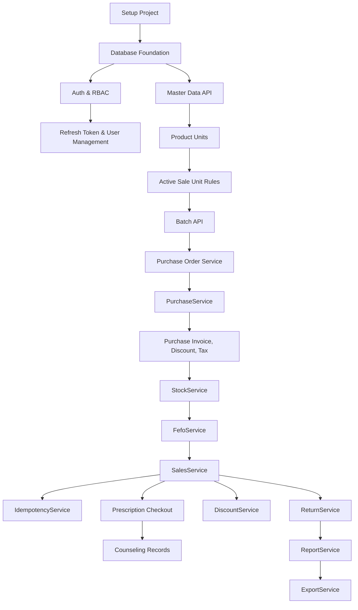
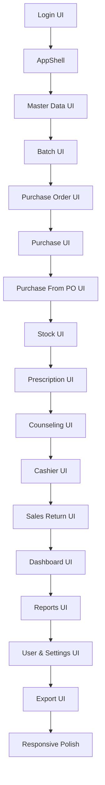

---
document_name: "05_TASK_BREAKDOWN_POS_APOTEK_REVISI_SINKRON"
document_type: "Task Breakdown / Implementation Plan"
project_name: "POS Apotek"
version: "1.1.0"
status: "Draft Revisi - Synchronized with PRD, SRS, SDD, UI/UX, Frontend, and Backend"
prepared_for: "AI Vibe Coding / Codex GPT"
prepared_by: "Suryadi Umar"
last_updated: "2026-06-02"
source_documents:
  - "01_PRD_POS_APOTEK.md"
  - "02_SRS_POS_APOTEK.md"
  - "03_SDD_SYSTEM_DESIGN_POS_APOTEK.md"
  - "04_UI_UX_FLOW_POS_APOTEK.md"
  - "06_FRONTEND_POS_APOTEK.md"
  - "07_BACKEND_POS_APOTEK.md"
related_documents:
  - "01_PRD_POS_APOTEK.md"
  - "02_SRS_POS_APOTEK.md"
  - "03_SDD_SYSTEM_DESIGN_POS_APOTEK.md"
  - "04_UI_UX_FLOW_POS_APOTEK.md"
  - "06_FRONTEND_POS_APOTEK.md"
  - "07_BACKEND_POS_APOTEK.md"
revision_focus:
  - "sinkronisasi route frontend final berbahasa Indonesia"
  - "penambahan task refresh token, idempotency key, dan audit log"
  - "penambahan task manajemen user dan pengaturan profil apotek"
  - "penegasan APP_TIMEZONE Asia/Makassar dan penyimpanan timestamp UTC"
  - "penguatan testing concurrency, role sanitization, histori transaksi, dan idempotency"
  - "penegasan Presisi Harga Modal dan HPP"
  - "penambahan task PO, pembelian dari PO, pelayanan resep dasar, konseling, dan pembatasan satuan jual"
---

# Task Breakdown - POS Apotek

## 0. Instruksi Pembacaan untuk AI Coding

Dokumen ini adalah **Task Breakdown** untuk implementasi aplikasi **POS Apotek**.

Dokumen ini memecah pekerjaan menjadi tugas teknis yang bisa dieksekusi secara bertahap oleh AI coding atau developer.

Dokumen ini harus dibaca setelah:
1. `01_PRD_POS_APOTEK.md`
2. `02_SRS_POS_APOTEK.md`
3. `03_SDD_SYSTEM_DESIGN_POS_APOTEK.md`
4. `06_FRONTEND_POS_APOTEK.md`
5. `07_BACKEND_POS_APOTEK.md`
6. `04_UI_UX_FLOW_POS_APOTEK.md`

AI coding wajib mengikuti aturan berikut:

1. Kerjakan task berdasarkan urutan fase.
2. Jangan mengerjakan fitur di luar scope V1.
3. Jangan melompati database dan service penting untuk langsung membuat UI.
4. Jangan menyimpan stok hanya pada level produk.
5. Jangan membuat transaksi kasir tanpa batch, FEFO, split allocation, dan mutasi stok.
6. Jangan menghitung harga jual pelanggan otomatis dari harga modal atau HPP.
7. Jangan menampilkan harga modal, HPP, margin, atau laba kepada role kasir.
8. Jangan menghitung laba dari harga produk terbaru.
9. Jangan mengubah transaksi lama ketika harga produk berubah.
10. Jangan menghapus permanen transaksi, batch, pembelian, retur, atau mutasi stok.
11. Jangan membuat PO/Pemesanan Obat menambah atau mengurangi stok.
12. Jangan mengurangi stok saat resep dibuat atau ditandai siap bayar.
13. Jangan mengizinkan kasir memilih satuan jual yang tidak aktif.
14. Jangan memakai `FLOAT`, `DOUBLE`, atau `REAL` untuk uang, HPP, pajak, diskon, atau laba.
15. Jangan memasukkan piutang sebagai task inti V1; piutang hanya future enhancement.
16. Jangan menjadikan frontend sebagai sumber kebenaran final.
17. Jika task gagal, perbaiki task itu dahulu sebelum melanjutkan task berikutnya.
18. Gunakan route frontend final berbahasa Indonesia sesuai SDD dan UI/UX Flow.
19. Gunakan endpoint API backend berbahasa Inggris teknis dengan prefix `/api`.
20. Gunakan idempotency key untuk checkout, pembelian, retur, dan koreksi stok.
21. Gunakan waktu backend sebagai waktu transaksi final; jam frontend hanya tampilan.
22. Simpan timestamp database dalam UTC dan tampilkan waktu operasional dalam `Asia/Makassar`.
23. Jangan menganggap aplikasi selesai hanya karena halaman sudah muncul. Itu hanya kosmetik digital, bukan sistem yang benar.

---

## 1. Tujuan Task Breakdown

Tujuan dokumen ini adalah:
- membagi pekerjaan pengembangan menjadi bagian kecil;
- menjaga urutan implementasi agar tidak berantakan;
- menghubungkan task dengan PRD, SRS, SDD, dan UI/UX Flow;
- menyediakan checklist dan definition of done;
- membantu AI coding memahami prioritas kerja;
- mencegah implementasi fitur yang tidak sesuai kebutuhan POS Apotek;
- memastikan Task Breakdown sinkron dengan route final, idempotency, audit log, refresh token, manajemen user, settings, dan testing kritis.

---

## 2. Legenda Task

### 2.1 Format ID Task

| Jenis Task | Format | Contoh |
|---|---|---|
| Setup | TASK-SETUP-001 | Setup repository |
| Database | TASK-DB-001 | Membuat tabel users |
| Backend | TASK-BE-001 | Membuat AuthService |
| Frontend | TASK-FE-001 | Membuat halaman login |
| UI/UX | TASK-UI-001 | Membuat AppShell |
| Testing | TASK-TEST-001 | Unit test FEFO |
| Deployment | TASK-DEPLOY-001 | Setup environment |
| Documentation | TASK-DOC-001 | Update README |

### 2.2 Prioritas

| Prioritas | Makna |
|---|---|
| P0 | Wajib untuk sistem berjalan |
| P1 | Wajib untuk MVP/V1 |
| P2 | Penting tetapi dapat dikerjakan setelah fitur utama |
| P3 | Opsional atau peningkatan berikutnya |

### 2.3 Kompleksitas

| Kompleksitas | Makna |
|---|---|
| S | Kecil |
| M | Sedang |
| L | Besar |
| XL | Sangat besar dan harus dipecah jika terlalu luas |

### 2.4 Status Checklist

Gunakan checklist berikut saat implementasi:

```md
- [ ] Belum dikerjakan
- [x] Selesai
```

---

## 3. Urutan Fase Implementasi

| Fase | Nama | Fokus |
|---|---|---|
| Phase 0 | Persiapan Proyek | Setup repo, environment, struktur folder |
| Phase 1 | Database Foundation | Migration tabel inti dan seed awal |
| Phase 2 | Auth, RBAC, User & Security Foundation | Login, token, refresh token, role, proteksi route, user API, audit dasar |
| Phase 3 | Master Data | Produk, kategori, supplier, satuan |
| Phase 4 | Batch, PO & Pembelian | Batch, harga jual batch, PO obat, pembelian supplier |
| Phase 4C | Presisi Harga Modal dan HPP | Migration presisi harga modal, HPP, harga jual bulat, dan laba internal |
| Phase 4D | Purchase Order dan Pembelian Lanjutan | PO, convert PO ke draft pembelian, faktur supplier, diskon pembelian, dan PPN |
| Phase 5 | Stok & Mutasi | StockService, mutasi stok, koreksi stok |
| Phase 6 | Kasir & Transaksi | Halaman kasir, sales service, FEFO, split batch, idempotency checkout |
| Phase 6C | Pelayanan Resep dan Konseling | Resep dasar, tarik resep ke kasir, dan konseling dasar |
| Phase 7 | Diskon & Pembayaran | Diskon, alokasi diskon, metode pembayaran |
| Phase 8 | Retur | Retur penjualan dan retur pembelian |
| Phase 9 | Dashboard & Laporan | Dashboard, laporan penjualan, laporan laba |
| Phase 10 | Export | Export Excel/PDF |
| Phase 11 | User, Settings, Responsive & UX Polish | Manajemen user, pengaturan, loading, empty, error, responsive |
| Phase 12 | Testing | Unit, integration, E2E |
| Phase 13 | Deployment | Migration production, seed, env, backup |
| Phase 14 | Final Review | Audit requirement dan dokumentasi |

---

## 4. Milestone Utama

| Milestone | Target Output |
|---|---|
| M1 | Aplikasi bisa login, refresh token, role, dan proteksi route berjalan |
| M2 | Master data produk, satuan, supplier, kategori selesai |
| M3 | Pembelian dapat membuat batch dan stok |
| M4 | Kasir dapat menyimpan transaksi dengan FEFO dan mutasi stok |
| M5 | Retur penjualan dan retur pembelian berjalan |
| M6 | Dashboard dan laporan laba akurat |
| M7 | Export laporan dan responsive UI selesai |
| M8 | Testing kritis, audit requirement, dan deployment siap |

---

## 4.1 Route Frontend Final dan Endpoint API

Route frontend memakai istilah UI berbahasa Indonesia. Endpoint backend tetap memakai istilah teknis berbahasa Inggris dengan prefix `/api`. Jangan mencampur keduanya. Manusia sudah cukup sering mencampur hal sederhana sampai menjadi masalah arsitektur.

| Halaman UI | Route Frontend Final | Endpoint API Utama | Role |
|---|---|---|---|
| Login | `/login` | `POST /api/auth/login` | Publik |
| Dashboard | `/dashboard` | `/api/dashboard/*` | Manager, Pemilik opsional |
| Kasir | `/kasir` | `POST /api/sales`, `GET /api/cashier/products` | Kasir, Manager |
| Riwayat Transaksi | `/riwayat-transaksi` | `GET /api/sales` | Kasir terbatas, Manager |
| Retur Penjualan | `/retur-penjualan` | `POST /api/sales-returns` | Kasir, Manager |
| Produk | `/produk` | `/api/products` | Manager |
| Kategori | `/kategori` | `/api/categories` | Manager |
| Supplier | `/supplier` | `/api/suppliers` | Manager |
| Satuan | `/satuan` | `/api/units`, `/api/products/:productId/units` | Manager |
| Batch | `/batch` | `/api/batches` | Manager |
| Pemesanan / PO Obat | `/pemesanan` | `/api/purchase-orders` | Apoteker, Manager |
| Pembelian | `/pembelian` | `/api/purchases` | Manager |
| Pembelian dari PO | `/pembelian/dari-po/:poId` | `/api/purchases/create-from-po/:poId` | Manager |
| Pelayanan Resep | `/pelayanan/resep` | `/api/prescriptions` | Apoteker, Manager |
| Konseling | `/pelayanan/konseling` | `/api/counseling-records` | Apoteker, Manager |
| Stok | `/stok` | `/api/stock` | Manager, Kasir terbatas |
| Mutasi Stok | `/mutasi-stok` | `/api/stock/mutations` | Manager |
| Koreksi Stok | `/koreksi-stok` | `POST /api/stock/adjustments` | Manager |
| Retur Pembelian | `/retur-pembelian` | `/api/purchase-returns` | Manager |
| Laporan Penjualan | `/laporan/penjualan` | `/api/reports/sales` | Manager, Pemilik opsional |
| Laporan Laba | `/laporan/laba` | `/api/reports/profit` | Manager, Pemilik opsional |
| Export | `/export` | `/api/exports/*` | Manager, Pemilik opsional |
| Manajemen User | `/users` | `/api/users` | Manager |
| Pengaturan | `/settings` | `/api/settings` | Manager |

---

# PHASE 0 - Persiapan Proyek

## TASK-SETUP-001: Setup Repository dan Struktur Awal

**Type:** Setup  
**Priority:** P0  
**Complexity:** S  
**Related Documents:** SDD Section 7

### Description
Membuat repository proyek dan struktur folder dasar sesuai SDD.

### Checklist
- [ ] Buat repository proyek.
- [ ] Buat struktur folder frontend sesuai `06_FRONTEND_POS_APOTEK.md`.
- [ ] Buat struktur folder backend sesuai `07_BACKEND_POS_APOTEK.md`.
- [ ] Pisahkan folder frontend, backend, database, dan tests secara jelas.
- [ ] Buat file konfigurasi environment.
- [ ] Buat README awal.
- [ ] Pastikan aplikasi dapat dijalankan secara lokal.

### Definition of Done
- Struktur folder tersedia.
- Aplikasi dapat dijalankan tanpa error awal.
- README berisi cara menjalankan proyek.

---

## TASK-SETUP-002: Setup Environment Variables

**Type:** Setup  
**Priority:** P0  
**Complexity:** S  
**Related Documents:** SDD Section 21

### Checklist
- [ ] Buat `.env.example`.
- [ ] Tambahkan `DATABASE_URL`.
- [ ] Tambahkan `APP_URL`.
- [ ] Tambahkan `JWT_SECRET`.
- [ ] Tambahkan `JWT_REFRESH_SECRET`.
- [ ] Tambahkan `APP_TIMEZONE=Asia/Makassar`.
- [ ] Pastikan database menyimpan timestamp dalam UTC.
- [ ] Tambahkan konfigurasi export jika diperlukan.
- [ ] Tambahkan konfigurasi CORS dan API base URL sesuai environment.
- [ ] Pastikan `.env` tidak masuk version control.

### Definition of Done
- `.env.example` tersedia.
- Aplikasi membaca environment variable.
- Secret tidak bocor ke repository.

---

## TASK-SETUP-003: Setup Database Connection dan ORM

**Type:** Setup / Database  
**Priority:** P0  
**Complexity:** M  
**Related Documents:** SDD Section 4, Section 9

### Checklist
- [ ] Pilih ORM atau query builder.
- [ ] Konfigurasi koneksi database.
- [ ] Buat script migration.
- [ ] Buat script seed.
- [ ] Uji koneksi database lokal.
- [ ] Pastikan migration dapat dijalankan ulang secara aman.

### Definition of Done
- Database terkoneksi.
- Migration tool berjalan.
- Seed tool berjalan.

---

## TASK-SETUP-004: Setup Code Quality

**Type:** Setup  
**Priority:** P1  
**Complexity:** S

### Checklist
- [ ] Setup linting.
- [ ] Setup formatting.
- [ ] Setup type checking jika memakai TypeScript.
- [ ] Setup script test.
- [ ] Tambahkan aturan import yang konsisten.

### Definition of Done
- Script lint berjalan.
- Script format berjalan.
- Script test tersedia.

---

# PHASE 1 - Database Foundation

## TASK-DB-001: Membuat Tabel Roles dan Users

**Type:** Database  
**Priority:** P0  
**Complexity:** M  
**Related SRS:** SRS-AUTH-001, SRS-AUTH-003  
**Related SDD:** Tabel `roles`, `users`

### Checklist
- [ ] Buat migration tabel `roles`.
- [ ] Buat migration tabel `users`.
- [ ] Tambahkan foreign key `users.role_id`.
- [ ] Tambahkan unique constraint username.
- [ ] Tambahkan unique nullable email.
- [ ] Tambahkan field `password_hash`.
- [ ] Tambahkan field `is_active`.
- [ ] Tambahkan timestamp.
- [ ] Seed role `KASIR`, `MANAGER`, dan `PEMILIK` opsional.
- [ ] Seed user manager awal.

### Definition of Done
- Tabel roles dan users berhasil dibuat.
- Role awal tersedia.
- User manager awal dapat digunakan untuk login setelah Auth selesai.

---

## TASK-DB-002: Membuat Tabel Categories, Suppliers, dan Units

**Type:** Database  
**Priority:** P0  
**Complexity:** M  
**Related SRS:** SRS-CAT-001, SRS-SUP-001, SRS-UNIT-001  
**Related SDD:** Tabel `categories`, `suppliers`, `units`

### Checklist
- [ ] Buat tabel `categories`.
- [ ] Buat tabel `suppliers`.
- [ ] Buat tabel `units`.
- [ ] Tambahkan field `is_active`.
- [ ] Tambahkan soft delete jika diperlukan.
- [ ] Tambahkan unique constraint nama kategori.
- [ ] Tambahkan unique constraint nama supplier.
- [ ] Tambahkan unique constraint nama satuan.
- [ ] Seed satuan awal: tablet, kaplet, kapsul, strip, box, botol, tube, sachet, biji, pcs.

### Definition of Done
- Tabel master dasar tersedia.
- Seed satuan berhasil.
- Constraint unik berjalan.

---

## TASK-DB-003: Membuat Tabel Products dan Product Units

**Type:** Database  
**Priority:** P0  
**Complexity:** L  
**Related SRS:** SRS-PROD-001, SRS-UNIT-002  
**Related SDD:** Tabel `products`, `product_units`

### Checklist
- [ ] Buat tabel `products`.
- [ ] Tambahkan FK ke `categories`.
- [ ] Tambahkan FK `base_unit_id` ke `units`.
- [ ] Tambahkan field `code`, `barcode`, `name`, `generic_name`.
- [ ] Tambahkan field `min_stock_base`.
- [ ] Tambahkan field `is_active`.
- [ ] Buat tabel `product_units`.
- [ ] Tambahkan FK ke `products`.
- [ ] Tambahkan FK ke `units`.
- [ ] Tambahkan field `conversion_to_base`.
- [ ] Tambahkan field `is_default_sale_unit`.
- [ ] Tambahkan constraint `conversion_to_base > 0`.
- [ ] Tambahkan index pencarian produk.

### Definition of Done
- Produk dapat memiliki satuan dasar.
- Produk dapat memiliki banyak satuan jual.
- Konversi satuan tersimpan.
- Stok minimum tersimpan dalam satuan dasar.

---

## TASK-DB-004: Membuat Tabel Product Batches dan Batch Unit Prices

**Type:** Database  
**Priority:** P0  
**Complexity:** L  
**Related SRS:** SRS-BATCH-001, SRS-BATCH-002  
**Related SDD:** Tabel `product_batches`, `batch_unit_prices`

### Checklist
- [ ] Buat tabel `product_batches`.
- [ ] Tambahkan FK ke `products`.
- [ ] Tambahkan FK opsional ke `suppliers`.
- [ ] Tambahkan field `batch_number`.
- [ ] Tambahkan field `expired_date`.
- [ ] Tambahkan field `initial_stock_base`.
- [ ] Tambahkan field `current_stock_base`.
- [ ] Tambahkan field `hpp_base`.
- [ ] Gunakan `hpp_base NUMERIC(18,8)` untuk HPP per satuan dasar.
- [ ] Tambahkan constraint stok tidak negatif.
- [ ] Tambahkan constraint HPP tidak negatif.
- [ ] Buat tabel `batch_unit_prices`.
- [ ] Tambahkan FK ke `product_batches`.
- [ ] Tambahkan FK ke `product_units`.
- [ ] Tambahkan field `selling_price`.
- [ ] Gunakan `selling_price NUMERIC(18,0)` untuk harga jual final rupiah bulat yang ditentukan manual oleh Manager.
- [ ] Tambahkan unique constraint batch dan satuan jual.
- [ ] Tambahkan index FEFO.

### Definition of Done
- Batch menyimpan stok aktual.
- Harga jual disimpan per batch dan satuan jual.
- Harga jual batch tidak dihitung otomatis dari harga modal atau HPP.
- Batch dapat diurutkan untuk FEFO.

---

## TASK-DB-005: Membuat Tabel Purchases dan Purchase Items

**Type:** Database  
**Priority:** P0  
**Complexity:** L  
**Related SRS:** SRS-PUR-001, SRS-PUR-002  
**Related SDD:** Tabel `purchases`, `purchase_items`

### Checklist
- [ ] Buat tabel `purchases`.
- [ ] Tambahkan FK supplier.
- [ ] Tambahkan nomor pembelian unik.
- [ ] Tambahkan tanggal pembelian.
- [ ] Tambahkan subtotal.
- [ ] Buat tabel `purchase_items`.
- [ ] Tambahkan FK purchase.
- [ ] Tambahkan FK product.
- [ ] Tambahkan FK product unit.
- [ ] Tambahkan nomor batch dan expired date.
- [ ] Tambahkan qty pembelian.
- [ ] Tambahkan conversion snapshot.
- [ ] Tambahkan qty base.
- [ ] Tambahkan purchase price.
- [ ] Gunakan `purchase_price NUMERIC(18,6)` untuk harga beli supplier.
- [ ] Tambahkan hpp base.
- [ ] Gunakan `hpp_base NUMERIC(18,8)` untuk HPP internal presisi.
- [ ] Tambahkan total price.

### Definition of Done
- Pembelian dapat menyimpan item.
- Data pembelian cukup untuk membuat batch dan menghitung HPP.

---

## TASK-DB-006: Membuat Tabel Sales, Sale Items, dan Sale Batch Allocations

**Type:** Database  
**Priority:** P0  
**Complexity:** XL  
**Related SRS:** SRS-SALE-005, SRS-FEFO-001, SRS-SPLIT-001  
**Related SDD:** Tabel `sales`, `sale_items`, `sale_batch_allocations`

### Checklist
- [ ] Buat tabel `sales`.
- [ ] Tambahkan nomor transaksi unik.
- [ ] Tambahkan cashier_id.
- [ ] Tambahkan payment_method.
- [ ] Tambahkan subtotal, discount, total.
- [ ] Tambahkan paid_amount dan change_amount.
- [ ] Tambahkan total_hpp dan total_profit.
- [ ] Buat tabel `sale_items`.
- [ ] Simpan snapshot nama produk.
- [ ] Simpan snapshot nama satuan.
- [ ] Simpan qty satuan jual dan qty base.
- [ ] Simpan harga jual final.
- [ ] Simpan snapshot harga jual transaksi sebagai rupiah bulat `NUMERIC(18,0)`.
- [ ] Buat tabel `sale_batch_allocations`.
- [ ] Tambahkan FK sale item.
- [ ] Tambahkan FK batch.
- [ ] Simpan batch snapshot.
- [ ] Simpan expired snapshot.
- [ ] Simpan qty base.
- [ ] Simpan HPP snapshot.
- [ ] Simpan HPP snapshot presisi tinggi `NUMERIC(18,8)`.
- [ ] Simpan subtotal allocation.
- [ ] Simpan diskon allocation.
- [ ] Simpan profit allocation.
- [ ] Simpan profit allocation `NUMERIC(18,8)` dan bulatkan hanya saat display laporan.
- [ ] Tambahkan returned_qty_base.

### Definition of Done
- Transaksi dapat menyimpan detail produk.
- Transaksi dapat menyimpan detail batch.
- Laporan laba dapat dihitung dari detail transaksi.
- Perubahan harga jual baru tidak mengubah histori transaksi lama.
- Retur dapat mengacu ke allocation batch.

---

## TASK-DB-007: Membuat Tabel Returns

**Type:** Database  
**Priority:** P1  
**Complexity:** L  
**Related SRS:** SRS-RETSALE-001, SRS-RETPUR-001  
**Related SDD:** Tabel `sales_returns`, `sales_return_items`, `purchase_returns`, `purchase_return_items`

### Checklist
- [ ] Buat tabel `sales_returns`.
- [ ] Buat tabel `sales_return_items`.
- [ ] Tambahkan FK ke sale.
- [ ] Tambahkan FK ke sale_batch_allocation.
- [ ] Tambahkan qty retur.
- [ ] Tambahkan refund amount.
- [ ] Tambahkan HPP dan profit reversed.
- [ ] Buat tabel `purchase_returns`.
- [ ] Buat tabel `purchase_return_items`.
- [ ] Tambahkan FK ke batch.
- [ ] Tambahkan qty retur pembelian.
- [ ] Tambahkan alasan retur.

### Definition of Done
- Retur penjualan dapat mengacu batch asal.
- Retur pembelian dapat mengurangi stok batch.
- Data retur cukup untuk koreksi laporan.

---

## TASK-DB-008: Membuat Tabel Stock Mutations dan Stock Adjustments

**Type:** Database  
**Priority:** P0  
**Complexity:** L  
**Related SRS:** SRS-STOCK-002, SRS-STOCK-003  
**Related SDD:** Tabel `stock_mutations`, `stock_adjustments`

### Checklist
- [ ] Buat tabel `stock_mutations`.
- [ ] Tambahkan FK product.
- [ ] Tambahkan FK batch.
- [ ] Tambahkan mutation_type.
- [ ] Tambahkan reference_type dan reference_id.
- [ ] Tambahkan qty_before, qty_change, qty_after.
- [ ] Tambahkan created_by.
- [ ] Tambahkan reason.
- [ ] Buat tabel `stock_adjustments`.
- [ ] Tambahkan old_qty, new_qty, difference.
- [ ] Tambahkan alasan koreksi.
- [ ] Tambahkan index batch, product, created_at.

### Definition of Done
- Setiap perubahan stok dapat dicatat.
- Mutasi stok dapat ditelusuri.
- Koreksi stok dapat diaudit.

---

## TASK-DB-009: Membuat App Settings dan View Ringkasan Stok

**Type:** Database  
**Priority:** P1  
**Complexity:** M  
**Related SRS:** SRS-STOCK-004, SRS-DASH-001  
**Related SDD:** `app_settings`, `v_product_stock_summary`

### Checklist
- [ ] Buat tabel `app_settings`.
- [ ] Tambahkan `expired_alert_days`.
- [ ] Tambahkan `app_timezone` atau `APP_TIMEZONE`.
- [ ] Tambahkan `currency`.
- [ ] Tambahkan profil apotek dasar: nama, alamat, telepon, dan catatan footer laporan.
- [ ] Seed setting awal.
- [ ] Buat view atau query ringkasan stok.
- [ ] Pastikan batch expired tidak dihitung sebagai stok tersedia normal.

### Definition of Done
- Setting dasar tersedia.
- Profil apotek dapat dipakai pada dashboard, export, dan tampilan laporan.
- Dashboard dapat membaca ringkasan stok.
- Alert stok minimum dapat dihitung.

---

## TASK-DB-010: Membuat Tabel Refresh Tokens

**Type:** Database / Security  
**Priority:** P0  
**Complexity:** M  
**Related SDD:** Tabel `refresh_tokens`

### Checklist
- [ ] Buat tabel `refresh_tokens`.
- [ ] Tambahkan FK `user_id` ke `users`.
- [ ] Tambahkan field `token_hash`.
- [ ] Tambahkan field `expires_at`.
- [ ] Tambahkan field `revoked_at`.
- [ ] Tambahkan timestamp.
- [ ] Tambahkan index `user_id` dan `expires_at`.
- [ ] Pastikan refresh token tidak disimpan plaintext.

### Definition of Done
- Refresh token dapat disimpan sebagai hash.
- Token dapat dicabut saat logout.
- Token user nonaktif dapat ditolak.

---

## TASK-DB-011: Membuat Tabel Idempotency Keys

**Type:** Database / Reliability  
**Priority:** P0  
**Complexity:** M  
**Related SDD:** Tabel `idempotency_keys`

### Checklist
- [ ] Buat tabel `idempotency_keys`.
- [ ] Tambahkan `key` unik.
- [ ] Tambahkan `user_id`.
- [ ] Tambahkan `action_type`, misalnya `SALE_CHECKOUT`, `PURCHASE_CREATE`, `SALES_RETURN`, `STOCK_ADJUSTMENT`.
- [ ] Tambahkan `request_hash`.
- [ ] Tambahkan `response_snapshot` jika request berhasil.
- [ ] Tambahkan `status`: `PROCESSING`, `SUCCESS`, `FAILED`.
- [ ] Tambahkan `expires_at`.
- [ ] Tambahkan unique constraint pada key aktif.

### Definition of Done
- Request penting dapat dicegah agar tidak tersimpan ganda.
- Retry request dengan key sama dapat mengembalikan hasil yang konsisten.
- Checkout tidak membuat transaksi duplikat akibat double click atau timeout.

---

## TASK-DB-012: Membuat Tabel Audit Logs

**Type:** Database / Audit  
**Priority:** P1  
**Complexity:** M  
**Related SDD:** Tabel `audit_logs`

### Checklist
- [ ] Buat tabel `audit_logs`.
- [ ] Tambahkan `actor_user_id`.
- [ ] Tambahkan `action`.
- [ ] Tambahkan `entity_type` dan `entity_id`.
- [ ] Tambahkan `before_data` dan `after_data` jika relevan.
- [ ] Tambahkan `ip_address` dan `user_agent` jika tersedia.
- [ ] Tambahkan `created_at`.
- [ ] Tambahkan index `actor_user_id`, `entity_type`, dan `created_at`.

### Definition of Done
- Aktivitas penting dapat diaudit.
- Perubahan sensitif dapat ditelusuri.
- Audit log tidak dapat diubah dari UI biasa.

---

# PHASE 4C - Presisi Harga Modal dan HPP

## TASK-DB-013: Migration Presisi Harga Modal dan HPP

**Type:** Database / Backend Adjustment
**Priority:** P0
**Complexity:** M
**Related SRS:** Aturan harga modal, HPP, laba internal
**Related SDD:** Rekomendasi tipe data harga

### Checklist
- [ ] Migrasikan `purchase_price` menjadi `NUMERIC(18,6)`.
- [ ] Migrasikan field `hpp_base` dan snapshot HPP menjadi `NUMERIC(18,8)`.
- [ ] Migrasikan `selling_price` dan snapshot harga jual transaksi menjadi `NUMERIC(18,0)`.
- [ ] Migrasikan field laba internal, termasuk `profit_amount`, `total_profit`, dan profit allocation menjadi `NUMERIC(18,8)`.
- [ ] Pastikan `profit_display` hanya nilai laporan yang dibulatkan/diformat saat ditampilkan.
- [ ] Pastikan harga jual pelanggan tetap manual dari Manager dan tidak dihitung otomatis dari harga modal.
- [ ] Pastikan response Kasir tidak memuat harga modal, harga beli supplier, HPP, margin, atau laba.
- [ ] Jalankan `npm.cmd run db:validate`.
- [ ] Jalankan `npm.cmd run db:generate`.
- [ ] Jalankan `npm.cmd run db:deploy`.
- [ ] Jalankan `npm.cmd run build`.
- [ ] Jalankan `npm.cmd test`.

### Definition of Done
- Harga modal/HPP/laba internal memakai presisi tinggi.
- Harga jual kasir tetap rupiah bulat dari harga jual final yang ditetapkan Manager.
- Perubahan harga jual baru tidak mengubah histori transaksi lama.
- Kasir hanya menerima data harga jual final produk.

---

# PHASE 4D - Purchase Order dan Pembelian Lanjutan

## TASK-DB-PO-001: Membuat Tabel Purchase Orders dan Purchase Order Items

**Type:** Database
**Priority:** P1
**Complexity:** M
**Related SRS:** SRS-PO-001, SRS-PO-002
**Related SDD:** Tabel `purchase_orders`, `purchase_order_items`

### Checklist
- [ ] Buat tabel `purchase_orders`.
- [ ] Buat tabel `purchase_order_items`.
- [ ] Simpan supplier, pembuat otomatis dari user login, tanggal PO, catatan, dan status.
- [ ] Gunakan status `DRAFT`, `SENT`, `PARTIALLY_RECEIVED`, `RECEIVED`, dan `CANCELLED`.
- [ ] Simpan item produk, satuan, qty order, catatan, dan qty yang sudah diterima.
- [ ] Tambahkan relasi PO ke pembelian agar pembelian bisa berasal dari PO.
- [ ] Pastikan pembuatan PO tidak membuat batch, stok, atau stock mutation.

### Definition of Done
- PO dan item PO tersimpan sebagai dokumen pemesanan.
- PO dapat dilacak ke pembelian jika sudah diterima.
- PO tidak mengubah stok dalam kondisi apa pun.

---

## TASK-DB-PRESC-001: Membuat Tabel Prescriptions dan Prescription Items

**Type:** Database
**Priority:** P1
**Complexity:** M
**Related SRS:** SRS-PRESC-001, SRS-PRESC-002
**Related SDD:** Tabel `prescriptions`, `prescription_items`

### Checklist
- [ ] Buat tabel `prescriptions`.
- [ ] Buat tabel `prescription_items`.
- [ ] Simpan nomor resep, data pasien minimal, dokter opsional, status resep, dan pembuat resep.
- [ ] Simpan item produk, satuan jual, qty, aturan pakai, dan catatan.
- [ ] Tambahkan status agar resep bisa ditandai `READY_FOR_PAYMENT`.
- [ ] Tambahkan relasi resep ke sales jika sudah ditarik ke kasir dan checkout berhasil.
- [ ] Pastikan resep tidak membuat stock mutation sebelum checkout kasir.

### Definition of Done
- Resep dasar dapat disimpan sebelum pembayaran.
- Resep siap bayar dapat ditarik ke kasir.
- Stok belum berkurang sampai checkout berhasil.

---

## TASK-DB-COUNS-001: Membuat Tabel Counseling Records

**Type:** Database
**Priority:** P1
**Complexity:** S
**Related SRS:** SRS-COUNS-001
**Related SDD:** Tabel `counseling_records`

### Checklist
- [ ] Buat tabel `counseling_records`.
- [ ] Simpan apoteker pencatat.
- [ ] Simpan relasi opsional ke resep atau transaksi.
- [ ] Simpan ringkasan edukasi obat, catatan pasien, dan waktu pencatatan.
- [ ] Pastikan konseling tidak membuat tagihan dan tidak mengubah stok.

### Definition of Done
- Konseling dasar terdokumentasi.
- Konseling bisa terkait resep atau transaksi jika tersedia.
- Konseling bukan clinical decision support dan bukan transaksi finansial.

---

# PHASE 2 - Auth, RBAC, User, dan Security Foundation

## TASK-BE-001: Membuat AuthService

**Type:** Backend  
**Priority:** P0  
**Complexity:** M  
**Related SRS:** SRS-AUTH-001, SRS-AUTH-002

### Checklist
- [ ] Buat fungsi login.
- [ ] Validasi username/email dan password.
- [ ] Hash dan verify password.
- [ ] Blokir user nonaktif.
- [ ] Buat access token.
- [ ] Buat refresh token dan simpan hash ke tabel `refresh_tokens`.
- [ ] Buat fungsi refresh access token.
- [ ] Buat fungsi logout dan revoke refresh token.
- [ ] Buat fungsi get current user.

### Definition of Done
- User aktif dapat login.
- User nonaktif tidak dapat login.
- Logout mengakhiri sesi dan mencabut refresh token.
- Refresh token tidak disimpan plaintext.
- Password tidak pernah dikirim ke frontend.

---

## TASK-BE-002: Membuat Middleware Authentication dan Authorization

**Type:** Backend  
**Priority:** P0  
**Complexity:** M  
**Related SRS:** SRS-AUTH-003  
**Related SDD:** Security Design

### Checklist
- [ ] Buat guard/middleware `requireAuth` atau `JwtAuthGuard`.
- [ ] Buat guard/middleware `requireRole` atau `RolesGuard`.
- [ ] Proteksi endpoint internal.
- [ ] Blokir akses tanpa login.
- [ ] Blokir role yang tidak berhak.
- [ ] Pastikan kasir tidak dapat akses laporan laba.

### Definition of Done
- Endpoint internal tidak dapat diakses tanpa login.
- Role salah mendapat error 403.
- Kasir tidak dapat membuka endpoint laporan laba.

---

## TASK-FE-001: Membuat Halaman Login

**Type:** Frontend  
**Priority:** P0  
**Complexity:** M  
**Related UI:** Login Flow  
**Related SRS:** SRS-AUTH-001

### Checklist
- [ ] Buat route `/login`.
- [ ] Buat input username/email.
- [ ] Buat input password.
- [ ] Buat tombol login.
- [ ] Tambahkan validasi field kosong.
- [ ] Tambahkan loading state.
- [ ] Tampilkan error login.
- [ ] Redirect berdasarkan role.

### Definition of Done
- Halaman login dapat digunakan.
- Error login tampil jelas.
- Kasir diarahkan ke `/kasir`.
- Manager diarahkan ke `/dashboard`.

---

## TASK-FE-002: Membuat AppShell dan Role-Based Navigation

**Type:** Frontend / UI  
**Priority:** P0  
**Complexity:** L  
**Related UI:** Layout Global, Sidebar

### Checklist
- [ ] Buat layout global.
- [ ] Buat topbar.
- [ ] Buat sidebar manager.
- [ ] Buat sidebar kasir.
- [ ] Buat sidebar pemilik.
- [ ] Tambahkan tombol logout.
- [ ] Tambahkan jam lokal Asia/Makassar untuk tampilan.
- [ ] Sembunyikan menu berdasarkan role.
- [ ] Buat sidebar responsive.

### Definition of Done
- Navigasi berubah berdasarkan role.
- Kasir tidak melihat menu laporan laba.
- Sidebar dapat digunakan di desktop dan mobile.

---

## TASK-BE-025: Membuat User Management API

**Type:** Backend  
**Priority:** P1  
**Complexity:** L  
**Related SRS:** Manajemen user dan role  
**Related UI:** UI Flow Manajemen User

### Checklist
- [ ] GET daftar user.
- [ ] GET detail user.
- [ ] POST user baru.
- [ ] PATCH data user.
- [ ] PATCH aktif/nonaktif user.
- [ ] PATCH role user.
- [ ] Validasi username unik.
- [ ] Validasi email unik jika diisi.
- [ ] Hash password.
- [ ] Cegah manager menonaktifkan akun sendiri tanpa fallback admin.
- [ ] Proteksi endpoint hanya untuk Manager.

### Definition of Done
- Manager dapat mengelola user.
- User nonaktif tidak dapat login.
- Role user menentukan akses halaman dan endpoint.

---

## TASK-BE-026: Membuat AuditLogService

**Type:** Backend / Audit  
**Priority:** P1  
**Complexity:** M

### Checklist
- [ ] Buat fungsi `recordAuditLog`.
- [ ] Catat login gagal berulang jika diperlukan.
- [ ] Catat perubahan user, produk, batch, harga, pembelian, transaksi, retur, dan koreksi stok.
- [ ] Simpan actor user.
- [ ] Simpan entity dan action.
- [ ] Pastikan audit log tidak mengganggu transaksi utama jika logging non-kritis gagal, kecuali untuk mutasi stok yang wajib tercatat.

### Definition of Done
- Aktivitas penting terekam.
- Perubahan sensitif dapat ditelusuri.
- Audit log tersedia untuk pemeriksaan internal.

---

# PHASE 3 - Master Data

## TASK-BE-003: Membuat API Categories

**Type:** Backend  
**Priority:** P1  
**Complexity:** M  
**Related SRS:** SRS-CAT-001

### Checklist
- [ ] GET daftar kategori.
- [ ] POST kategori.
- [ ] PATCH kategori.
- [ ] PATCH nonaktifkan kategori.
- [ ] Validasi nama wajib.
- [ ] Validasi nama unik.
- [ ] Cegah hard delete kategori historis.

### Definition of Done
- Kategori dapat dibuat, diubah, dinonaktifkan.
- Kategori aktif dapat dipakai produk.

---

## TASK-FE-003: Membuat UI Kategori

**Type:** Frontend  
**Priority:** P1  
**Complexity:** M  
**Related UI:** UI Flow Kategori

### Checklist
- [ ] Buat halaman `/kategori`.
- [ ] Buat tabel kategori.
- [ ] Buat search kategori.
- [ ] Buat modal/form tambah kategori.
- [ ] Buat edit kategori.
- [ ] Buat aksi nonaktifkan.
- [ ] Tambahkan empty state.
- [ ] Tambahkan loading state.
- [ ] Tambahkan error state.

### Definition of Done
- Manager dapat mengelola kategori dari UI.
- Empty state muncul jika data kosong.

---

## TASK-BE-004: Membuat API Suppliers

**Type:** Backend  
**Priority:** P1  
**Complexity:** M  
**Related SRS:** SRS-SUP-001

### Checklist
- [ ] GET supplier.
- [ ] POST supplier.
- [ ] PATCH supplier.
- [ ] PATCH nonaktifkan supplier.
- [ ] Validasi nama wajib.
- [ ] Validasi nama unik.
- [ ] Cegah hard delete supplier historis.

### Definition of Done
- Supplier dapat dikelola.
- Supplier aktif dapat dipakai pembelian.

---

## TASK-FE-004: Membuat UI Supplier

**Type:** Frontend  
**Priority:** P1  
**Complexity:** M  
**Related UI:** UI Flow Supplier

### Checklist
- [ ] Buat halaman `/supplier`.
- [ ] Buat tabel supplier.
- [ ] Buat search supplier.
- [ ] Buat form tambah/edit supplier.
- [ ] Buat aksi nonaktifkan.
- [ ] Tambahkan validasi field.
- [ ] Tambahkan empty/loading/error state.

### Definition of Done
- Manager dapat mengelola supplier.
- Supplier nonaktif tidak dipakai pembelian baru.

---

## TASK-BE-005: Membuat API Units dan Product Units

**Type:** Backend  
**Priority:** P1  
**Complexity:** L  
**Related SRS:** SRS-UNIT-001, SRS-UNIT-002

### Checklist
- [ ] GET daftar satuan.
- [ ] POST satuan.
- [ ] PATCH satuan.
- [ ] GET satuan jual produk.
- [ ] POST satuan jual produk.
- [ ] PATCH satuan jual produk.
- [ ] PATCH nonaktifkan satuan jual produk.
- [ ] Validasi conversion_to_base > 0.
- [ ] Cegah duplikat satuan jual per produk.

### Definition of Done
- Produk dapat memiliki satuan jual.
- Konversi satuan dapat dipakai transaksi.

---

## TASK-FE-005: Membuat UI Satuan dan Konversi

**Type:** Frontend  
**Priority:** P1  
**Complexity:** L  
**Related UI:** UI Flow Satuan dan Konversi

### Checklist
- [ ] Buat halaman `/satuan`.
- [ ] Buat daftar satuan.
- [ ] Buat form tambah/edit satuan.
- [ ] Buat UI konversi satuan pada detail produk.
- [ ] Tambahkan input conversion_to_base.
- [ ] Tambahkan toggle satuan default.
- [ ] Tambahkan validasi angka.
- [ ] Tambahkan error konversi duplikat.

### Definition of Done
- Manager dapat mengatur satuan.
- Manager dapat mengatur satuan jual produk.

---

## TASK-BE-006: Membuat API Products

**Type:** Backend  
**Priority:** P1  
**Complexity:** L  
**Related SRS:** SRS-PROD-001 sampai SRS-PROD-004

### Checklist
- [ ] GET daftar produk dengan search dan filter.
- [ ] GET detail produk.
- [ ] POST produk.
- [ ] PATCH produk.
- [ ] PATCH nonaktifkan produk.
- [ ] PATCH aktifkan kembali produk.
- [ ] Validasi kode unik.
- [ ] Validasi barcode unik jika diisi.
- [ ] Validasi kategori dan satuan dasar.
- [ ] Tambahkan ringkasan stok jika dibutuhkan.

### Definition of Done
- Produk dapat dibuat dan diubah.
- Produk nonaktif tidak muncul di kasir.
- Produk dapat dicari berdasarkan nama, kode, barcode, kategori.

---

## TASK-FE-006: Membuat UI Produk

**Type:** Frontend  
**Priority:** P1  
**Complexity:** L  
**Related UI:** UI Flow Produk

### Checklist
- [ ] Buat halaman `/produk`.
- [ ] Buat tabel produk.
- [ ] Buat search produk.
- [ ] Buat filter kategori dan status.
- [ ] Buat form tambah produk.
- [ ] Buat form edit produk.
- [ ] Buat detail produk.
- [ ] Tambahkan badge aktif/nonaktif.
- [ ] Tambahkan badge stok rendah.
- [ ] Tambahkan aksi nonaktifkan/aktifkan.
- [ ] Tambahkan empty/loading/error state.

### Definition of Done
- Manager dapat mengelola produk dari UI.
- Produk dapat dikaitkan dengan kategori dan satuan dasar.
- Produk siap digunakan untuk batch dan pembelian.

---

# PHASE 4 - Batch dan Pembelian

## TASK-BE-007: Membuat BatchService dan API Batch

**Type:** Backend  
**Priority:** P1  
**Complexity:** L  
**Related SRS:** SRS-BATCH-001 sampai SRS-BATCH-003

### Checklist
- [ ] Buat BatchService.
- [ ] GET daftar batch.
- [ ] GET batch per produk.
- [ ] GET batch mendekati expired.
- [ ] POST batch manual jika diperlukan.
- [ ] PATCH status batch.
- [ ] Validasi expired date.
- [ ] Validasi stok tidak negatif.
- [ ] Validasi HPP tidak negatif.
- [ ] Validasi harga jual tidak negatif.
- [ ] Pastikan batch expired tidak dipakai transaksi.

### Definition of Done
- Batch dapat dibuat dan dilihat.
- Batch memiliki stok, HPP, expired date, dan harga jual.
- Expired alert dapat dibaca.

---

## TASK-FE-007: Membuat UI Batch

**Type:** Frontend  
**Priority:** P1  
**Complexity:** L  
**Related UI:** UI Flow Batch Obat

### Checklist
- [ ] Buat halaman `/batch`.
- [ ] Buat search produk/batch.
- [ ] Buat filter status batch.
- [ ] Buat filter expired.
- [ ] Buat tabel batch.
- [ ] Buat detail batch.
- [ ] Tampilkan HPP hanya untuk manager/pemilik.
- [ ] Tampilkan harga jual per satuan.
- [ ] Tampilkan mutasi stok batch.
- [ ] Tambahkan badge expired/mendekati expired/stok habis.

### Definition of Done
- Manager dapat melihat batch secara rinci.
- Batch expired dan mendekati expired terlihat jelas.
- Kasir tidak melihat HPP.

---

## TASK-BE-008: Membuat PurchaseService

**Type:** Backend  
**Priority:** P1  
**Complexity:** XL  
**Related SRS:** SRS-PUR-001, SRS-PUR-002  
**Related SDD:** PurchaseService

### Checklist
- [ ] Buat fungsi createPurchase.
- [ ] Validasi supplier aktif.
- [ ] Validasi item pembelian minimal satu.
- [ ] Validasi produk aktif.
- [ ] Validasi satuan pembelian.
- [ ] Hitung qty_base.
- [ ] Hitung hpp_base.
- [ ] Buat purchase.
- [ ] Buat purchase_items.
- [ ] Buat product_batches.
- [ ] Buat batch_unit_prices.
- [ ] Tambahkan stok batch.
- [ ] Buat stock_mutation PURCHASE_IN.
- [ ] Gunakan idempotency key untuk mencegah pembelian ganda akibat retry.
- [ ] Jalankan semua dalam database transaction.

### Definition of Done
- Pembelian valid membuat batch.
- Stok batch bertambah.
- HPP tersimpan.
- Mutasi stok masuk tercatat.
- Jika gagal, tidak ada data parsial.

---

## TASK-BE-009: Membuat API Purchases

**Type:** Backend  
**Priority:** P1  
**Complexity:** L  
**Related SRS:** SRS-PUR-001

### Checklist
- [ ] GET daftar pembelian.
- [ ] GET detail pembelian.
- [ ] POST pembelian.
- [ ] Tambahkan filter tanggal.
- [ ] Tambahkan filter supplier.
- [ ] Tambahkan search nomor invoice/pembelian.
- [ ] Proteksi endpoint hanya manager.

### Definition of Done
- Manager dapat mencatat pembelian.
- Pembelian dapat dilihat kembali.
- Kasir tidak dapat akses pembelian.

---

## TASK-FE-008: Membuat UI Pembelian Supplier

**Type:** Frontend  
**Priority:** P1  
**Complexity:** XL  
**Related UI:** UI Flow Pembelian Supplier

### Checklist
- [ ] Buat halaman `/pembelian`.
- [ ] Buat daftar pembelian.
- [ ] Buat filter tanggal dan supplier.
- [ ] Buat form pembelian baru.
- [ ] Buat item pembelian dinamis.
- [ ] Buat pilih produk.
- [ ] Buat pilih satuan pembelian.
- [ ] Buat input qty dan harga beli.
- [ ] Buat input nomor batch dan expired date.
- [ ] Buat input harga jual per satuan.
- [ ] Hitung subtotal sementara di UI.
- [ ] Tampilkan validasi field.
- [ ] Tampilkan success state.
- [ ] Redirect ke detail pembelian setelah sukses.

### Definition of Done
- Manager dapat mencatat pembelian dari UI.
- Batch dan stok bertambah setelah pembelian berhasil.
- Error validasi tampil jelas.

---

## TASK-BE-UNIT-REV-001: Revisi Product Units untuk Pembatasan Satuan Jual

**Type:** Backend
**Priority:** P1
**Complexity:** M
**Related SRS:** SRS-UNIT-003

### Checklist
- [ ] Tambahkan dukungan `is_sale_unit`.
- [ ] Tambahkan dukungan `is_active`.
- [ ] Tambahkan dukungan `min_sale_qty`.
- [ ] Tambahkan dukungan `sale_unit_note`.
- [ ] Pastikan endpoint kasir hanya mengembalikan satuan jual aktif.
- [ ] Pastikan checkout menolak product unit tidak aktif atau bukan satuan jual.
- [ ] Pastikan `min_sale_qty` divalidasi saat kasir menjual produk.

### Definition of Done
- Tidak semua satuan dasar otomatis bisa dijual.
- Kasir hanya melihat satuan jual aktif.
- Backend tetap menjadi penjaga final walaupun UI salah kirim payload.

---

## TASK-FE-UNIT-REV-001: Revisi UI Satuan Jual Aktif

**Type:** Frontend
**Priority:** P1
**Complexity:** M
**Related UI:** Halaman Satuan dan Produk

### Checklist
- [ ] Tambahkan kontrol aktif/nonaktif satuan jual.
- [ ] Tambahkan kontrol apakah satuan boleh dijual di kasir.
- [ ] Tambahkan input minimum qty jual.
- [ ] Tambahkan catatan satuan jual.
- [ ] Pastikan halaman kasir hanya menampilkan satuan jual dari API kasir.
- [ ] Tampilkan validasi jika satuan jual tidak memenuhi aturan backend.

### Definition of Done
- Manager dapat membatasi satuan jual produk.
- Kasir tidak dapat memilih satuan yang tidak aktif.
- UI tidak menyiratkan semua satuan konversi boleh dijual.

---

## TASK-BE-PO-001: Membuat PurchaseOrderService dan API Purchase Orders

**Type:** Backend
**Priority:** P1
**Complexity:** L
**Related SRS:** SRS-PO-001

### Checklist
- [ ] Buat modul `purchase-orders`.
- [ ] Buat endpoint list, detail, create, update, cancel, dan print preview.
- [ ] Batasi akses ke Apoteker dan Manager sesuai RBAC.
- [ ] Isi pembuat PO otomatis dari user login.
- [ ] Validasi supplier aktif, produk aktif, satuan valid, dan qty order > 0.
- [ ] Pastikan PO tidak membuat batch, stok, pembelian final, atau stock mutation.
- [ ] Tambahkan audit log untuk perubahan status penting.

### Definition of Done
- Apoteker/Manager dapat membuat PO obat.
- PO dapat dicetak sebagai dokumen pemesanan.
- PO tidak mengubah stok.

---

## TASK-BE-PO-002: Convert PO ke Draft Pembelian

**Type:** Backend
**Priority:** P1
**Complexity:** L
**Related SRS:** SRS-PO-002, SRS-PUR-002

### Checklist
- [ ] Buat endpoint convert PO ke draft pembelian.
- [ ] Buat endpoint atau service `create-from-po`.
- [ ] Tarik item PO ke draft pembelian tanpa mengunci qty final.
- [ ] Izinkan Manager mengubah qty, harga, diskon, PPN, batch, expired, dan harga jual final.
- [ ] Dukung penerimaan sebagian.
- [ ] Update status PO menjadi `PARTIALLY_RECEIVED` atau `RECEIVED` setelah pembelian final.
- [ ] Pastikan stok hanya bertambah setelah pembelian final, bukan saat draft dibuat.

### Definition of Done
- PO dapat menjadi draft pembelian.
- Draft pembelian masih bisa disesuaikan Manager.
- Status PO berubah sesuai qty diterima setelah pembelian final.

---

## TASK-BE-PUR-REV-001: Revisi PurchaseService untuk PO, Diskon, PPN, dan Validasi Faktur

**Type:** Backend
**Priority:** P1
**Complexity:** XL
**Related SRS:** SRS-PUR-001, SRS-PUR-002

### Checklist
- [ ] Dukung pembelian manual dan pembelian dari PO.
- [ ] Tambahkan `purchase_order_id`, `invoice_number`, dan `invoice_date`.
- [ ] Tambahkan mode pajak `NON_PPN`, `PPN_INCLUDED`, dan `PPN_EXCLUDED`.
- [ ] Tambahkan diskon pembelian `NONE`, `NOMINAL`, dan `PERCENT`.
- [ ] Hitung `gross_total`, `discount_amount`, `net_total`, `tax_amount`, dan `hpp_base` di backend.
- [ ] Gunakan presisi tinggi untuk harga modal, diskon, PPN, HPP, dan total faktur.
- [ ] Larang `FLOAT`, `DOUBLE`, dan `REAL` untuk nilai uang.
- [ ] Validasi `invoice_total_input`, `calculated_total`, `rounding_adjustment`, dan `difference_note`.
- [ ] Tolak finalisasi pembelian jika selisih faktur signifikan tanpa alasan koreksi.
- [ ] Wajibkan batch number dan expired date untuk setiap item diterima.
- [ ] Izinkan satu item PO diterima menjadi beberapa batch.
- [ ] Jalankan finalisasi pembelian dalam database transaction.

### Definition of Done
- Pembelian manual dan dari PO berjalan.
- Diskon pembelian, PPN pembelian, dan validasi faktur dihitung server-side.
- Pembelian final menambah stok batch, mencatat mutasi stok masuk, dan memperbarui status PO jika ada.

---

## TASK-FE-PO-001: Membuat UI Daftar, Form, Detail, dan Cetak PO

**Type:** Frontend
**Priority:** P1
**Complexity:** L
**Related UI:** Flow Pemesanan / PO Obat

### Checklist
- [ ] Buat halaman `/pemesanan`.
- [ ] Buat halaman `/pemesanan/tambah`.
- [ ] Buat halaman `/pemesanan/:id`.
- [ ] Buat halaman `/pemesanan/:id/cetak`.
- [ ] Tampilkan status PO.
- [ ] Tampilkan pembuat PO dari data backend.
- [ ] Tambahkan aksi kirim, batal, dan print preview.
- [ ] Jangan tampilkan PO sebagai stok masuk.

### Definition of Done
- Apoteker/Manager dapat membuat dan melihat PO.
- PO dapat dicetak.
- UI tidak menyiratkan stok bertambah saat PO dibuat.

---

## TASK-FE-PO-002: Membuat UI Convert PO ke Pembelian

**Type:** Frontend
**Priority:** P1
**Complexity:** L
**Related UI:** Flow PO ke Pembelian

### Checklist
- [ ] Tambahkan aksi convert PO dari detail PO.
- [ ] Buat halaman `/pembelian/dari-po/:poId`.
- [ ] Isi draft pembelian dari item PO.
- [ ] Izinkan Manager mengubah qty, harga, diskon, PPN, batch, expired, dan harga jual final.
- [ ] Tampilkan status penerimaan sebagian.
- [ ] Tampilkan peringatan bahwa stok hanya bertambah setelah pembelian final.

### Definition of Done
- Manager dapat membuat draft pembelian dari PO.
- Manager tetap bisa menyesuaikan data faktur supplier.
- Pembelian final mengikuti validasi backend.

---

## TASK-FE-PUR-REV-001: Revisi UI Pembelian untuk Faktur, Diskon, PPN, dan Presisi HPP

**Type:** Frontend
**Priority:** P1
**Complexity:** L
**Related UI:** Flow Pembelian Supplier

### Checklist
- [ ] Tambahkan input nomor faktur dan tanggal faktur.
- [ ] Tambahkan pilihan sumber pembelian manual atau dari PO.
- [ ] Tambahkan diskon pembelian per item.
- [ ] Tambahkan mode pajak `NON_PPN`, `PPN_INCLUDED`, dan `PPN_EXCLUDED`.
- [ ] Tambahkan input total faktur supplier.
- [ ] Tampilkan calculated total dan selisih pembulatan.
- [ ] Wajibkan alasan koreksi jika selisih faktur signifikan.
- [ ] Izinkan harga modal presisi tinggi.
- [ ] Tetapkan harga jual pelanggan sebagai rupiah bulat manual Manager.

### Definition of Done
- UI pembelian dapat menangani faktur supplier realistis.
- UI tidak menghitung harga jual otomatis dari harga modal.
- Manager dapat melihat selisih faktur sebelum finalisasi.

---

# PHASE 5 - Stok dan Mutasi

## TASK-BE-010: Membuat StockService

**Type:** Backend  
**Priority:** P0  
**Complexity:** XL  
**Related SRS:** SRS-STOCK-001 sampai SRS-STOCK-004  
**Related SDD:** StockService

### Checklist
- [ ] Buat fungsi increaseStock.
- [ ] Buat fungsi decreaseStock.
- [ ] Buat fungsi adjustStock.
- [ ] Buat fungsi createMutation.
- [ ] Validasi stok tidak negatif.
- [ ] Simpan qty_before, qty_change, qty_after.
- [ ] Simpan reference_type dan reference_id.
- [ ] Simpan created_by.
- [ ] Wajib dipakai oleh PurchaseService, SalesService, ReturnService.
- [ ] Cegah update stok langsung dari modul lain.

### Definition of Done
- Semua perubahan stok melalui StockService.
- Mutasi stok tercatat.
- Stok batch tidak pernah negatif.

---

## TASK-BE-011: Membuat API Stock dan Mutations

**Type:** Backend  
**Priority:** P1  
**Complexity:** L  
**Related SRS:** SRS-STOCK-001, SRS-STOCK-002

### Checklist
- [ ] GET daftar stok.
- [ ] GET stok per produk.
- [ ] GET mutasi stok.
- [ ] GET stok rendah.
- [ ] Tambahkan filter produk, batch, tanggal, tipe mutasi.
- [ ] Proteksi mutasi penuh hanya untuk manager.
- [ ] Kasir hanya dapat melihat stok relevan.

### Definition of Done
- Manager dapat melihat stok dan mutasi.
- Kasir tidak melihat informasi sensitif.
- Stok rendah dapat ditampilkan dashboard.

---

## TASK-BE-012: Membuat API Stock Adjustment

**Type:** Backend  
**Priority:** P2  
**Complexity:** M  
**Related SRS:** SRS-STOCK-003

### Checklist
- [ ] POST koreksi stok.
- [ ] Validasi batch.
- [ ] Validasi new_qty tidak negatif.
- [ ] Validasi alasan wajib.
- [ ] Hitung difference.
- [ ] Update stok batch.
- [ ] Buat stock_adjustment.
- [ ] Buat stock_mutation adjustment.
- [ ] Proteksi hanya manager.
- [ ] Jalankan dalam transaksi database.

### Definition of Done
- Manager dapat koreksi stok.
- Koreksi tercatat dan dapat diaudit.
- Kasir tidak dapat koreksi stok.

---

## TASK-FE-009: Membuat UI Stok dan Mutasi

**Type:** Frontend  
**Priority:** P1  
**Complexity:** L  
**Related UI:** UI Flow Stok dan Mutasi

### Checklist
- [ ] Buat halaman `/stok`.
- [ ] Buat daftar stok.
- [ ] Buat filter kategori dan status stok.
- [ ] Buat detail stok per batch.
- [ ] Buat halaman `/mutasi-stok`.
- [ ] Buat filter tanggal, produk, batch, tipe mutasi.
- [ ] Buat tabel mutasi.
- [ ] Buat empty/loading/error state.
- [ ] Sembunyikan data sensitif dari kasir.

### Definition of Done
- Manager dapat memantau stok dan mutasi.
- Stok kritis terlihat jelas.
- Mutasi dapat ditelusuri.

---

## TASK-FE-010: Membuat UI Koreksi Stok

**Type:** Frontend  
**Priority:** P2  
**Complexity:** M  
**Related UI:** UI Flow Koreksi Stok

### Checklist
- [ ] Buat route `/koreksi-stok`.
- [ ] Buat pilih produk.
- [ ] Buat pilih batch.
- [ ] Tampilkan stok saat ini.
- [ ] Input stok baru.
- [ ] Input alasan koreksi.
- [ ] Tambahkan dialog konfirmasi.
- [ ] Tambahkan validasi.
- [ ] Tampilkan success/error state.

### Definition of Done
- Manager dapat melakukan koreksi stok.
- UI memberi peringatan sebelum simpan.
- Koreksi berhasil membuat mutasi.

---

# PHASE 6 - Kasir, FEFO, dan Transaksi

## TASK-BE-013: Membuat FefoService

**Type:** Backend  
**Priority:** P0  
**Complexity:** XL  
**Related SRS:** SRS-FEFO-001  
**Related SDD:** FefoService

### Checklist
- [ ] Buat fungsi allocateBatches(productId, requiredQtyBase).
- [ ] Ambil batch aktif.
- [ ] Abaikan batch expired.
- [ ] Abaikan batch stok nol.
- [ ] Urutkan expired_date ascending.
- [ ] Jika tanggal sama, urutkan received_at ascending.
- [ ] Gunakan row-level locking saat transaksi.
- [ ] Split alokasi jika batch pertama tidak cukup.
- [ ] Lempar error jika stok total tidak cukup.
- [ ] Buat unit test FEFO.

### Definition of Done
- FEFO memilih batch expired terdekat.
- FEFO mengabaikan batch expired.
- FEFO dapat split multi-batch.
- FEFO aman terhadap race condition.

---

## TASK-BE-014: Membuat SalesService

**Type:** Backend  
**Priority:** P0  
**Complexity:** XL  
**Related SRS:** SRS-SALE-001 sampai SRS-SALE-006  
**Related SDD:** SalesService

### Checklist
- [ ] Validasi keranjang tidak kosong.
- [ ] Validasi produk aktif.
- [ ] Validasi satuan jual aktif.
- [ ] Hitung qty_base.
- [ ] Hitung subtotal.
- [ ] Validasi diskon.
- [ ] Validasi pembayaran.
- [ ] Jalankan FefoService.
- [ ] Buat sale.
- [ ] Buat sale_items.
- [ ] Buat sale_batch_allocations.
- [ ] Hitung HPP detail.
- [ ] Hitung laba detail.
- [ ] Update stok batch.
- [ ] Buat stock_mutation SALE_OUT.
- [ ] Jalankan semua dalam database transaction.
- [ ] Pastikan rollback jika gagal.

### Definition of Done
- Transaksi valid tersimpan.
- Stok batch berkurang.
- Mutasi stok keluar tercatat.
- Split batch tersimpan.
- Laba tersimpan dari detail transaksi.
- Transaksi gagal tidak mengubah stok.

---

## TASK-BE-027: Membuat IdempotencyService untuk Transaksi Penting

**Type:** Backend / Reliability  
**Priority:** P0  
**Complexity:** L  
**Related SDD:** Idempotency, transaksi atomic

### Checklist
- [ ] Buat fungsi validasi idempotency key.
- [ ] Simpan request hash sebelum proses transaksi.
- [ ] Tandai status key sebagai `PROCESSING`, `SUCCESS`, atau `FAILED`.
- [ ] Kembalikan response snapshot jika key yang sama sudah berhasil.
- [ ] Tolak key sama dengan payload berbeda.
- [ ] Terapkan pada checkout penjualan.
- [ ] Terapkan pada pembelian supplier.
- [ ] Terapkan pada retur penjualan.
- [ ] Terapkan pada retur pembelian jika fitur aktif.
- [ ] Terapkan pada koreksi stok.

### Definition of Done
- Checkout tidak membuat transaksi ganda.
- Retry request aman memakai key yang sama.
- Double click tidak menghasilkan data duplikat.

---

## TASK-BE-015: Membuat API Sales dan Cashier Products

**Type:** Backend  
**Priority:** P0  
**Complexity:** L  
**Related SRS:** SRS-SALE-001 sampai SRS-SALE-006

### Checklist
- [ ] GET `/api/cashier/products`.
- [ ] POST `/api/sales/preview` jika diperlukan.
- [ ] POST `/api/sales` wajib menerima `idempotencyKey`.
- [ ] GET daftar sales.
- [ ] GET detail sales.
- [ ] Role kasir hanya melihat data transaksi yang aman.
- [ ] Manager dapat melihat detail batch dan laba.
- [ ] Kasir tidak menerima HPP/laba pada response.

### Definition of Done
- Halaman kasir dapat mengambil produk.
- Transaksi dapat disimpan dari API.
- Detail transaksi dapat dibaca sesuai role.

---

## TASK-FE-011: Membuat Halaman Kasir - Layout Dasar

**Type:** Frontend  
**Priority:** P0  
**Complexity:** L  
**Related UI:** UI Flow Halaman Kasir

### Checklist
- [ ] Buat route `/kasir`.
- [ ] Buat layout panel produk dan keranjang.
- [ ] Buat search produk.
- [ ] Buat filter kategori cepat.
- [ ] Buat daftar produk.
- [ ] Buat panel detail produk terpilih.
- [ ] Buat pilihan satuan jual.
- [ ] Buat input qty.
- [ ] Buat tombol tambah ke keranjang.
- [ ] Buat responsive layout.

### Definition of Done
- Kasir dapat membuka halaman kasir.
- Produk dapat dicari.
- Produk dapat dipilih.
- UI dasar kasir siap untuk transaksi.

---

## TASK-FE-012: Membuat Keranjang Kasir

**Type:** Frontend  
**Priority:** P0  
**Complexity:** L  
**Related UI:** Flow Tambah Produk ke Keranjang

### Checklist
- [ ] Buat state cartItems.
- [ ] Tambahkan item ke keranjang.
- [ ] Ubah qty item.
- [ ] Ubah satuan item.
- [ ] Hapus item.
- [ ] Hitung subtotal sementara.
- [ ] Tampilkan error stok estimasi.
- [ ] Pastikan keranjang belum mengurangi stok.
- [ ] Tambahkan empty state keranjang.

### Definition of Done
- Kasir dapat mengelola keranjang.
- Subtotal sementara berubah sesuai item.
- Keranjang kosong memiliki empty state.

---

## TASK-FE-013: Membuat Panel Pembayaran Kasir

**Type:** Frontend  
**Priority:** P0  
**Complexity:** M  
**Related UI:** Flow Pembayaran

### Checklist
- [ ] Buat field diskon.
- [ ] Buat pilihan tipe diskon.
- [ ] Buat metode pembayaran.
- [ ] Buat input uang diterima untuk cash.
- [ ] Hitung total sementara.
- [ ] Hitung kembalian sementara.
- [ ] Disable tombol submit jika cash kurang.
- [ ] Tampilkan pesan error pembayaran.

### Definition of Done
- Kasir dapat memilih metode pembayaran.
- Cash menghitung kembalian.
- Cash kurang tidak bisa submit.

---

## TASK-FE-014: Integrasi Simpan Transaksi

**Type:** Frontend  
**Priority:** P0  
**Complexity:** L  
**Related UI:** Flow Simpan Transaksi

### Checklist
- [ ] Hubungkan tombol simpan ke POST `/api/sales`.
- [ ] Kirim cart, payment, dan `idempotencyKey`.
- [ ] Tampilkan loading saat submit.
- [ ] Disable tombol saat loading.
- [ ] Tampilkan modal sukses.
- [ ] Tampilkan error stok tidak cukup.
- [ ] Reset keranjang setelah sukses.
- [ ] Fokus kembali ke search produk.
- [ ] Cegah double submit dengan disable tombol.
- [ ] Jika request timeout, ulangi request memakai `idempotencyKey` yang sama.
- [ ] Jangan membuat key baru sebelum status transaksi lama dikonfirmasi.

### Definition of Done
- Transaksi dapat dibuat dari UI.
- UI menampilkan hasil transaksi.
- Error backend ditampilkan jelas.
- Double click dan retry jaringan tidak membuat transaksi ganda.

---

# PHASE 6C - Pelayanan Resep dan Konseling

## TASK-BE-PRESC-001: Membuat PrescriptionService dan API Resep Dasar

**Type:** Backend
**Priority:** P1
**Complexity:** L
**Related SRS:** SRS-PRESC-001

### Checklist
- [ ] Buat modul `prescriptions`.
- [ ] Buat endpoint list, detail, create, update, cancel, dan ready for payment.
- [ ] Batasi pengelolaan resep ke Apoteker dan Manager.
- [ ] Validasi produk aktif dan satuan jual aktif.
- [ ] Simpan data pasien minimal, dokter opsional, item resep, qty, aturan pakai, dan catatan.
- [ ] Tandai resep `READY_FOR_PAYMENT` jika siap ditarik kasir.
- [ ] Pastikan pembuatan resep tidak mengurangi stok.
- [ ] Pastikan ready for payment tidak mengurangi stok.

### Definition of Done
- Apoteker/Manager dapat membuat resep dasar.
- Resep bisa ditandai siap bayar.
- Tidak ada stok atau mutasi stok yang berubah sebelum checkout.

---

## TASK-BE-PRESC-002: Tarik Resep ke Checkout Kasir

**Type:** Backend
**Priority:** P1
**Complexity:** L
**Related SRS:** SRS-PRESC-002

### Checklist
- [ ] Buat endpoint `GET /api/prescriptions/ready-for-payment`.
- [ ] Buat endpoint `POST /api/sales/from-prescription/:prescriptionId`.
- [ ] Izinkan Kasir dan Manager menarik resep siap bayar.
- [ ] Konversi item resep menjadi payload checkout yang tetap divalidasi SalesService.
- [ ] Jalankan FEFO, split batch, diskon, pembayaran, pengurangan stok, dan mutasi stok hanya saat checkout berhasil.
- [ ] Simpan relasi sales ke prescription.
- [ ] Tolak resep yang belum ready, sudah dibayar, dibatalkan, atau tidak valid.

### Definition of Done
- Kasir dapat menarik resep siap bayar ke transaksi.
- Stok berkurang hanya setelah checkout berhasil.
- Histori sales tetap menyimpan snapshot transaksi final.

---

## TASK-BE-COUNS-001: Membuat CounselingService dan API Konseling Dasar

**Type:** Backend
**Priority:** P1
**Complexity:** M
**Related SRS:** SRS-COUNS-001

### Checklist
- [ ] Buat modul `counseling-records`.
- [ ] Buat endpoint list, detail, create, dan update.
- [ ] Batasi akses ke Apoteker dan Manager.
- [ ] Izinkan relasi opsional ke resep atau transaksi.
- [ ] Simpan catatan edukasi obat dan ringkasan konseling.
- [ ] Pastikan konseling tidak membuat tagihan.
- [ ] Pastikan konseling tidak mengubah stok.
- [ ] Pastikan fitur ini tidak menjadi clinical decision support otomatis.

### Definition of Done
- Konseling dasar dapat dicatat.
- Konseling dapat ditelusuri dari resep/transaksi terkait.
- Tidak ada efek stok atau finansial dari pencatatan konseling.

---

## TASK-FE-PRESC-001: Membuat UI Pelayanan Resep Dasar

**Type:** Frontend
**Priority:** P1
**Complexity:** L
**Related UI:** Flow Pelayanan Resep

### Checklist
- [ ] Buat halaman `/pelayanan/resep`.
- [ ] Buat halaman `/pelayanan/resep/tambah`.
- [ ] Buat halaman `/pelayanan/resep/:id`.
- [ ] Buat form data pasien minimal.
- [ ] Buat input item resep, satuan jual aktif, qty, aturan pakai, dan catatan.
- [ ] Tambahkan aksi ready for payment.
- [ ] Tampilkan status resep.
- [ ] Jangan tampilkan resep sebagai transaksi final.
- [ ] Jangan tampilkan stok berkurang saat resep dibuat.

### Definition of Done
- Apoteker/Manager dapat mengelola resep dasar dari UI.
- Resep dapat ditandai siap bayar.
- UI jelas membedakan resep dari checkout final.

---

## TASK-FE-PRESC-002: Integrasi Resep Siap Bayar ke Kasir

**Type:** Frontend
**Priority:** P1
**Complexity:** L
**Related UI:** Flow Resep ke Kasir

### Checklist
- [ ] Tambahkan daftar resep siap bayar di halaman kasir.
- [ ] Izinkan Kasir menarik resep ke keranjang.
- [ ] Tampilkan data jual aman tanpa HPP, modal, margin, atau laba.
- [ ] Jalankan checkout melalui endpoint sales dari resep.
- [ ] Tampilkan error jika resep sudah dibayar, dibatalkan, atau stok tidak cukup.

### Definition of Done
- Kasir dapat menyelesaikan pembayaran resep.
- Checkout resep tetap memakai FEFO dan idempotency.
- Kasir tidak menerima data sensitif.

---

## TASK-FE-COUNS-001: Membuat UI Konseling Dasar

**Type:** Frontend
**Priority:** P1
**Complexity:** M
**Related UI:** Flow Konseling Dasar

### Checklist
- [ ] Buat halaman `/pelayanan/konseling`.
- [ ] Buat halaman `/pelayanan/riwayat`.
- [ ] Buat form catatan konseling.
- [ ] Izinkan relasi opsional ke resep atau transaksi.
- [ ] Tampilkan riwayat konseling untuk Apoteker/Manager.
- [ ] Jangan membuat tagihan dari konseling.
- [ ] Jangan menampilkan konseling sebagai mutasi stok.

### Definition of Done
- Apoteker/Manager dapat mencatat konseling.
- Konseling dapat ditelusuri tanpa mengubah stok atau tagihan.
- UI tidak menyiratkan decision support otomatis.

---

# PHASE 7 - Diskon dan Pembayaran

## TASK-BE-016: Membuat DiscountService

**Type:** Backend  
**Priority:** P0  
**Complexity:** L  
**Related SRS:** SRS-DISC-001, SRS-DISC-002

### Checklist
- [ ] Hitung diskon persen.
- [ ] Hitung diskon nominal.
- [ ] Validasi diskon tidak negatif.
- [ ] Validasi diskon tidak lebih dari subtotal.
- [ ] Alokasikan diskon ke detail batch.
- [ ] Tangani pembulatan.
- [ ] Pastikan total alokasi sama dengan total diskon.
- [ ] Buat unit test diskon.

### Definition of Done
- Diskon persen benar.
- Diskon nominal benar.
- Diskon alokasi proporsional.
- Selisih pembulatan tertangani.

---

## TASK-BE-017: Validasi Metode Pembayaran

**Type:** Backend  
**Priority:** P1  
**Complexity:** M  
**Related SRS:** SRS-SALE-006

### Checklist
- [ ] Definisikan enum CASH, TRANSFER, QRIS, DEBIT.
- [ ] Validasi metode pembayaran wajib.
- [ ] Validasi cash wajib paid_amount.
- [ ] Validasi paid_amount cash >= total.
- [ ] Hitung change_amount.
- [ ] Non-cash tidak wajib paid_amount.
- [ ] Simpan payment_method pada transaksi.

### Definition of Done
- Pembayaran cash tervalidasi.
- Kembalian cash benar.
- Non-cash dapat diproses sesuai aturan.

---

# PHASE 8 - Retur

## TASK-BE-018: Membuat Sales Return Service

**Type:** Backend  
**Priority:** P1  
**Complexity:** XL  
**Related SRS:** SRS-RETSALE-001  
**Related SDD:** ReturnService

### Checklist
- [ ] Cari transaksi asal.
- [ ] Ambil sale_batch_allocations.
- [ ] Hitung qty yang masih bisa diretur.
- [ ] Validasi qty retur > 0.
- [ ] Validasi qty retur tidak melebihi sisa.
- [ ] Validasi alasan wajib.
- [ ] Buat sales_return.
- [ ] Buat sales_return_items.
- [ ] Update returned_qty_base.
- [ ] Tambah stok ke batch asal.
- [ ] Buat stock_mutation SALES_RETURN_IN.
- [ ] Hitung refund, HPP reversed, profit reversed.
- [ ] Jalankan dalam transaksi database.

### Definition of Done
- Retur penjualan dapat dilakukan.
- Stok kembali ke batch asal.
- Laporan laba terkoreksi.
- Retur berlebih ditolak.

---

## TASK-BE-019: Membuat API Sales Returns

**Type:** Backend  
**Priority:** P1  
**Complexity:** L

### Checklist
- [ ] GET returnable items.
- [ ] POST sales return.
- [ ] GET daftar retur.
- [ ] GET detail retur.
- [ ] Role kasir dapat retur penjualan.
- [ ] Role manager dapat melihat daftar retur lengkap.

### Definition of Done
- UI retur dapat mencari transaksi.
- Retur dapat diproses.
- Detail retur dapat dilihat.

---

## TASK-FE-015: Membuat UI Retur Penjualan

**Type:** Frontend  
**Priority:** P1  
**Complexity:** L  
**Related UI:** UI Flow Retur Penjualan

### Checklist
- [ ] Buat halaman `/retur-penjualan`.
- [ ] Buat pencarian transaksi asal.
- [ ] Tampilkan item yang dapat diretur.
- [ ] Buat input qty retur.
- [ ] Buat input alasan retur.
- [ ] Tampilkan ringkasan refund.
- [ ] Tambahkan validasi field.
- [ ] Submit retur.
- [ ] Tampilkan success/error state.

### Definition of Done
- Kasir dapat memproses retur penjualan.
- Qty retur tidak dapat melebihi sisa.
- Stok kembali setelah retur berhasil.

---

## TASK-BE-020: Membuat Purchase Return Service dan API

**Type:** Backend  
**Priority:** P2  
**Complexity:** L  
**Related SRS:** SRS-RETPUR-001

### Checklist
- [ ] Buat service retur pembelian.
- [ ] Validasi batch.
- [ ] Validasi qty retur > 0.
- [ ] Validasi qty retur <= stok batch.
- [ ] Validasi alasan wajib.
- [ ] Buat purchase_return.
- [ ] Buat purchase_return_items.
- [ ] Kurangi stok batch.
- [ ] Buat stock_mutation PURCHASE_RETURN_OUT.
- [ ] Jalankan dalam transaksi database.
- [ ] Buat API daftar dan detail retur pembelian.

### Definition of Done
- Manager dapat retur pembelian.
- Stok batch berkurang.
- Retur berlebih ditolak.

---

## TASK-FE-016: Membuat UI Retur Pembelian

**Type:** Frontend  
**Priority:** P2  
**Complexity:** M  
**Related UI:** UI Flow Retur Pembelian

### Checklist
- [ ] Buat halaman `/retur-pembelian`.
- [ ] Buat pilih pembelian/batch.
- [ ] Buat input qty retur.
- [ ] Buat input alasan.
- [ ] Tampilkan stok batch tersedia.
- [ ] Tambahkan validasi field.
- [ ] Submit retur pembelian.
- [ ] Tampilkan success/error state.

### Definition of Done
- Manager dapat melakukan retur pembelian dari UI.
- Stok batch berkurang setelah retur berhasil.

---

# PHASE 9 - Dashboard dan Laporan

## TASK-BE-021: Membuat Dashboard Service dan API

**Type:** Backend  
**Priority:** P1  
**Complexity:** L  
**Related SRS:** SRS-DASH-001

### Checklist
- [ ] Hitung omzet hari ini.
- [ ] Hitung laba hari ini.
- [ ] Hitung laba minggu ini.
- [ ] Hitung laba bulan ini.
- [ ] Hitung laba tahun ini.
- [ ] Hitung jumlah transaksi hari ini.
- [ ] Hitung stok kritis.
- [ ] Hitung batch mendekati expired.
- [ ] Ambil transaksi terbaru.
- [ ] Ambil daftar stok kritis.
- [ ] Ambil daftar batch mendekati expired.
- [ ] Proteksi laba dari role kasir.

### Definition of Done
- Dashboard manager menampilkan ringkasan.
- Nilai laba berasal dari detail transaksi.
- Alert stok dan expired tampil.

---

## TASK-FE-017: Membuat UI Dashboard

**Type:** Frontend  
**Priority:** P1  
**Complexity:** L  
**Related UI:** UI Flow Dashboard

### Checklist
- [ ] Buat halaman `/dashboard`.
- [ ] Buat card omzet hari ini.
- [ ] Buat card laba hari ini.
- [ ] Buat card laba minggu/bulan/tahun.
- [ ] Buat card transaksi hari ini.
- [ ] Buat card stok kritis.
- [ ] Buat card expired alert.
- [ ] Buat daftar transaksi terbaru.
- [ ] Buat daftar stok kritis.
- [ ] Buat daftar batch mendekati expired.
- [ ] Tambahkan loading/empty/error state.

### Definition of Done
- Manager melihat dashboard lengkap.
- Kasir tidak melihat laba.
- Data dashboard mudah dibaca.

---

## TASK-BE-022: Membuat ReportService Laporan Penjualan

**Type:** Backend  
**Priority:** P1  
**Complexity:** L  
**Related SRS:** SRS-REPORT-001

### Checklist
- [ ] Filter tanggal.
- [ ] Filter metode pembayaran.
- [ ] Filter kasir.
- [ ] Filter produk/kategori jika diperlukan.
- [ ] Hitung omzet.
- [ ] Hitung diskon.
- [ ] Hitung total transaksi.
- [ ] Hitung retur terkait.
- [ ] Ambil detail transaksi.
- [ ] Tambahkan pagination.

### Definition of Done
- Laporan penjualan dapat difilter.
- Data transaksi tampil sesuai periode.
- Retur diperhitungkan.

---

## TASK-BE-023: Membuat ReportService Laporan Laba

**Type:** Backend  
**Priority:** P1  
**Complexity:** XL  
**Related SRS:** SRS-REPORT-002  
**Related SDD:** ReportService

### Checklist
- [ ] Ambil data dari sale_batch_allocations.
- [ ] Hitung gross revenue.
- [ ] Hitung total HPP.
- [ ] Hitung total diskon.
- [ ] Hitung gross profit.
- [ ] Ambil sales_return_items.
- [ ] Hitung return revenue.
- [ ] Hitung return HPP.
- [ ] Hitung return profit.
- [ ] Hitung net revenue.
- [ ] Hitung net profit.
- [ ] Bulatkan `profit_display` saat laporan ditampilkan tanpa mengubah nilai internal presisi.
- [ ] Buat filter periode.
- [ ] Proteksi hanya manager/pemilik.
- [ ] Pastikan perubahan harga baru tidak mengubah laporan lama.

### Definition of Done
- Laporan laba akurat berdasarkan detail transaksi.
- Retur mengoreksi laporan.
- Kasir tidak dapat akses laporan laba.

---

## TASK-FE-018: Membuat UI Laporan Penjualan

**Type:** Frontend  
**Priority:** P1  
**Complexity:** L  
**Related UI:** UI Flow Laporan Penjualan

### Checklist
- [ ] Buat halaman `/laporan/penjualan`.
- [ ] Buat filter periode.
- [ ] Buat filter metode pembayaran.
- [ ] Buat filter kasir.
- [ ] Buat card ringkasan.
- [ ] Buat tabel transaksi.
- [ ] Tambahkan pagination.
- [ ] Tambahkan loading/empty/error state.
- [ ] Tambahkan tombol export jika fitur export aktif.

### Definition of Done
- Manager dapat membaca laporan penjualan.
- Filter bekerja.
- Empty state tampil jika data kosong.

---

## TASK-FE-019: Membuat UI Laporan Laba

**Type:** Frontend  
**Priority:** P1  
**Complexity:** L  
**Related UI:** UI Flow Laporan Laba

### Checklist
- [ ] Buat halaman `/laporan/laba`.
- [ ] Proteksi route dari kasir.
- [ ] Buat filter periode.
- [ ] Buat card omzet.
- [ ] Buat card HPP.
- [ ] Buat card diskon.
- [ ] Buat card laba.
- [ ] Tampilkan koreksi retur.
- [ ] Buat tabel laba per transaksi/produk.
- [ ] Tambahkan loading/empty/error state.
- [ ] Tambahkan tombol export jika aktif.

### Definition of Done
- Laporan laba tampil untuk manager/pemilik.
- Kasir tidak bisa membuka halaman.
- Angka laba sesuai API.

---

# PHASE 10 - Export

## TASK-BE-024: Membuat ExportService

**Type:** Backend  
**Priority:** P2  
**Complexity:** L  
**Related SRS:** SRS-EXPORT-001

### Checklist
- [ ] Buat export Excel untuk laporan penjualan.
- [ ] Buat export PDF untuk laporan penjualan.
- [ ] Buat export Excel untuk laporan laba.
- [ ] Buat export PDF untuk laporan laba.
- [ ] Gunakan filter aktif.
- [ ] Tambahkan metadata periode laporan.
- [ ] Proteksi role.
- [ ] Tangani error export.

### Definition of Done
- File `.xlsx` dapat dibuat.
- File `.pdf` dapat dibuat.
- Isi file sesuai filter.
- Kasir tidak dapat export laporan laba.

---

## TASK-FE-020: Integrasi Tombol Export Laporan

**Type:** Frontend  
**Priority:** P2  
**Complexity:** M

### Checklist
- [ ] Tambahkan tombol Excel.
- [ ] Tambahkan tombol PDF.
- [ ] Kirim filter aktif ke API export.
- [ ] Tampilkan loading saat export.
- [ ] Tampilkan error jika export gagal.
- [ ] Pastikan tombol export tidak muncul untuk role yang tidak berhak.

### Definition of Done
- Manager dapat mengunduh laporan.
- Export memakai filter aktif.
- Error export ditampilkan jelas.

---

# PHASE 11B - Responsive dan UX Polish

## TASK-UI-001: Finalisasi Empty, Loading, Error, dan Success State

**Type:** UI/UX  
**Priority:** P1  
**Complexity:** M  
**Related UI:** State Global UI

### Checklist
- [ ] Buat komponen EmptyState.
- [ ] Buat komponen ErrorState.
- [ ] Buat komponen LoadingSkeleton.
- [ ] Buat Toast notification.
- [ ] Terapkan pada semua halaman data.
- [ ] Terapkan pada form submit.
- [ ] Terapkan pada halaman kasir.
- [ ] Terapkan pada laporan.

### Definition of Done
- Tidak ada halaman kosong tanpa pesan.
- Tidak ada proses async tanpa loading.
- Error tampil jelas.

---

## TASK-UI-002: Finalisasi Responsive Layout

**Type:** UI/UX  
**Priority:** P1  
**Complexity:** L  
**Related UI:** Responsive Behavior Detail

### Checklist
- [ ] Uji layout desktop.
- [ ] Uji layout tablet.
- [ ] Uji layout mobile.
- [ ] Sidebar berubah menjadi drawer di layar kecil.
- [ ] Tabel besar berubah menjadi card/list pada mobile.
- [ ] Halaman kasir tetap bisa digunakan di mobile.
- [ ] Hilangkan horizontal scroll tidak perlu.
- [ ] Pastikan tombol utama mudah dijangkau.

### Definition of Done
- Layout tidak pecah.
- Tidak ada horizontal scroll tidak perlu.
- Halaman kasir tetap terbaca.

---

## TASK-UI-003: Standardisasi Format Data

**Type:** UI/UX  
**Priority:** P1  
**Complexity:** S

### Checklist
- [ ] Buat formatter Rupiah.
- [ ] Buat formatter tanggal.
- [ ] Buat formatter tanggal dan jam WITA.
- [ ] Buat formatter qty dan satuan.
- [ ] Terapkan formatter ke dashboard.
- [ ] Terapkan formatter ke kasir.
- [ ] Terapkan formatter ke laporan.
- [ ] Terapkan formatter ke transaksi.

### Definition of Done
- Format uang konsisten.
- Format tanggal konsisten.
- Format qty konsisten.

---

# PHASE 12 - Testing

## TASK-TEST-001: Unit Test FEFO

**Type:** Testing  
**Priority:** P0  
**Complexity:** L  
**Related SDD:** FefoService

### Checklist
- [ ] Test memilih batch expired terdekat.
- [ ] Test mengabaikan batch expired.
- [ ] Test mengabaikan batch stok nol.
- [ ] Test split multi-batch.
- [ ] Test error stok tidak cukup.
- [ ] Test urutan jika expired date sama.

### Definition of Done
- Semua skenario FEFO lulus.
- FEFO tidak bergantung frontend.

---

## TASK-TEST-002: Unit Test DiscountService

**Type:** Testing  
**Priority:** P0  
**Complexity:** M

### Checklist
- [ ] Test diskon persen.
- [ ] Test diskon nominal.
- [ ] Test diskon lebih dari subtotal ditolak.
- [ ] Test alokasi diskon proporsional.
- [ ] Test pembulatan alokasi.
- [ ] Test total alokasi sama dengan total diskon.

### Definition of Done
- Perhitungan diskon stabil.
- Tidak ada selisih alokasi diskon.

---

## TASK-TEST-003: Integration Test Pembelian

**Type:** Testing  
**Priority:** P1  
**Complexity:** L

### Checklist
- [ ] Buat pembelian valid.
- [ ] Pastikan purchase tersimpan.
- [ ] Pastikan purchase_items tersimpan.
- [ ] Pastikan batch dibuat.
- [ ] Pastikan stok batch bertambah.
- [ ] Pastikan HPP benar.
- [ ] Pastikan mutasi PURCHASE_IN tercatat.
- [ ] Test rollback jika item invalid.

### Definition of Done
- Pembelian bekerja end-to-end.
- Data parsial tidak tersimpan jika gagal.

---

## TASK-TEST-004: Integration Test Penjualan

**Type:** Testing  
**Priority:** P0  
**Complexity:** XL

### Checklist
- [ ] Buat transaksi satu batch.
- [ ] Buat transaksi multi-batch.
- [ ] Test stok berkurang.
- [ ] Test sale_items tersimpan.
- [ ] Test sale_batch_allocations tersimpan.
- [ ] Test mutasi SALE_OUT tercatat.
- [ ] Test laba detail benar.
- [ ] Test diskon alokasi benar.
- [ ] Test cash kurang ditolak.
- [ ] Test stok tidak cukup ditolak.
- [ ] Test rollback jika gagal.

### Definition of Done
- Penjualan benar-benar mengubah stok.
- Transaksi gagal tidak mengubah stok.
- Laba dihitung dari detail batch.

---

## TASK-TEST-005: Integration Test Retur

**Type:** Testing  
**Priority:** P1  
**Complexity:** L

### Checklist
- [ ] Retur penjualan sebagian.
- [ ] Retur penjualan penuh.
- [ ] Retur melebihi qty ditolak.
- [ ] Stok kembali ke batch asal.
- [ ] Mutasi SALES_RETURN_IN tercatat.
- [ ] Laporan laba terkoreksi.
- [ ] Retur pembelian mengurangi stok.
- [ ] Retur pembelian melebihi stok ditolak.

### Definition of Done
- Retur aman dan auditable.
- Stok kembali atau berkurang sesuai aturan.

---

## TASK-TEST-006: E2E Test Alur Utama

**Type:** Testing  
**Priority:** P1  
**Complexity:** XL

### Checklist
- [ ] Login manager.
- [ ] Buat kategori.
- [ ] Buat satuan.
- [ ] Buat produk.
- [ ] Atur satuan jual.
- [ ] Buat supplier.
- [ ] Buat pembelian.
- [ ] Login kasir.
- [ ] Buat transaksi kasir.
- [ ] Retur penjualan.
- [ ] Login manager.
- [ ] Cek dashboard.
- [ ] Cek laporan laba.
- [ ] Export laporan jika tersedia.

### Definition of Done
- Alur operasional utama berjalan dari awal sampai akhir.
- Role kasir dan manager berjalan sesuai hak akses.

---

## TASK-TEST-PO-001: Test Purchase Order Tidak Mengubah Stok

**Type:** Testing
**Priority:** P1
**Complexity:** M
**Related SRS:** SRS-PO-001, SRS-PO-002

### Checklist
- [ ] Test Apoteker/Manager dapat membuat PO.
- [ ] Test Kasir ditolak dari endpoint PO management.
- [ ] Test pembuatan PO tidak membuat batch.
- [ ] Test pembuatan PO tidak membuat stock mutation.
- [ ] Test convert PO hanya membuat draft pembelian.
- [ ] Test status PO berubah setelah pembelian final.

### Definition of Done
- PO terbukti bukan transaksi stok.
- Convert PO tidak menambah stok sebelum pembelian final.

---

## TASK-TEST-PUR-001: Test Pembelian dari PO, Diskon, PPN, dan Validasi Faktur

**Type:** Testing
**Priority:** P1
**Complexity:** L
**Related SRS:** SRS-PUR-001, SRS-PUR-002

### Checklist
- [ ] Test pembelian manual valid.
- [ ] Test pembelian dari PO valid.
- [ ] Test pembelian final menambah stok batch.
- [ ] Test satu item PO dapat diterima ke beberapa batch.
- [ ] Test batch number dan expired date wajib.
- [ ] Test diskon pembelian nominal dan persen.
- [ ] Test `NON_PPN`, `PPN_INCLUDED`, dan `PPN_EXCLUDED`.
- [ ] Test pembelian gagal jika selisih faktur signifikan tanpa `difference_note`.
- [ ] Test rollback total jika salah satu item invalid.

### Definition of Done
- Pembelian dari PO dan manual aman secara transaksi.
- Diskon, PPN, faktur, batch, dan stok terverifikasi.

---

## TASK-TEST-PRECISION-001: Test Presisi Harga Modal, HPP, dan Laba Internal

**Type:** Testing
**Priority:** P1
**Complexity:** M
**Related SRS:** Presisi Harga Modal dan HPP

### Checklist
- [ ] Test `purchase_price` memakai presisi tinggi.
- [ ] Test `hpp_base` memakai presisi tinggi.
- [ ] Test `selling_price` tetap rupiah bulat.
- [ ] Test laba dihitung dari harga jual snapshot dikurangi HPP presisi.
- [ ] Test perubahan harga jual baru tidak mengubah transaksi lama.
- [ ] Test schema tidak memakai `FLOAT`, `DOUBLE`, atau `REAL` untuk uang, HPP, pajak, diskon, atau laba.
- [ ] Test response Kasir tidak memuat modal, HPP, margin, atau laba.

### Definition of Done
- Presisi internal terjaga tanpa mengubah aturan harga jual pelanggan.
- Histori transaksi tetap benar.

---

## TASK-TEST-PRESC-001: Test Pelayanan Resep Dasar

**Type:** Testing
**Priority:** P1
**Complexity:** L
**Related SRS:** SRS-PRESC-001, SRS-PRESC-002

### Checklist
- [ ] Test Apoteker/Manager dapat membuat resep.
- [ ] Test Kasir tidak dapat mengelola resep.
- [ ] Test pembuatan resep tidak mengurangi stok.
- [ ] Test ready for payment tidak mengurangi stok.
- [ ] Test Kasir dapat menarik resep siap bayar ke checkout.
- [ ] Test checkout resep menjalankan FEFO dan mengurangi stok setelah sukses.
- [ ] Test resep yang sudah dibayar tidak dapat dibayar ulang.
- [ ] Test stok tidak cukup menolak checkout dan rollback.

### Definition of Done
- Resep dasar terbukti bukan transaksi final.
- Stok berubah hanya melalui checkout sales.

---

## TASK-TEST-UNIT-001: Test Pembatasan Satuan Jual Aktif

**Type:** Testing
**Priority:** P1
**Complexity:** M
**Related SRS:** SRS-UNIT-003

### Checklist
- [ ] Test cashier products hanya menampilkan satuan jual aktif.
- [ ] Test checkout menolak product unit tidak aktif.
- [ ] Test checkout menolak product unit yang bukan satuan jual.
- [ ] Test checkout menolak qty di bawah `min_sale_qty`.
- [ ] Test Manager dapat mengaktifkan/nonaktifkan satuan jual.

### Definition of Done
- Backend mencegah penjualan dengan satuan yang tidak boleh dijual.
- UI kasir hanya menerima data satuan jual aman.

---

# PHASE 13 - Deployment

## TASK-DEPLOY-001: Setup Environment Deployment

**Type:** Deployment  
**Priority:** P1  
**Complexity:** M

### Checklist
- [ ] Siapkan environment production.
- [ ] Set environment variables.
- [ ] Set database production.
- [ ] Jalankan migration.
- [ ] Jalankan seed roles dan admin awal.
- [ ] Pastikan secret aman.
- [ ] Pastikan `APP_TIMEZONE=Asia/Makassar`.
- [ ] Pastikan database menyimpan timestamp UTC.
- [ ] Pastikan idempotency dan backup berjalan.

### Definition of Done
- Aplikasi dapat berjalan di production.
- Database production siap.
- Admin awal dapat login.

---

## TASK-DEPLOY-002: Setup Backup dan Recovery

**Type:** Deployment  
**Priority:** P1  
**Complexity:** M

### Checklist
- [ ] Buat strategi backup database.
- [ ] Dokumentasikan cara restore.
- [ ] Uji restore pada environment non-production.
- [ ] Pastikan backup tidak menyimpan secret di tempat publik.
- [ ] Tentukan jadwal backup.

### Definition of Done
- Backup tersedia.
- Restore pernah diuji.
- Risiko kehilangan data berkurang.

---

## TASK-DEPLOY-003: Final Production Checklist

**Type:** Deployment  
**Priority:** P1  
**Complexity:** M

### Checklist
- [ ] Semua migration berhasil.
- [ ] Semua seed berhasil.
- [ ] Login admin berhasil.
- [ ] Role kasir berhasil.
- [ ] Role apoteker berhasil jika diaktifkan untuk V1.
- [ ] PO obat berhasil dibuat tanpa mengubah stok.
- [ ] Convert PO ke pembelian berhasil.
- [ ] Transaksi kasir berhasil.
- [ ] Pembelian berhasil.
- [ ] Pembelian dari PO dengan faktur, diskon, dan PPN berhasil.
- [ ] Pelayanan resep dasar berhasil dibuat tanpa mengubah stok.
- [ ] Resep siap bayar berhasil ditarik ke kasir.
- [ ] Konseling dasar berhasil dicatat tanpa tagihan dan tanpa mutasi stok.
- [ ] Retur berhasil.
- [ ] Dashboard tampil.
- [ ] Laporan laba tampil.
- [ ] Kasir tidak bisa akses laporan laba.
- [ ] Error page tampil aman.
- [ ] Tidak ada secret di frontend.
- [ ] Tidak ada console error fatal.
- [ ] Idempotency checkout lolos uji.
- [ ] Audit log aktivitas penting tercatat.

### Definition of Done
- Sistem siap digunakan untuk uji operasional.
- Fitur utama V1 berjalan.

---

# PHASE 14 - Final Review dan Audit Requirement

## TASK-DOC-001: Review Traceability PRD-SRS-SDD-UI-Task

**Type:** Documentation / QA  
**Priority:** P1  
**Complexity:** M

### Checklist
- [ ] Cocokkan task dengan PRD.
- [ ] Cocokkan task dengan SRS.
- [ ] Cocokkan task dengan SDD.
- [ ] Cocokkan task dengan UI/UX Flow.
- [ ] Cocokkan task dengan dokumen frontend.
- [ ] Cocokkan task dengan dokumen backend.
- [ ] Tandai requirement yang belum memiliki task.
- [ ] Tandai task yang tidak punya requirement.
- [ ] Hapus atau pindahkan task out of scope.

### Definition of Done
- Tidak ada fitur wajib yang tertinggal.
- Tidak ada task liar di luar scope V1.

---

## TASK-DOC-002: Membuat Dokumentasi Penggunaan Internal

**Type:** Documentation  
**Priority:** P2  
**Complexity:** M

### Checklist
- [ ] Dokumentasikan cara login.
- [ ] Dokumentasikan cara membuat produk.
- [ ] Dokumentasikan cara mengatur satuan.
- [ ] Dokumentasikan cara mencatat pembelian.
- [ ] Dokumentasikan cara transaksi kasir.
- [ ] Dokumentasikan cara retur.
- [ ] Dokumentasikan cara melihat laporan.
- [ ] Dokumentasikan cara backup dasar jika diperlukan.

### Definition of Done
- Pengguna internal memiliki panduan dasar.
- Fitur utama dapat dipahami tanpa membaca kode, sebuah kemewahan yang tampaknya sering diremehkan.

---

# 5. Dependency Map

## 5.1 Urutan Kritis Backend



## 5.2 Urutan Kritis Frontend



---

# 6. Prioritas MVP V1

## 6.1 Task Wajib MVP

Task berikut wajib selesai agar aplikasi layak disebut V1:

| Task ID | Nama |
|---|---|
| TASK-SETUP-001 | Setup repository |
| TASK-SETUP-002 | Setup env |
| TASK-SETUP-003 | Setup database |
| TASK-DB-001 | Roles dan users |
| TASK-DB-002 | Master dasar |
| TASK-DB-003 | Products dan units |
| TASK-DB-004 | Batch dan harga batch |
| TASK-DB-005 | Purchases |
| TASK-DB-006 | Sales dan allocations |
| TASK-DB-008 | Stock mutations |
| TASK-DB-010 | Refresh tokens |
| TASK-DB-011 | Idempotency keys |
| TASK-DB-012 | Audit logs |
| TASK-DB-013 | Presisi harga modal dan HPP |
| TASK-DB-PO-001 | Purchase orders dan items |
| TASK-DB-PRESC-001 | Prescriptions dan items |
| TASK-DB-COUNS-001 | Counseling records |
| TASK-BE-001 | AuthService |
| TASK-BE-002 | Middleware RBAC |
| TASK-BE-025 | User Management API |
| TASK-BE-026 | AuditLogService |
| TASK-BE-006 | API Products |
| TASK-BE-UNIT-REV-001 | Revisi satuan jual aktif |
| TASK-BE-PO-001 | PurchaseOrderService |
| TASK-BE-PO-002 | Convert PO ke pembelian |
| TASK-BE-008 | PurchaseService |
| TASK-BE-PUR-REV-001 | Revisi PurchaseService untuk PO, diskon, PPN, dan faktur |
| TASK-BE-010 | StockService |
| TASK-BE-013 | FefoService |
| TASK-BE-014 | SalesService |
| TASK-BE-015 | API Sales |
| TASK-BE-027 | IdempotencyService |
| TASK-BE-PRESC-001 | PrescriptionService |
| TASK-BE-PRESC-002 | Tarik resep ke checkout |
| TASK-BE-COUNS-001 | CounselingService |
| TASK-BE-016 | DiscountService |
| TASK-BE-018 | Sales Return Service |
| TASK-BE-021 | Dashboard API |
| TASK-BE-022 | Sales Report |
| TASK-BE-023 | Profit Report |
| TASK-FE-001 | Login UI |
| TASK-FE-002 | AppShell |
| TASK-FE-006 | Produk UI |
| TASK-FE-UNIT-REV-001 | UI satuan jual aktif |
| TASK-FE-PO-001 | UI PO obat |
| TASK-FE-PO-002 | UI convert PO ke pembelian |
| TASK-FE-008 | Pembelian UI |
| TASK-FE-PUR-REV-001 | UI pembelian faktur, diskon, PPN |
| TASK-FE-011 | Kasir layout |
| TASK-FE-012 | Keranjang kasir |
| TASK-FE-013 | Pembayaran kasir |
| TASK-FE-014 | Submit transaksi |
| TASK-FE-PRESC-001 | UI pelayanan resep |
| TASK-FE-PRESC-002 | Integrasi resep ke kasir |
| TASK-FE-COUNS-001 | UI konseling dasar |
| TASK-FE-015 | Retur penjualan UI |
| TASK-FE-017 | Dashboard UI |
| TASK-FE-018 | Laporan penjualan UI |
| TASK-FE-019 | Laporan laba UI |
| TASK-FE-021 | UI manajemen user |
| TASK-FE-022 | UI pengaturan profil apotek |
| TASK-TEST-001 | Test FEFO |
| TASK-TEST-002 | Test diskon |
| TASK-TEST-004 | Test penjualan |
| TASK-TEST-007 | Test concurrent sale |
| TASK-TEST-008 | Test idempotency checkout |
| TASK-TEST-009 | Test role sanitization |
| TASK-TEST-010 | Test histori dan retur sebagian |
| TASK-TEST-PO-001 | Test PO tidak mengubah stok |
| TASK-TEST-PUR-001 | Test pembelian dari PO, diskon, PPN, dan faktur |
| TASK-TEST-PRECISION-001 | Test presisi harga modal dan HPP |
| TASK-TEST-PRESC-001 | Test pelayanan resep dasar |
| TASK-TEST-UNIT-001 | Test pembatasan satuan jual aktif |

## 6.2 Task Bisa Menyusul Setelah MVP

| Task ID | Nama |
|---|---|
| TASK-BE-012 | Stock adjustment |
| TASK-BE-020 | Purchase return |
| TASK-FE-010 | UI koreksi stok |
| TASK-FE-016 | UI retur pembelian |
| TASK-BE-024 | ExportService |
| TASK-FE-020 | Tombol export |
| TASK-DOC-002 | Dokumentasi penggunaan |

---

# 7. Checklist Global Definition of Done V1

Aplikasi POS Apotek V1 dianggap selesai jika:

- [ ] User dapat login dan logout.
- [ ] Role kasir dan manager berjalan.
- [ ] Refresh token tersimpan sebagai hash dan dapat dicabut saat logout.
- [ ] User nonaktif tidak dapat login.
- [ ] Kasir tidak dapat mengakses laporan laba.
- [ ] Manager dapat membuat kategori.
- [ ] Manager dapat membuat supplier.
- [ ] Manager dapat membuat satuan.
- [ ] Manager dapat membuat produk.
- [ ] Manager dapat mengatur satuan jual produk.
- [ ] Manager dapat membatasi satuan jual aktif, minimum qty jual, dan catatan satuan jual.
- [ ] Kasir hanya dapat memakai satuan jual aktif.
- [ ] Apoteker/Manager dapat membuat PO obat.
- [ ] PO obat tidak menambah atau mengurangi stok.
- [ ] PO dapat dicetak dan dikonversi menjadi draft pembelian.
- [ ] Manager dapat mencatat pembelian.
- [ ] Manager dapat mencatat pembelian manual atau dari PO.
- [ ] Pembelian dari PO tetap dapat disesuaikan qty, harga, diskon, PPN, batch, expired, dan harga jual final.
- [ ] Pembelian mendukung validasi faktur supplier.
- [ ] Pembelian membuat batch.
- [ ] Pembelian menambah stok batch.
- [ ] Pembelian mencatat mutasi stok masuk.
- [ ] Harga modal/HPP/laba internal memakai presisi tinggi.
- [ ] Diskon pembelian dan PPN pembelian memakai presisi tinggi.
- [ ] Uang, HPP, pajak, diskon, dan laba tidak memakai `FLOAT`, `DOUBLE`, atau `REAL`.
- [ ] Harga jual kasir tetap rupiah bulat final dari Manager.
- [ ] Kasir tidak menerima harga modal, HPP, margin, atau laba.
- [ ] Apoteker tidak menerima HPP/laba/margin kecuali ada izin khusus di masa depan.
- [ ] Apoteker/Manager dapat membuat resep dasar.
- [ ] Resep dasar tidak mengurangi stok sebelum checkout kasir berhasil.
- [ ] Resep siap bayar dapat ditarik ke kasir.
- [ ] Apoteker/Manager dapat mencatat konseling dasar.
- [ ] Konseling tidak membuat tagihan dan tidak mengubah stok.
- [ ] Kasir dapat mencari produk.
- [ ] Kasir dapat memilih satuan jual.
- [ ] Kasir dapat menambahkan item ke keranjang.
- [ ] Kasir dapat memilih metode pembayaran.
- [ ] Kasir dapat menyimpan transaksi.
- [ ] Checkout memakai idempotency key.
- [ ] Transaksi menjalankan FEFO server-side.
- [ ] Transaksi melakukan split batch jika perlu.
- [ ] Transaksi mengurangi stok batch.
- [ ] Transaksi mencatat mutasi stok keluar.
- [ ] Detail transaksi menyimpan HPP dan laba.
- [ ] Diskon persen dan nominal berjalan.
- [ ] Diskon dialokasikan ke detail batch.
- [ ] Retur penjualan dapat diproses.
- [ ] Retur penjualan mengembalikan stok ke batch asal.
- [ ] Retur penjualan mengoreksi laporan laba.
- [ ] Retur dan koreksi stok memakai idempotency key jika mengubah stok.
- [ ] Dashboard tampil.
- [ ] Laporan penjualan tampil.
- [ ] Laporan laba tampil.
- [ ] Perubahan harga tidak mengubah laporan lama.
- [ ] Empty state tersedia.
- [ ] Loading state tersedia.
- [ ] Error state tersedia.
- [ ] UI responsif.
- [ ] Manajemen user tersedia untuk Manager.
- [ ] Pengaturan profil apotek tersedia.
- [ ] Audit log aktivitas penting tercatat.
- [ ] Unit test FEFO lulus.
- [ ] Unit test diskon lulus.
- [ ] Integration test penjualan lulus.
- [ ] Tidak ada fitur out of scope V1 yang menyusup diam-diam.

---

# 8. Guardrail Implementasi

AI coding tidak boleh:

1. Membuat transaksi tanpa `sale_batch_allocations`.
2. Menghapus `stock_mutations`.
3. Menyimpan stok hanya pada tabel produk.
4. Mengabaikan batch expired.
5. Mengabaikan FEFO.
6. Menghitung harga jual pelanggan otomatis dari harga modal atau HPP.
7. Menghitung laba dari harga produk terbaru.
8. Mengirim harga modal, HPP, margin, atau laba ke role kasir.
9. Membulatkan harga modal, HPP, atau laba internal sebelum disimpan.
10. Menggunakan `FLOAT`, `DOUBLE`, atau `REAL` untuk uang, HPP, pajak, diskon, atau laba.
11. Membuat PO/Pemesanan Obat menambah atau mengurangi stok.
12. Membuat convert PO ke draft pembelian sebagai transaksi stok.
13. Mengurangi stok saat resep dibuat atau ditandai siap bayar.
14. Membuat konseling menjadi tagihan atau mutasi stok.
15. Mengizinkan kasir memilih satuan jual tidak aktif.
16. Menganggap semua satuan dasar otomatis boleh dijual.
17. Memasukkan e-faktur, clinical decision support, atau validasi interaksi obat otomatis ke V1.
18. Memasukkan piutang sebagai scope inti V1.
19. Menyimpan password plaintext.
20. Membuat fitur payment gateway otomatis.
21. Membuat fitur BPJS.
22. Membuat fitur multi-cabang.
23. Menghapus transaksi final secara permanen.
24. Menghapus batch historis secara permanen.
25. Mengizinkan stok negatif.
26. Mengizinkan retur tanpa transaksi asal.
27. Mengizinkan retur melebihi qty yang belum diretur.
28. Membuat UI tanpa empty/loading/error state.
29. Membuat halaman kasir yang memaksa kasir berpindah-pindah halaman untuk transaksi normal.
30. Menggunakan waktu browser sebagai waktu final transaksi.
31. Membuat checkout tanpa idempotency key.
32. Menyimpan refresh token plaintext.
33. Mengirim field sensitif ke kasir hanya karena UI tidak menampilkannya.
34. Menganggap test tidak perlu karena aplikasi “sudah jalan”. Frasa itu biasanya berarti bug sedang menunggu giliran tampil.

---

# 9. Catatan untuk AI Coding Saat Eksekusi

Gunakan urutan kerja berikut jika harus membangun aplikasi secara bertahap:

```text
1. Setup project
2. Database migration
3. Seed role dan admin
4. Auth, refresh token, RBAC, user foundation, dan audit log
5. Master data
6. Satuan dan konversi
7. Batch
8. Pembelian
9. StockService dan mutasi
10. FEFO
11. SalesService dan IdempotencyService
12. Halaman kasir
13. Retur penjualan
14. Dashboard
15. Laporan laba
16. User management dan settings
17. Export
18. Testing
19. Deployment
```

Jika suatu fitur membutuhkan data dari fitur sebelumnya, jangan membuat mock permanen. Mock hanya boleh sementara dan harus dihapus saat API tersedia.

---

# 10. Definition of Done Dokumen Task Breakdown

Dokumen ini dianggap selesai jika:

- semua fase implementasi tersedia;
- task memiliki ID;
- task memiliki prioritas;
- task memiliki checklist;
- task memiliki definition of done;
- task memiliki relasi ke PRD/SRS/SDD/UI jika relevan;
- urutan dependensi jelas;
- MVP task ditandai;
- guardrail implementasi tersedia;
- dokumen dapat langsung digunakan AI coding sebagai panduan kerja bertahap;
- route frontend final sinkron dengan SDD dan UI/UX Flow;
- task idempotency, refresh token, audit log, manajemen user, settings, dan testing kritis tersedia.
