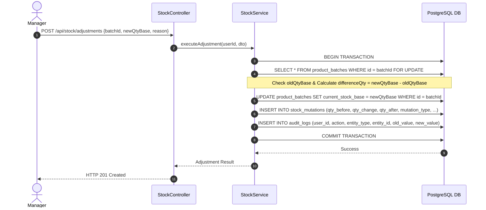

# Inventory Domain Specification — POS Apotek V2

## Document Metadata
- **Document Title:** Inventory Domain Specification — POS Apotek V2
- **Version:** 1.0.0
- **Date:** July 2026
- **Status:** Approved Architecture Specification
- **Target Audience:** Backend Developers, Frontend Developers, QA Engineers, System Architects

---

## 1. Overview & Core Philosophy

Domain Inventaris (Stok & Batch) merupakan salah satu komponen paling vital dalam **POS Apotek V2**. Penanganan persediaan obat di apotek membutuhkan kepatuhan regulasi kesehatan, ketelitian pencatatan tanggal kedaluwarsa (*expiry date*), pelacakan nomor batch, serta transparansi mutasi stok secara *real-time*.

### Core Principles
1. **Batch-Level Stock Storage in Base Units:**
   - Stok **TIDAK PERNAH** disimpan secara global agregat pada tabel produk semata.
   - Setiap butir/mililiter stok obat dicatat pada **level batch** (`product_batches`) dan diukur secara eksklusif dalam **satuan dasar** (*base unit*).
2. **Non-Negative Stock Rule (Stok Tidak Boleh Negatif):**
   - Database menolak transaksi yang menyebabkan stok batch bernilai negatif melalui database constraint (`CHECK (current_stock_base >= 0)`).
   - Pengurangan stok yang melebihi saldo batch aktif akan langsung menggagalkan database transaction dengan exception `INSUFFICIENT_STOCK`.
3. **Backend as the Single Source of Truth:**
   - Frontend tidak boleh menghitung sisa stok final, alokasi FEFO, atau pemotongan stok. Frontend hanya menampilkan informasi sementara dari backend.
   - Pemilihan batch, kalkulasi HPP, dan mutasi stok dikontrol 100% secara otomatis di backend server-side.
4. **Acid Transactions & Auditability:**
   - Setiap perubahan angka stok (pembelian, penjualan, retur, koreksi, discard) **WAJIB** berada di dalam database transaction (`prisma.$transaction`) dan secara atomik mencatat riwayat pada tabel `stock_mutations`.

---

## 2. Product Batches Data Model

Tabel `product_batches` menjadi pusat data stok fisik di dalam apotek.

### 2.1 Schema Definition (`product_batches`)

| Attribute Name | Database Field | Data Type | Nullable | Constraint | Description |
|---|---|---|:---:|---|---|
| **ID** | `id` | `UUID` | No | PK | ID unik batch. |
| **Product ID** | `product_id` | `UUID` | No | FK `products.id` | ID produk pemilik batch. |
| **Supplier ID** | `supplier_id` | `UUID` | Yes | FK `suppliers.id` | Supplier yang memasok batch ini. |
| **Purchase Item ID** | `purchase_item_id` | `UUID` | Yes | FK `purchase_items.id` | Detail item pembelian asal batch. |
| **Batch Number** | `batch_number` | `VARCHAR(150)` | No | - | Nomor lot/batch dari pabrikan (misal: "LOT-2026A99"). |
| **Expired Date** | `expired_date` | `DATE` | No | - | Tanggal kedaluwarsa obat. |
| **Initial Stock Base** | `initial_stock_base` | `NUMERIC(14,3)` | No | CHECK `>= 0` | Jumlah stok awal batch saat diterima (satuan dasar). |
| **Current Stock Base**| `current_stock_base` | `NUMERIC(14,3)` | No | CHECK `>= 0` | Saldo stok fisik saat ini (satuan dasar). |
| **Buy Price Base** | `buy_price_base` | `NUMERIC(18,8)` | No | CHECK `>= 0` | Harga beli bersih per satuan dasar (presisi desimal). |
| **HPP Base** | `hpp_base` | `NUMERIC(18,8)` | No | CHECK `>= 0` | HPP per satuan dasar presisi tinggi setelah alokasi diskon/PPN. |
| **Received At** | `received_at` | `TIMESTAMP` | No | Default `now()` | Waktu fisik batch masuk ke apotek. |
| **Is Active** | `is_active` | `BOOLEAN` | No | Default `true` | Status keaktifan batch. Batch non-aktif tidak ikut FEFO. |
| **Created At** | `created_at` | `TIMESTAMP` | No | Default `now()` | Waktu record dibuat (UTC). |
| **Updated At** | `updated_at` | `TIMESTAMP` | No | Default `now()` | Waktu record diubah (UTC). |
| **Deleted At** | `deleted_at` | `TIMESTAMP` | Yes | `NULL` | Soft delete. Batch dengan histori transaksi tidak boleh di-hard-delete. |

### 2.2 Database Indexes & FEFO Indexing
```sql
-- Security Constraint: Prevent negative stock at DB level
ALTER TABLE product_batches
ADD CONSTRAINT chk_batches_current_stock_non_negative
CHECK (current_stock_base >= 0);

ALTER TABLE product_batches
ADD CONSTRAINT chk_batches_hpp_non_negative
CHECK (hpp_base >= 0);

-- Compound Index untuk pencarian FEFO ultra cepat
CREATE INDEX idx_batches_fefo
ON product_batches(product_id, expired_date ASC, received_at ASC, current_stock_base DESC)
WHERE is_active = true AND deleted_at IS NULL;
```

---

## 3. FEFO (First Expired First Out) Engine

Prinsip **FEFO (First Expired First Out)** mewajibkan obat dengan tanggal kedaluwarsa paling awal dikeluarkan/dijual terlebih dahulu untuk mencegah penumpukan obat *expired* di apotek.

### 3.1 Server-Side FEFO Selection Logic
Ketika transaksi kasir terjadi (atau pembuatan alokasi penjualan):
1. Backend melakukan query batch aktif untuk `product_id` terkait:
   ```sql
   SELECT id, batch_number, expired_date, current_stock_base, hpp_base
   FROM product_batches
   WHERE product_id = :productId
     AND is_active = true
     AND deleted_at IS NULL
     AND current_stock_base > 0
     AND expired_date > CURRENT_DATE -- Abaikan batch yang sudah kedaluwarsa
   ORDER BY expired_date ASC, received_at ASC;
   ```
2. Engine mengambil batch teratas (expired paling awal).

### 3.2 Split Batch Allocation Algorithm
Jika kuantitas pembelian pelanggan membutuhkan $Q_{req}$ satuan dasar, namun batch teratas hanya memiliki sisa stok $Q_{b1} < Q_{req}$, maka backend secara otomatis menjalankan **Split Batch Allocation**:

```text
Algoritma Split Batch:
Input: ProductID, NeededQtyBase
RemainingNeeded = NeededQtyBase
Allocations = []

For each batch B in FEFO_Sorted_Batches(ProductID):
    If RemainingNeeded <= 0: Break
    
    TakeQty = Min(B.currentStockBase, RemainingNeeded)
    
    Allocations.append({
        batchId: B.id,
        batchNumber: B.batchNumber,
        expiredDate: B.expiredDate,
        qtyBaseTaken: TakeQty,
        hppBaseSnapshot: B.hppBase
    })
    
    RemainingNeeded -= TakeQty

If RemainingNeeded > 0:
    THROW INSUFFICIENT_STOCK Exception ("Stok barang tidak mencukupi untuk alokasi FEFO")
```

- **Alokasi Transaksi:** Setiap alokasi dari pemecahan batch ini dicatat pada tabel `sale_batch_allocations` secara presisi lengkap dengan snapshot HPP masing-masing batch.

---

## 4. Stock Mutation Audit Trail

Seluruh aktivitas pergantian nilai stok wajib memicu pembuatan baris histori mutasi pada tabel `stock_mutations`. Tabel ini bersifat *append-only* (tidak boleh di-edit atau dihapus).

### 4.1 Schema Definition (`stock_mutations`)

| Attribute | Data Type | Constraint | Description |
|---|---|---|---|
| `id` | `UUID` | PK | ID unik mutasi stok. |
| `product_id` | `UUID` | FK `products.id` | Produk terkait. |
| `batch_id` | `UUID` | FK `product_batches.id` | Batch terkait. |
| `mutation_type` | `VARCHAR(50)` | ENUM | Jenis mutasi stok (lihat 4.2). |
| `reference_type` | `VARCHAR(50)` | ENUM | Entitas referensi (`PURCHASE`, `SALE`, `SALES_RETURN`, `PURCHASE_RETURN`, `STOCK_ADJUSTMENT`, `DISCARD`). |
| `reference_id` | `UUID` | No | ID dokumen transaksi/koreksi asal. |
| `qty_before` | `NUMERIC(14,3)` | CHECK `>= 0` | Stok batch sebelum mutasi (satuan dasar). |
| `qty_change` | `NUMERIC(14,3)` | CHECK `<> 0` | Perubahan kuantitas (+ bertambah, - berkurang). |
| `qty_after` | `NUMERIC(14,3)` | CHECK `>= 0` | Stok batch setelah mutasi (satuan dasar). |
| `reason` | `TEXT` | Optional | Alasan/catatan mutasi. |
| `created_by` | `UUID` | FK `users.id` | User eksekutor transaksi. |
| `created_at` | `TIMESTAMP` | Default `now()` | Waktu kejadian mutasi (UTC). |

### 4.2 Standard Mutation Types (`mutation_type`)

| Mutation Type | Sign | Trigger Event | Description |
|---|:---:|---|---|
| `PURCHASE_IN` | `+` | Pembelian Final Supplier | Stok bertambah dari barang masuk supplier. |
| `SALES_OUT` | `-` | Checkout Kasir | Stok berkurang akibat transaksi penjualan kasir. |
| `SALES_RETURN_IN` | `+` | Retur Penjualan Kasir | Stok bertambah kembali karena barang dikembalikan pelanggan. |
| `PURCHASE_RETURN_OUT` | `-` | Retur Pembelian Supplier | Stok berkurang karena dikembalikan ke supplier. |
| `ADJUSTMENT_IN` | `+` | Koreksi Stok Positif | Stok bertambah hasil penyesuaian/opname Manager. |
| `ADJUSTMENT_OUT` | `-` | Koreksi Stok Negatif | Stok berkurang hasil penyesuaian/opname Manager. |
| `EXPIRATION_DISCARD` | `-` | Pembuangan Obat Expired | Stok berkurang karena pemusnahan barang kedaluwarsa. |

---

## 5. Stock Adjustment (Koreksi Stok) Rules

Koreksi stok (*Stock Adjustment / Opname*) adalah tindakan sensitif yang mengubah jumlah barang tanpa melalui transaksi jual-beli biasa.

### 5.1 Authorization & Guard Rules
1. **Manager-Only Authorization:**
   - Hanya user dengan Role **`MANAGER`** yang berhak melakukan penyesuaian stok.
   - Role Kasir, Apoteker, maupun Pemilik yang mencoba mengakses `POST /api/stock/adjustments` akan ditolak langsung dengan respon `403 Forbidden`.
2. **Mandatory Reason (`reason`):**
   - Setiap koreksi stok wajib menyertakan alasan tertulis secara rinci (misal: "Selisih stock opname bulanan", "Barang pecah/rusak di rak", "Kesalahan input batch").
   - Jika `reason` kosong atau kurang dari 5 karakter, backend menolak dengan `422 Unprocessable Entity`.
3. **Automatic Audit Logging:**
   - Eksekusi penyesuaian stok secara otomatis mencatat ke tabel `audit_logs` dengan `action: "STOCK_ADJUSTMENT"` berisi payload `oldQtyBase`, `newQtyBase`, `differenceQty`, dan `reason`.

### 5.2 Stock Adjustment Execution Flow (In Database Transaction)


---

## 6. Stock Alert System & Critical Thresholds

Backend POS Apotek V2 menyediakan indikator peringatan stok kritis dan kedaluwarsa untuk mendukung pengambilan keputusan pengadaan obat (PO).

### 6.1 Low Stock Alert (Stok Tipis)
- **Threshold Condition:** Total `current_stock_base` dari seluruh batch aktif untuk produk $P$ $\le$ `products.min_stock_base`.
- **System Action:**
  - Produk ditandai dengan status alert `LOW_STOCK`.
  - Muncul di widget Dashboard Manager (`GET /api/dashboard/low-stock`).
  - Menjadi masukan rekomendasi item otomatis saat Manager membuat draft Purchase Order (PO).

### 6.2 Expired Batch Warning System
Kategori peringatan kedaluwarsa diukur berdasarkan selisih hari antara `expired_date` batch dengan tanggal hari ini ($D_{exp} - D_{today}$):

| Warning Level | Condition (Days to Expire) | System Status & Action |
|---|---|---|
| **Critical Expired** | $\le 0$ hari (Sudah Kedaluwarsa) | Status: `EXPIRED`. **DIBLOKIR OTOMATIS** oleh backend dari transaksi normal kasir dan pencarian FEFO kasir. |
| **Near Expired Warning** | $1 \text{ s/d } 90$ hari | Status: `NEAR_EXPIRED`. Ditampilkan pada Dashboard Alert dan Laporan Expired agar Apoteker/Manager dapat melakukan retur ke supplier atau promosi clearance. |
| **Normal / Safe** | $> 90$ hari | Status: `SAFE`. Batch beroperasi normal dalam alokasi FEFO. |

---

## 7. API Endpoints & Interfaces

### 7.1 Batch Endpoints (`/api/batches`)

#### `GET /api/batches`
- **Access:** `MANAGER`, `APOTEKER`, `KASIR` (sanitized).
- **Query Params:** `productId`, `supplierId`, `status` (`ACTIVE`/`EXPIRED`/`EMPTY`), `search`, `page`, `limit`.
- **Response `200 OK` (Manager View):**
```json
{
  "statusCode": 200,
  "data": [
    {
      "id": "b1111111-2222-3333-4444-555555555555",
      "productId": "c39a8f21-7b3e-4f1a-b6d8-912e4fbc5101",
      "productName": "Paracetamol 500mg Tablet",
      "batchNumber": "LOT-2026A99",
      "expiredDate": "2027-12-31",
      "initialStockBase": 1000.0,
      "currentStockBase": 850.0,
      "baseUnitName": "tablet",
      "buyPriceBase": 150.0,
      "hppBase": 150.0,
      "receivedAt": "2026-06-01T08:00:00.000Z",
      "isActive": true
    }
  ]
}
```

---

### 7.2 Stock Overview Endpoints (`/api/stock`)

#### `GET /api/stock`
- **Access:** `MANAGER`, `APOTEKER`, `KASIR`, `PEMILIK`.
- **Description:** Ringkasan total stok per produk dari gabungan seluruh batch aktif.

#### `GET /api/stock/low-stock`
- **Access:** `MANAGER`, `PEMILIK`, `APOTEKER`.
- **Description:** Mengambil daftar produk yang stoknya di bawah `minStockBase`.

#### `GET /api/stock/expired-batches`
- **Access:** `MANAGER`, `PEMILIK`, `APOTEKER`.
- **Description:** Mengambil daftar batch yang mendekati kedaluwarsa ($\le 90$ hari) atau sudah kedaluwarsa.

---

### 7.3 Stock Mutation Endpoints (`/api/stock/mutations`)

#### `GET /api/stock/mutations`
- **Access:** `MANAGER`, `PEMILIK`.
- **Query Params:** `productId`, `batchId`, `mutationType`, `startDate`, `endDate`, `page`, `limit`.
- **Response `200 OK`:**
```json
{
  "statusCode": 200,
  "data": [
    {
      "id": "m9999999-8888-7777-6666-555555555555",
      "productId": "c39a8f21-7b3e-4f1a-b6d8-912e4fbc5101",
      "productName": "Paracetamol 500mg Tablet",
      "batchId": "b1111111-2222-3333-4444-555555555555",
      "batchNumber": "LOT-2026A99",
      "mutationType": "SALES_OUT",
      "referenceType": "SALE",
      "referenceId": "s7777777-1111-2222-3333-444444444444",
      "qtyBefore": 870.0,
      "qtyChange": -20.0,
      "qtyAfter": 850.0,
      "reason": "Penjualan Kasir TRX-20260602-0001",
      "createdByName": "Kasir Budi",
      "createdAt": "2026-06-02T10:15:00.000Z"
    }
  ]
}
```

---

### 7.4 Stock Adjustment Endpoints (`/api/stock/adjustments`)

#### `POST /api/stock/adjustments`
- **Access:** `MANAGER` only.
- **Request Body:**
```json
{
  "batchId": "b1111111-2222-3333-4444-555555555555",
  "newQtyBase": 845.0,
  "reason": "Stock opname rutin bulanan - ditemukan 5 tablet rusak di sudut kemasan"
}
```
- **Response `201 Created`:**
```json
{
  "statusCode": 201,
  "message": "Stock adjustment executed successfully",
  "data": {
    "adjustmentId": "adj-123456",
    "batchId": "b1111111-2222-3333-4444-555555555555",
    "oldQtyBase": 850.0,
    "newQtyBase": 845.0,
    "differenceQty": -5.0,
    "mutationType": "ADJUSTMENT_OUT",
    "reason": "Stock opname rutin bulanan - ditemukan 5 tablet rusak di sudut kemasan"
  }
}
```

---

## 8. Data Integrity & Verification Checklist
- [x] Schema & constraint mencegah nilai `current_stock_base < 0` pada level PostgreSQL.
- [x] Algoritma FEFO mengurutkan `expired_date ASC, received_at ASC` dan mengabaikan batch expired/kosong.
- [x] Mutasi stok (`stock_mutations`) dicatat secara atomik di dalam database transaction untuk setiap transaksi.
- [x] Koreksi stok dilindungi RBAC khusus `MANAGER` dan wajib menyertakan alasan tertulis.
- [x] Alert stok tipis ($\le \text{minStockBase}$) dan warning kedaluwarsa ($\le 90$ hari / $< 0$ hari) terekspos via API REST.
