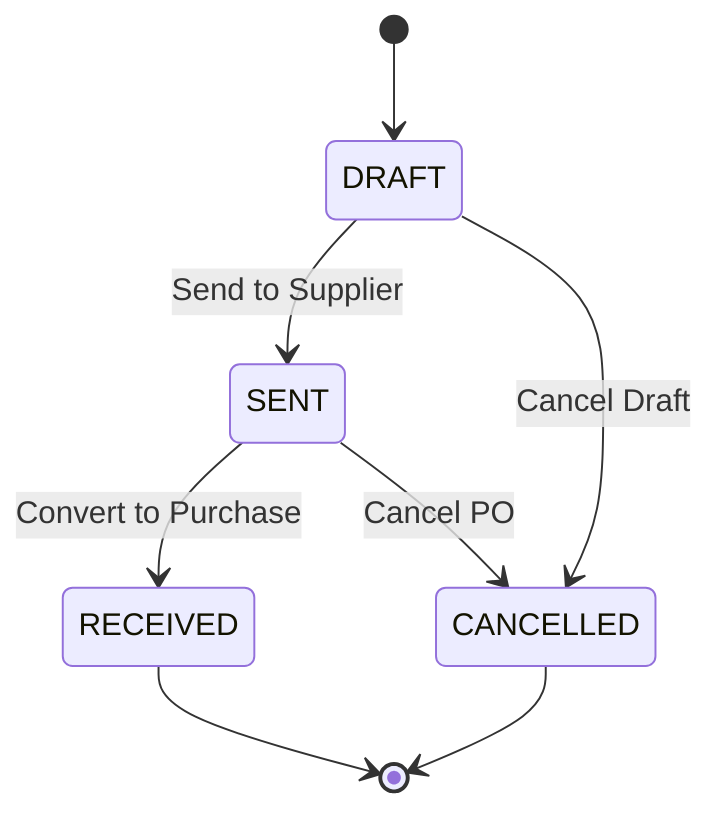

# Purchasing Domain Specification — POS Apotek V2

## Document Metadata
- **Document Title:** Purchasing Domain Specification — POS Apotek V2
- **Version:** 1.0.0
- **Date:** July 2026
- **Status:** Approved Architecture Specification
- **Target Audience:** Backend Developers, Frontend Developers, QA Engineers, System Architects

---

## 1. Overview & Scope

Domain Purchasing (Pengadaan & Pembelian) dalam **POS Apotek V2** bertangung jawab mengelola seluruh siklus hidup pemesanan dan penerimaan barang dari supplier, pencatatan invoice/faktur pembelian, penambahan stok ke batch, pembaruan presisi harga modal & HPP, serta penanganan retur pembelian barang.

### Key Scope & Business Functions
1. **Purchase Orders (PO / Pemesanan Obat):** Perencanaan pembelian kepada supplier. PO merupakan dokumen administratif dan **TIDAK PERNAH menambah atau mengurangi stok**.
2. **Purchase & Stock Reception (Pembelian / Penerimaan Barang):** Penerimaan fisik barang berdasarkan faktur supplier. Menambah stok pada level batch, memperbarui `currentStockBase`, `buyPriceBase`, dan `hppBase` produk, serta mencatat mutasi `PURCHASE_IN`.
3. **PO to Purchase Conversion (`POST /api/purchase-orders/:id/convert-to-purchase`):** Mengubah status PO yang dikirim/diterima menjadi dokumen Pembelian final secara otomatis.
4. **Purchase Returns (Retur Pembelian):** Pengembalian barang yang rusak, tidak sesuai, atau hampir kadaluarsa kepada supplier. Mengurangi stok batch, mencatat mutasi `PURCHASE_RETURN_OUT`, dan menyesuaikan tagihan/kredit supplier dengan dukungan idempotency key.

---

## 2. Purchase Orders (PO) Workflow

Purchase Order (PO) digunakan oleh Manager atau Apoteker untuk merencanakan pengadaan barang.

### 2.1 Lifecycle & States
Dokumen PO mengikuti mesin status (*state machine*) ketat berikut:
- **`DRAFT`:** PO baru dibuat, masih dapat diedit item dan kuantitasnya.
- **`SENT`:** PO telah dikirimkan ke supplier (via email/cetak/PDF).
- **`RECEIVED`:** Barang telah diterima penuh atau parsial dan telah dikonversi menjadi dokumen Pembelian.
- **`CANCELLED`:** PO dibatalkan sebelum pengiriman barang.

### 2.2 Critical Business Rule: PO & Stock Isolation
- **PO TIDAK BERDAMPAK PADA STOK:** Pembentukan, pembaruan, pengiriman, atau pembatalan PO **TIDAK BUKAN TRANSAKSI STOK** dan **TIDAK PERNAH** merubah angka `current_stock_base` pada batch maupun produk.
- Stok hanya bertambah secara legal saat transaksi Pembelian (*Purchase*) disimpan secara final ke database.

---

## 3. Purchase & Stock Reception

Penerimaan barang fisik dari supplier yang disertai faktur/invoice dicatat melalui dokumen Pembelian (*Purchase*).

### 3.1 Batch Creation & Price Updates
Saat dokumen Pembelian disimpan:
1. **Batch Generation / Assignment:** Setiap item pembelian dialokasikan ke batch fisik dengan `batchNumber` dan `expiredDate`. Jika batch number sudah ada untuk produk tersebut, stok ditambah ke batch existing; jika belum, batch baru dibuat.
2. **Stock Increment:** Stok batch ditambah sebesar `quantityBase` (kuantitas dalam satuan dasar).
3. **Presisi Harga Modal (`buyPriceBase`):** Harga beli per satuan dasar dicatat dengan presisi tinggi (`NUMERIC(14,4)`).
4. **HPP Update (`hppBase`):** Backend memperbarui `hppBase` produk berdasarkan HPP batch terbaru atau Weighted Average Cost (WAC) sesuai konfigurasi sistem.
5. **Stock Mutation Logging:** Backend membuat catatan mutasi stok dengan tipe `PURCHASE_IN` yang mereferensikan `purchase_id` dan `batch_id`.

### 3.2 Invoice Details & Taxes
Dokumen pembelian mencatat detail faktur supplier:
- `invoiceNumber`: Nomor faktur dari supplier (wajib unik per supplier).
- `supplierId`: Foreign key ke supplier.
- `subtotalBase`: Total harga beli dasar sebelum diskon/pajak.
- `discountAmount`: Diskon tingkat faktur.
- `taxAmount` / `taxPercentage`: Pajak PPN (misal 11%).
- `totalAmount`: Nilai tagihan bersih yang wajib dibayar (`subtotalBase - discountAmount + taxAmount`).

---

## 4. Conversion PO to Purchase

Sistem menyediakan mekanisme konversi cepat dari PO ke dokumen Pembelian melalui endpoint:
`POST /api/purchase-orders/:id/convert-to-purchase`

### 4.1 Conversion Payload & Rules
1. **Validasi Status:** Endpoint hanya menerima PO dengan status `DRAFT` atau `SENT`. PO berstatus `RECEIVED` atau `CANCELLED` akan ditolak (`INVALID_PO_STATE`).
2. **Override Reception Data:** User mengisi detail penerimaan nyata:
   - Nomor Faktur Supplier (`invoiceNumber`).
   - Tanggal Faktur & Jatuh Tempo.
   - Batch Number & Expiry Date per item.
   - Kuantitas riil yang diterima (bisa berbeda dari PO awal jika ada *partial delivery*).
   - Harga beli riil & diskon faktur.
3. **Atomic Transaction:**
   - Membuat record `purchases` dan `purchase_details`.
   - Membuat/mengupdate `batches`.
   - Mencatat mutasi stok `PURCHASE_IN`.
   - Mengubah status PO asal menjadi `RECEIVED`.
   - Seluruh langkah berjalan dalam 1 Database Transaction.

---

## 5. Purchase Return (Retur Pembelian) Rules

Retur Pembelian dilakukan ketika barang yang diterima dari supplier rusak (*damaged*), cacat, atau salah kirim.

### 5.1 Business & Stock Validation Rules
1. **Purchase & Batch Reference:** Retur pembelian WAJIB mereferensikan `purchase_id` asal dan `batch_id` yang sesuai.
2. **Stock Deduction:** Stok batch dikurangi sebesar kuantitas yang diretur dalam satuan dasar.
3. **Sufficient Stock Check:** Stok batch saat ini HARUS cukup (`currentStockBase >= returnQtyBase`). Jika tidak cukup, retur ditolak dengan error `INSUFFICIENT_BATCH_STOCK`.
4. **Stock Mutation:** Mencatat mutasi stok bertipe `PURCHASE_RETURN_OUT`.
5. **Supplier Credit / Cash Refund:** Mengurangi utang supplier (*accounts payable*) atau mencatat pengembalian dana tunai dari supplier.
6. **Idempotency Control:** Header `X-Idempotency-Key` wajib disertakan pada permintaan retur untuk mencegah pencatatan retur ganda akibat gangguan jaringan.

---

## 6. API Endpoints

 Seluruh endpoint backend menggunakan prefix `/api` dan bahasa Inggris teknis.

| Method | Endpoint | Role Access | Description |
|---|---|---|---|
| `GET` | `/api/purchase-orders` | Manager, Apoteker | Menampilkan daftar Purchase Order dengan filter status & supplier. |
| `POST` | `/api/purchase-orders` | Manager, Apoteker | Membuat draf PO baru. |
| `GET` | `/api/purchase-orders/:id` | Manager, Apoteker | Detail PO beserta item pemesanan. |
| `PUT` | `/api/purchase-orders/:id` | Manager, Apoteker | Mengubah draf PO. |
| `POST` | `/api/purchase-orders/:id/convert-to-purchase` | Manager, Apoteker | Memproses konversi PO menjadi Pembelian & penerimaan stok. |
| `GET` | `/api/purchases` | Manager | Menampilkan riwayat Pembelian / Penerimaan barang. |
| `POST` | `/api/purchases` | Manager | Input manual transaksi Pembelian & penerimaan stok langsung. |
| `GET` | `/api/purchases/:id` | Manager | Detail pembelian, nomor faktur, batch, dan HPP. |
| `GET` | `/api/purchase-returns` | Manager | Menampilkan riwayat Retur Pembelian. |
| `POST` | `/api/purchase-returns` | Manager | Memproses retur barang ke supplier (memerlukan `X-Idempotency-Key`). |
