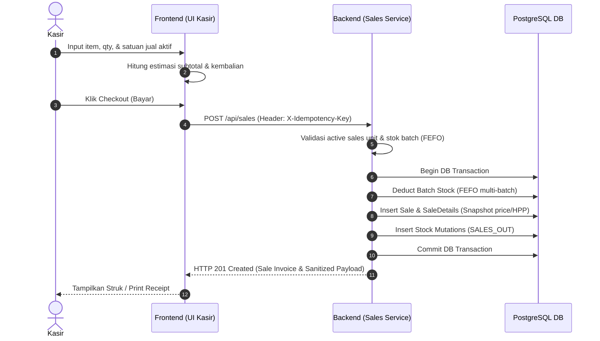

# Sales Domain Specification — POS Apotek V2

## Document Metadata
- **Document Title:** Sales Domain Specification — POS Apotek V2
- **Version:** 1.0.0
- **Date:** July 2026
- **Status:** Approved Architecture Specification
- **Target Audience:** Backend Developers, Frontend Developers, QA Engineers, System Architects

---

## 1. Overview & Cashier Philosophy

Domain Sales (Penjualan & Transaksi Kasir) merupakan inti operasional bisnis dalam **POS Apotek V2**. Domain ini dirancang untuk memproses transaksi kasir berkecepatan tinggi (*fast checkout*), memastikan ketepatan stok melalui algoritma First Expired First Out (FEFO) server-side, serta mematuhi pembatasan akses data keuangan (*financial security boundaries*).

### Core Principles
1. **Backend as Sole Source of Truth:** Frontend hanya menampilkan estimasi keranjang belanja. Backend menghitung ulang secara penuh seluruh nilai transaksi, stok batch, HPP, diskon alokasi, dan laba bersih.
2. **Server-Side Automatic FEFO:** Kasir tidak perlu memilih nomor batch secara manual saat transaksi normal. Backend secara otomatis mengalokasikan stok dari batch terdekat kadaluarsa.
3. **Strict Price & Role Isolation:** Informasi HPP, harga modal, margin, dan laba bersih **disanitasi total** dari respon API yang diakses oleh role Kasir dan Apoteker.
4. **Idempotency & Concurrent Safety:** Setiap transaksi checkout wajib menyertakan header `X-Idempotency-Key` untuk mencegah transaksi ganda akibat kegagalan koneksi atau *double click*.

---

## 2. Cashier Transaction Workflow

Alur transaksi kasir didesain untuk transaksi cepat dan akurat.

### 2.1 Active Sales Unit Validation
- Kasir memilih item berdasarkan **satuan jual aktif** (*active sales unit*).
- Backend menolak checkout jika unit yang dipilih bukan merupakan satuan jual aktif untuk produk tersebut (`INACTIVE_SALES_UNIT`).
- Kuantitas yang dibeli dikonversi ke **satuan dasar stok** (`quantityBase = quantitySalesUnit * conversionFactor`) untuk pengurangan stok di backend.

### 2.2 Idempotency Key Control
- Request checkout wajib menyertakan header `X-Idempotency-Key: <UUID>`.
- Jika request dengan key yang sama diterima kembali, backend mengembalikan hasil transaksi sebelumnya tanpa memproses transaksi atau pengurangan stok ulang.

---

## 3. Prescription (Resep) & Counseling Flow

Apotek melayani transaksi obat resep dokter dan pencatatan konseling apoteker.

### 3.1 Prescription (Resep) Workflow
1. **Entry Resep:** Apoteker atau Kasir membuat draf pelayanan resep di UI `/pelayanan/resep`.
2. **Strict Non-Deduction Rule:** Pembuatan resep **TIDAK MENGURANGI STOK BATCH**. Resep status `READY_FOR_PAYMENT` hanya merupakan dokumen pelayanan.
3. **Pulling to Cashier:** Kasir dapat menarik resep berstatus `READY_FOR_PAYMENT` ke kasir melalui endpoint `GET /api/prescriptions/ready-for-payment` dan memproses checkout via `POST /api/sales/from-prescription/:prescriptionId`.
4. **Checkout Finalization:** Pengurangan stok batch baru terjadi secara legal setelah checkout resep di kasir berhasil disimpan.

### 3.2 Counseling Records
- Apoteker dapat mencatat data konseling pasien (nama pasien, nama obat, catatan konseling, edukasi penggunaan) di `/pelayanan/konseling`.
- Rekam konseling tersimpan di `counseling_records` dan dapat dihubungkan dengan transaksi penjualan atau resep.

---

## 4. FEFO & Split Batch Allocation

Untuk menjaga kualitas obat dan mencegah kerugian akibat barang expired, backend mengimplementasikan **First Expired First Out (FEFO)**.

### 4.1 Multi-Batch Split Allocation
Jika permintaan suatu produk melebihi stok pada 1 batch terdekat expired:
1. Backend mengambil batch terdekat expired yang memiliki stok > 0 (`expired_date ASC, created_at ASC`).
2. Jika stok batch 1 belum mencukupi kuantitas pembelian, sisa kuantitas dialokasikan ke batch 2, batch 3, dst.
3. Transaksi disimpan dalam bentuk **split detail** (`sale_details` terpisah per batch) untuk mencatat:
   - `batch_id`
   - `quantityBase` yang diambil dari batch tersebut
   - `hppBase` snapshot historis batch tersebut
   - `sellPriceBase` snapshot harga jual
   - `allocatedDiscount` proporsional
   - `netProfit` bersih per detail (`(sellPriceBase - allocatedDiscount - hppBase) * quantityBase`)

---

## 5. Sales Returns (Retur Penjualan) Rules

Retur Penjualan terjadi apabila pelanggan mengembalikan obat yang dibeli (misal: kesalahan ambil atau barang cacat).

### 5.1 Business Rules & Restocking
1. **Invoice Reference:** Retur Penjualan WAJIB mereferensikan nomor faktur/faktur penjualan asal (`sale_id`).
2. **Batch Restocking:** Item yang diretur dikembalikan ke batch asal (`batch_id` pada detail transaksi). Stok batch bertambah sebesar kuantitas retur.
3. **Stock Mutation:** Pencatatan mutasi stok otomatis bertipe `SALES_RETURN_IN`.
4. **Refund Calculation:** Nilai pengembalian uang (*refund amount*) dihitung berdasarkan harga jual historis dikurangi diskon proporsional yang diterima saat pembelian.
5. **Idempotency:** Header `X-Idempotency-Key` wajib disertakan pada request `POST /api/sales-returns`.

---

## 6. Role & Security Controls

Akses terhadap data transaksi disesuaikan secara ketat berdasarkan Role pengguna:

### 6.1 Role Data Sanitization Matrix

| Data Attribute / Endpoint | MANAGER | APOTEKER | KASIR |
|---|:---:|:---:|:---:|
| **Harga Jual Transaksi (`sellPrice`)** | Visible | Visible | Visible |
| **Total Pembayaran & Kembalian** | Visible | Visible | Visible |
| **Harga Modal / Buy Price (`buyPriceBase`)** | Visible | **Hidden (Sanitized)** | **Hidden (Sanitized)** |
| **HPP Transaksi (`hppBase`)** | Visible | **Hidden (Sanitized)** | **Hidden (Sanitized)** |
| **Laba Transaksi / Profit (`netProfit`)** | Visible | **Hidden (Sanitized)** | **Hidden (Sanitized)** |
| **Akses Laporan Laba (`/api/reports/profit`)** | Allowed | **Forbidden (403)** | **Forbidden (403)** |

- Sanitasi dilakukan di level DTO/Interceptor backend. Properti sensitive (`hppBase`, `netProfit`, `buyPriceBase`) diset `undefined` / dihilangkan sebelum JSON response dikirim ke client Kasir/Apoteker.

---

## 7. API Endpoints

Seluruh endpoint backend menggunakan prefix `/api` dan bahasa Inggris teknis.

| Method | Endpoint | Role Access | Description |
|---|---|---|---|
| `POST` | `/api/sales` | Kasir, Manager | Checkout transaksi penjualan kasir (Header: `X-Idempotency-Key`). |
| `GET` | `/api/sales` | Kasir, Apoteker, Manager | Menampilkan riwayat transaksi penjualan. |
| `GET` | `/api/sales/:id` | Kasir, Apoteker, Manager | Detail transaksi penjualan (Sanitized untuk Kasir/Apoteker). |
| `GET` | `/api/prescriptions/ready-for-payment` | Kasir, Apoteker, Manager | Mengambil daftar resep siap bayar untuk ditarik ke kasir. |
| `POST` | `/api/sales/from-prescription/:prescriptionId` | Kasir, Manager | Checkout transaksi kasir berdasarkan resep. |
| `GET` | `/api/counseling-records` | Apoteker, Manager | Menampilkan daftar rekam konseling pasien. |
| `POST` | `/api/counseling-records` | Apoteker, Manager | Membuat rekam konseling pasien baru. |
| `GET` | `/api/sales-returns` | Kasir, Apoteker, Manager | Menampilkan daftar retur penjualan. |
| `POST` | `/api/sales-returns` | Kasir, Manager | Memproses retur penjualan (Header: `X-Idempotency-Key`). |
